# 🎭 Armas


## 🎭 Frases al Disparar
```
1 "SOS boleta", 
2 "Morite loco",
3 "Te voy a volar la cabeza",
4 "No te lo voy a perdonar",
5 "Soy el más vivo",
6 "Comete esta gil",
7 "Te gusta el sabor a balas?",
8 "Con el debido respeto",
9 "BANG"
```

1
### 🎃 Puño

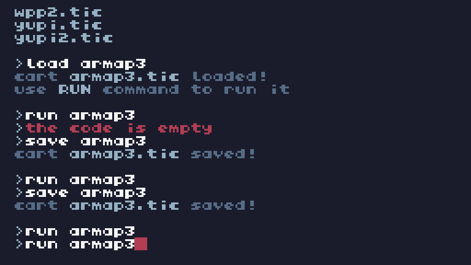

Arma cuerpo a cuerpo.
Poca potencia.

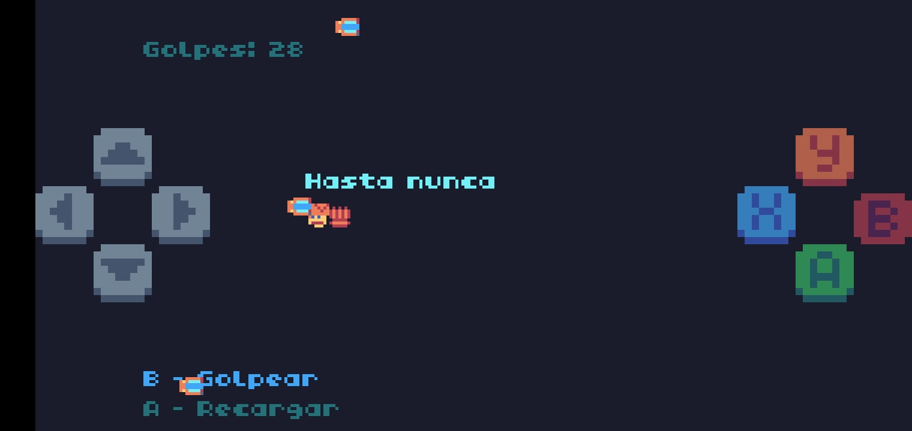

2
### 🎃 Katana


Arma cuerpo a cuerpo.
Mucha potencia.

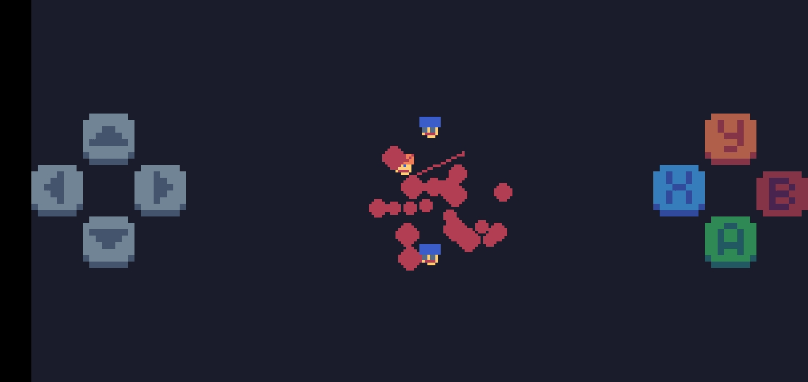
3
### 🎃 Pistola

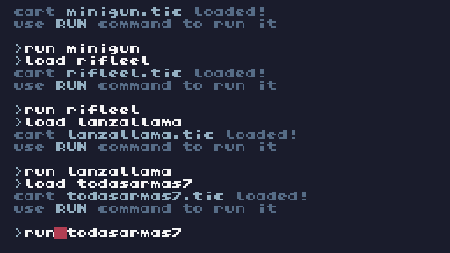

Arma de largo alcance.
Poca potencia.
Disparos lentos.


4
### 🎃 Escopeta

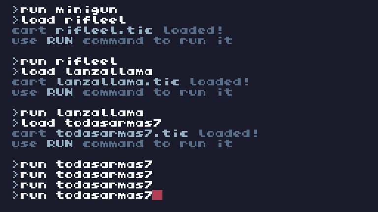

Arma de largo alcance.
Multiples disparos.


5
### 🎃 Granada

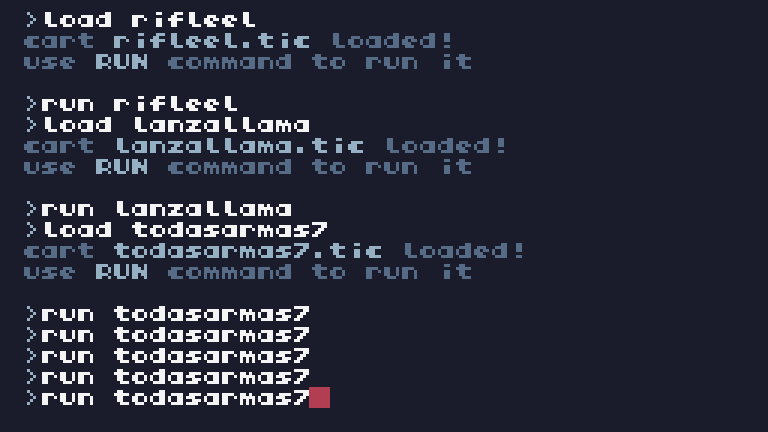

Arma de largo alcance.
Mucha potencia.


6
### 🎃 Rifle Electrico


Arma con rafagas pero corto alcance.
Mucha potencia.


7
### 🎃 Lanzallamas

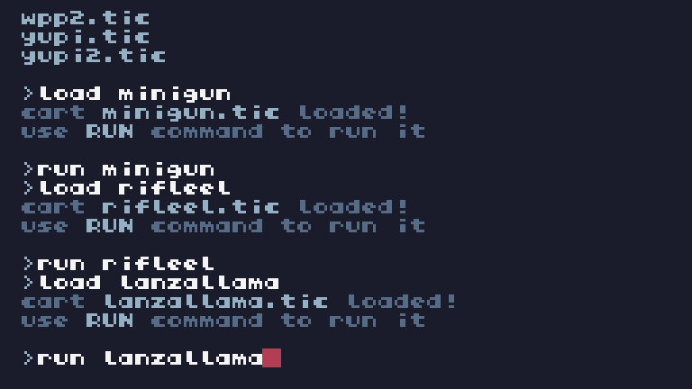
Arma con rafagas pero largo alcance.
Mucha potencia.


8
### 🎃 Bazooka

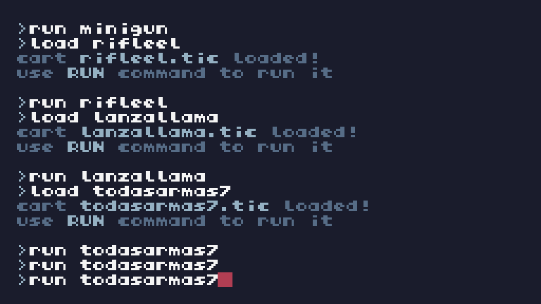

Arma con disparos lentos pero grandes.
Mucha potencia.


9
### 🎃 MiniGun

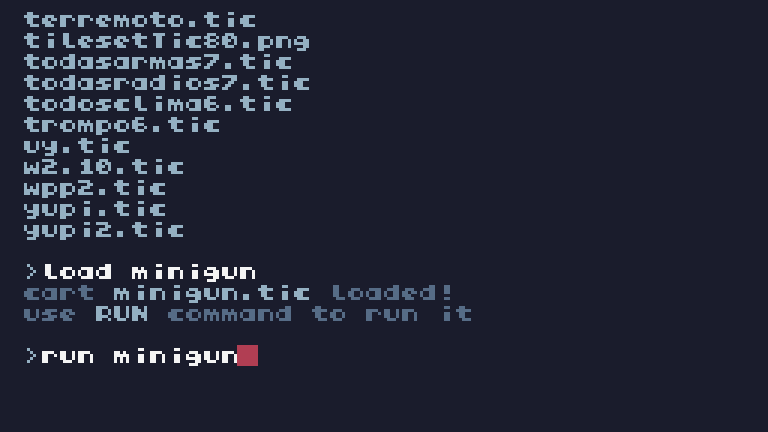
Arma con disparos de multiples rafagas.
Mucha potencia.


10
### 🎃 AK 47

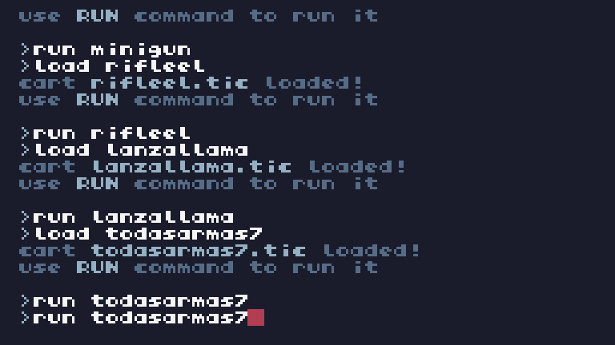

Arma de largo alcance.
Disparos rapidos.


11
### 🎃 Rayo Laser


Arma de largo alcance.
Mucha potencia.
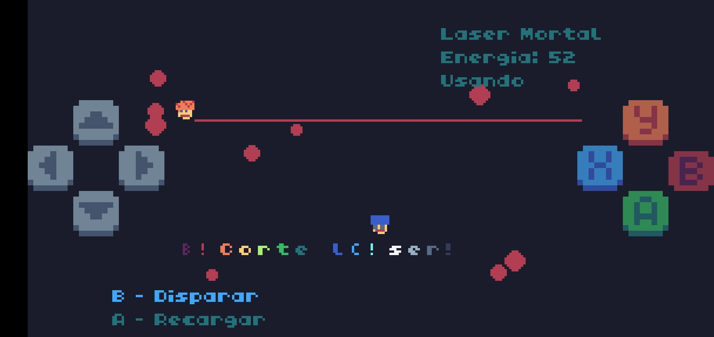

## ✨️Variables / Atributos

### Todas las Armas
```
1
t = 0

2
x_personaje = 64  
-- Posición inicial del personaje (horizontal)

3
y_personaje = 64  
-- Posición inicial del personaje (vertical)

4
velocidad = 1  
-- Velocidad del personaje

5
numero_cartuchos_pistola = 5  
-- Número inicial de cartuchos de la pistola

6
numero_cartuchos_ak47 = 5  
-- Número inicial de cartuchos del AK47

7
numero_cartuchos_bazooka = 5  
-- Número inicial de cartuchos de la bazooka

8
numero_cartuchos_escopeta = 5  
-- Número inicial de cartuchos de la escopeta

9
numero_granadas = 5  
-- Número inicial de granadas

10
disparos = {} 
-- Lista de disparos activos

11
granadas = {}  
-- Lista de granadas activas

12
frases = {"BOOM!", "Comete esta", "Te reventé", "BANG", "Demasiado tarde", "Hasta nunca", "¿Te dolió?"}

13
tiempo_frase = 0

14
frase_actual = ""

15
coches = {}  
-- Lista de coches en la pantalla

16
explosiones = {}  
-- Lista de explosiones

17
arma_actual = 1  
-- 1: Pistola, 2: AK47, 3: Bazooka, 4: Escopeta, 5: Granada

18
enemies = {}  
-- Lista de enemigos

```
### Puño
```
t = 0

x_personaje = 64  
-- Posición inicial del personaje (horizontal)

y_personaje = 64  
-- Posición inicial del personaje (vertical)

velocidad = 1  
-- Velocidad del personaje

numero_golpes = 30  
-- Número inicial de golpes

golpes = {}  
-- Lista de golpes

frases = {"¡Bam!", "Golpe certero", "¡Te alcancé!", "Toma eso", "¿Te dolió?", "Hasta nunca", "¡Te reventé!"}

tiempo_frase = 0

frase_actual = ""

coches = {}  
-- Lista de coches en la pantalla

explosiones = {}  
-- Lista de explosiones

distancia_entre_golpes = 5  
-- Distancia entre golpes consecutivos

tiempo_golpe_visible = 20  
-- Tiempo durante el cual el golpe es visible

particulas = {}  
-- Lista de partículas para explosiones
```

### Katana
```

```

### Pistola
```
t = 0
x_personaje = 64  -- Posición inicial del personaje (horizontal)
y_personaje = 64  -- Posición inicial del personaje (vertical)
balanza = nil  -- La balanza estará inicialmente inactiva
velocidad = 1  -- Velocidad del personaje
direccion_balanza = 0  -- Dirección de la balanza (0 = no disparada, 1 = disparada hacia la derecha, -1 = disparada hacia la izquierda)
pos_balanza_x = 0  -- Posición X de la balanza
pos_balanza_y = 64  -- Posición Y de la balanza

-- Contador de balas
numero_balas = 20  -- Número inicial de balas
disparando = false  -- Estado de disparo
tiempo_frase = 0  -- Temporizador para la frase
frase_actual = ""  -- Frase que se mostrará
tiempo_frase_mostrar = 0  -- Tiempo en que se mostró la última frase

-- Frases aleatorias
frases = {"SOS boleta", "morite loco", "te voy a volar la cabeza", "no te lo voy a perdonar", "soy el más vivo", "comete esta gil", "te gusta el sabor a balas?", "con el debido respeto", "BANG"}

-- Posición de los coches
coches = {
    {x = 120, y = 64, colisionado = false},  -- Primer coche
    {x = 120, y = 40, colisionado = false},  -- Coche arriba
    {x = 120, y = 88, colisionado = false},  -- Coche abajo
}

coche_explosion = false  -- Estado de la explosión
explosion_tiempo = 0  -- Temporizador para la animación de explosión
explosion_puntos = {}  -- Lista de puntos para la explosión

-- Variables para el poder del jugador
poder_jugador = 0  -- Poder que se mostrará al colisionar
poder_tiempo = 0  -- Tiempo en que se generó el poder
mostrar_poder = false  -- Indica si el poder debe mostrarse
```

### Granada
```
t = 0
x_personaje = 64  -- Posición inicial del personaje (horizontal)
y_personaje = 64  -- Posición inicial del personaje (vertical)
velocidad = 1  -- Velocidad del personaje
numero_granadas = 5  -- Número inicial de granadas
granadas = {}  -- Lista de granadas activas
frases = {"BOOM!", "Comete esta", "Te reventé", "BANG", "Demasiado tarde", "Hasta nunca", "¿Te dolió?"}
tiempo_frase = 0
frase_actual = ""
coches = {}  -- Lista de coches en la pantalla
explosiones = {}  -- Lista de explosiones
```
### AK 47
```
t = 0
x_personaje = 64  -- Posición inicial del personaje (horizontal)
y_personaje = 64  -- Posición inicial del personaje (vertical)
velocidad = 1  -- Velocidad del personaje
numero_cartuchos = 30  -- Número inicial de balas del AK-47
disparos = {}  -- Lista de disparos activos
frases = {"¡Bang!", "Disparo certero", "Te alcancé", "Toma esto", "¿Te dolió?", "Hasta nunca", "¡Te reventé!"}
tiempo_frase = 0
frase_actual = ""
coches = {}  -- Lista de coches en la pantalla
explosiones = {}  -- Lista de explosiones
distancia_entre_disparos = 5  -- Distancia entre disparos consecutivos
```
### Escopeta
```
t = 0
x_personaje = 64  -- Posición inicial del personaje (horizontal)
y_personaje = 64  -- Posición inicial del personaje (vertical)
velocidad = 1  -- Velocidad del personaje
numero_cartuchos = 5  -- Número inicial de cartuchos
disparos = {}  -- Lista de disparos activos
frases = {"BOOM!", "Comete esta", "Te reventé", "BANG", "Demasiado tarde", "Hasta nunca", "¿Te dolió?"}
tiempo_frase = 0
frase_actual = ""
coches = {}  -- Lista de coches en la pantalla
explosiones = {}  -- Lista de explosiones

```

### Rifle Electrico
```

```

### Lanzallamas
```

```
### Rayo Laser
```

```
### Bazooka
```
t = 0
x_personaje = 64  -- Posición inicial del personaje (horizontal)
y_personaje = 64  -- Posición inicial del personaje (vertical)
velocidad = 1  -- Velocidad del personaje
numero_cartuchos = 5  -- Número inicial de cartuchos
disparos = {}  -- Lista de disparos activos
frases = {"BOOM!", "Comete esta", "Te reventé", "BANG", "Demasiado tarde", "Hasta nunca", "¿Te dolió?"}
tiempo_frase = 0
frase_actual = ""
coches = {}  -- Lista de coches en la pantalla
explosiones = {}  -- Lista de explosiones
```

### MiniGun
```

```

## Funciones

### ✅️-Todas las Armas

#### 🔑-1  disparar_pistola()

.

#### 🔑-2  disparar_ak47()

.

#### 🔑-3  disparar_bazooka()

.

#### 🔑-4  disparar_escopeta()

.

#### 🔑-5  disparar_granada()

.

#### 🔑-6  mover_disparos()

.

#### 🔑-7  mover_granadas()

.

#### 🔑-8  recargar()

.

#### 🔑-9  cambiar_arma()

.

#### 🔑-10  mostrar_controles()

.

#### 🔑-11  mover_personaje()

.

#### 🔑-12  agregar_coches()

.

#### 🔑-13  mover_coches()

.

#### 🔑-14  crear_explosion(x,y)

.

#### 🔑-15  agregar_enemigos()

.

#### 🔑-16  mover_enemigos()

.

#### 🔑-17  TIC()

Bucle principal.

### ✅️-Puño

#### 🔑-1  golpear()

.

#### 🔑-2  mover_golpes()

.

#### 🔑-3  dibujar_golpes()

.

-4  mover_personaje()

-5  recargar()

-6  mostrar_controles()

-7  generar_coches()

-8  mover_coches()

-9  detectar_colisiones()

-10  generar_particulas(x,y)

-11  mover_y_dibujar_particulas()

-12  dibujar_explosiones()

-13  TIC()

### ✅️-Katana

-1  dibujar_personaje()

-2  mover_personaje()

#### 🔑-3  cortar_katana()

.

#### 🔑-4  actualizar_cortes()

.

-5  generar_particulas(x,y)

-6  actualizar_particulas()

-7  dibujar_enemigos()

-8  TIC()

### ✅️-Pistola

-1  dibujar_personaje()

-2  dibujar_coches()

#### 🔑-3  dibujar_balanza()

.

-4  mover_personaje()

#### 🔑-5  disparar_balanza()

.

#### 🔑-6  mover_balanza()

.

-7  detectar_colision()

-8  dibujar_explosion()

-9  mostrar_explosion()

-10  mostrar_poder_jugador()

-11  dibujar_pistola()

-12  mostrar_frase()

-13  recargar()

-14  mostrar_cambio_arma()

-15  mostrar_controles()

-16  TIC()

### ✅️-Escopeta

#### 🔑-1  disparar_escopeta()

.

-2  mover_disparos()

-3  dibujar_disparos()

-4  recargar()

-5  mostrar_controles()

-6  mover_personaje()

-7  agregar_coches()

-8  mover_coches()

-9  dibujar_coches()

-10  crear_explosion(x,y)

-11  dibujar_explosiones()

-12  verificar_impactos()

-13  dibujar_personaje()

-14  TIC()

### ✅️-Granada

#### 🔑-1  disparar_granada()

.

#### 🔑-2  mover_granada()

.

#### 🔑-3  dibujar_granada()

.

-4  mostrar_controles()

-5  mover_personaje()

-6  agregar_coches()

-7  mover_coches()

-8  dibujar_coches()

-9  crear_explosion(x,y)

-10  dibujar_explosiones()

-11  verificar_impactos()

-12  TIC()

#### 🔑-13  dibujar_mira_impacto()

.

### ✅️-Rifle Electrico

-1  dibujar_personaje()

-2  mover_personaje()

#### 🔑-3  disparar_rifle()

.

#### 🔑-4  mover_rayos()

.

#### 🔑-5  dibujar_rayos()

.

-6  detectar_colision()

-7  dibujar_coches()

-8  dibujar_explosion()

-9  mostrar_frase()

-10  recargar()

-11  mostrar_controles()

-12  TIC()

### ✅️-Lanzallamas

-1  dibujar_personaje()

-2  mover_personaje()

#### 🔑-3  disparar_lanzallamas()

.

#### 🔑-4  mover_llamas()

.

#### 🔑-5  dibujar_llamas()

.

-6  detectar_colision()

-7  dibujar_coches()

-8  dibujar_explosion()

-9  mostrar_frase()

-10  recargar()

-11  mostrar_controles()

-12  TIC()

### ✅️-Bazooka

#### 🔑-1  disparar_bazooka()

.

-2  mover_disparos()

-3  dibujar_disparos()

-4  recargar()

-5  mostrar_controles()

-6  mover_personaje()

-7  agregar_coches()

-8  mover_coches()

-9  dibujar_coches()

-10  crear_explosion(x,y)

-11  dibujar_explosiones()

-12  verificar_impactos()

-13  dibujar_personaje()

-14  TIC()

### ✅️-MiniGun

-1  crear_enemigo()

-2  mover_personaje()

#### 🔑-3  disparar_minigun()

.

#### 🔑-4  mover_balas()

.

#### 🔑-5  dibujar_balas()

.

-6  dibujar_enemigos()

-7  crear_efecto_sangre(x,y)

-8  crear_efecto_explosion(x,y)

-9  mover_y_dibujar_explosion()

-10  mostrar_frase()

-11  recargar()

-12  mostrar_controles()

-13  TIC()

### ✅️-AK47

#### 🔑-1  disparar_ak47()

.

-2  mover_disparos()

-3  dibujar_disparos()

-4  recargar()

-5  mostrar_controles()

-6  mover_personaje()

-7  agregar_coches()

-8  mover_coches()

-9  dibujar_coches()

-10  crear_explosion()

-11  dibujar_explosiones()

-12  verificar_impactos()

-13  dibujar_personaje()

-14  TIC()

### ✅️-Rayo Laser

-1  dibujar_personaje()

-2  mover_personaje()

#### 🔑-3  disparar_laser()

.

#### 🔑-4  dibujar_laser()

.

-5  dibujar_enemigos()

-6  dibujar_sangre()

-7  mostrar_frase()

-8  recargar()

-9  mostrar_controles()

-10  TIC()
