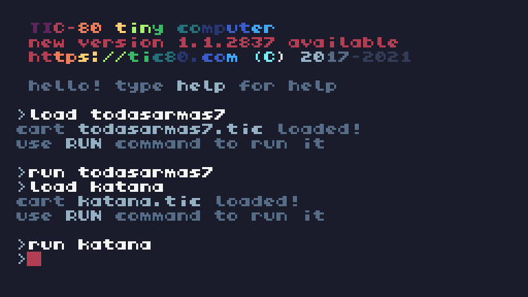

Armas

1
### 🎃-Puño

2
### 🎃-Katana

3
### 🎃-Pistola

4
### 🎃-Escopeta

5
### 🎃-Granada

6
### 🎃-Rifle Electrico

7
### 🎃-Lanzallamas

8
### 🎃-Bazooka

9
### 🎃-MiniGun

10
### 🎃-AK 47

11
### 🎃-Rayo Laser

Funciones

### ✅️-Todas las Armas

#### 🔑-1  disparar_pistola()

.

#### 🔑-2  disparar_ak47()

.

#### 🔑-3  disparar_bazooka()

.

#### 🔑-4  disparar_escopeta()

.

#### 🔑-5  disparar_granada()

.

#### 🔑-6  mover_disparos()

.

#### 🔑-7  mover_granadas()

.

#### 🔑-8  recargar()

.

#### 🔑-9  cambiar_arma()

.

#### 🔑-10  mostrar_controles()

.

#### 🔑-11  mover_personaje()

.

#### 🔑-12  agregar_coches()

.

#### 🔑-13  mover_coches()

.

#### 🔑-14  crear_explosion(x,y)

.

#### 🔑-15  agregar_enemigos()

.

#### 🔑-16  mover_enemigos()

.

#### 🔑-17  TIC()

Bucle principal.

### ✅️-Puño

-1  golpear()

-2  mover_golpes()

-3  dibujar_golpes()

-4  mover_personaje()

-5  recargar()

-6  mostrar_controles()

-7  generar_coches()

-8  mover_coches()

-9  detectar_colisiones()

-10  generar_particulas(x,y)

-11  mover_y_dibujar_particulas()

-12  dibujar_explosiones()

-13  TIC()

### ✅️-Katana

-1  dibujar_personaje()

-2  mover_personaje()

-3  cortar_katana()

-4  actualizar_cortes()

-5  generar_particulas(x,y)

-6  actualizar_particulas()

-7  dibujar_enemigos()

-8  TIC()

### ✅️-Pistola

-1  dibujar_personaje()

-2  dibujar_coches()

-3  dibujar_balanza()

-4  mover_personaje()

-5  disparar_balanza()

-6  mover_balanza()

-7  detectar_colision()

-8  dibujar_explosion()

-9  mostrar_explosion()

-10  mostrar_poder_jugador()

-11  dibujar_pistola()

-12  mostrar_frase()

-13  recargar()

-14  mostrar_cambio_arma()

-15  mostrar_controles()

-16  TIC()

### ✅️-Escopeta

-1  disparar_escopeta()

-2  mover_disparos()

-3  dibujar_disparos()

-4  recargar()

-5  mostrar_controles()

-6  mover_personaje()

-7  agregar_coches()

-8  mover_coches()

-9  dibujar_coches()

-10  crear_explosion(x,y)

-11  dibujar_explosiones()

-12  verificar_impactos()

-13  dibujar_personaje()

-14  TIC()

### ✅️-Granada

-1  disparar_granada()

-2  mover_granada()

-3  dibujar_granada()

-4  mostrar_controles()

-5  mover_personaje()

-6  agregar_coches()

-7  mover_coches()

-8  dibujar_coches()

-9  crear_explosion(x,y)

-10  dibujar_explosiones()

-11  verificar_impactos()

-12  TIC()

-13  dibujar_mira_impacto()

### ✅️-Rifle Electrico

-1  dibujar_personaje()

-2  mover_personaje()

-3  disparar_rifle()

-4  mover_rayos()

-5  dibujar_rayos()

-6  detectar_colision()

-7  dibujar_coches()

-8  dibujar_explosion()

-9  mostrar_frase()

-10  recargar()

-11  mostrar_controles()

-12  TIC()

### ✅️-Lanzallamas

-1  dibujar_personaje()

-2  mover_personaje()

-3  disparar_lanzallamas()

-4  mover_llamas()

-5  dibujar_llamas()

-6  detectar_colision()

-7  dibujar_coches()

-8  dibujar_explosion()

-9  mostrar_frase()

-10  recargar()

-11  mostrar_controles()

-12  TIC()

### ✅️-Bazooka

-1  disparar_bazooka()

-2  mover_disparos()

-3  dibujar_disparos()

-4  recargar()

-5  mostrar_controles()

-6  mover_personaje()

-7  agregar_coches()

-8  mover_coches()

-9  dibujar_coches()

-10  crear_explosion(x,y)

-11  dibujar_explosiones()

-12  verificar_impactos()

-13  dibujar_personaje()

-14  TIC()

### ✅️-MiniGun

-1  crear_enemigo()

-2  mover_personaje()

-3  disparar_minigun()

-4  mover_balas()

-5  dibujar_balas()

-6  dibujar_enemigos()

-7  crear_efecto_sangre(x,y)

-8  crear_efecto_explosion(x,y)

-9  mover_y_dibujar_explosion()

-10  mostrar_frase()

-11  recargar()

-12  mostrar_controles()

-13  TIC()

### ✅️-AK47

-1  disparar_ak47()

-2  mover_disparos()

-3  dibujar_disparos()

-4  recargar()

-5  mostrar_controles()

-6  mover_personaje()

-7  agregar_coches()

-8  mover_coches()

-9  dibujar_coches()

-10  crear_explosion()

-11  dibujar_explosiones()

-12  verificar_impactos()

-13  dibujar_personaje()

-14  TIC()

### ✅️-Rayo Laser

-1  dibujar_personaje()

-2  mover_personaje()

-3  disparar_laser()

-4  dibujar_laser()

-5  dibujar_enemigos()

-6  dibujar_sangre()

-7  mostrar_frase()

-8  recargar()

-9  mostrar_controles()

-10  TIC()
