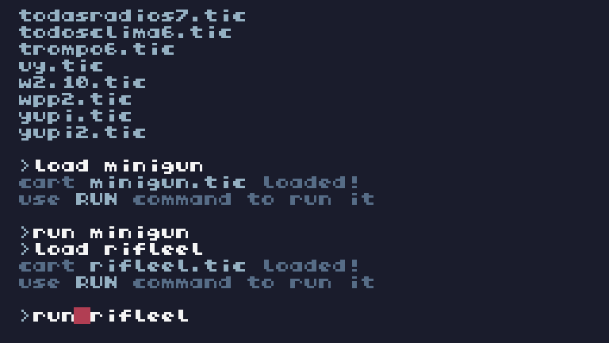

# 🎭 Armas


## 🎭 Frases al Disparar
```
1 "SOS boleta", 
2 "Morite loco",
3 "Te voy a volar la cabeza",
4 "No te lo voy a perdonar",
5 "Soy el más vivo",
6 "Comete esta gil",
7 "Te gusta el sabor a balas?",
8 "Con el debido respeto",
9 "BANG"
```

1
### 🎃 Puño


Arma cuerpo a cuerpo.
Poca potencia.


2
### 🎃 Katana


Arma cuerpo a cuerpo.
Mucha potencia.


3
### 🎃 Pistola


Arma de largo alcance.
Poca potencia.
Disparos lentos.


4
### 🎃 Escopeta


Arma de largo alcance.
Multiples disparos.


5
### 🎃 Granada


Arma de largo alcance.
Mucha potencia.


6
### 🎃 Rifle Electrico



Arma con rafagas pero corto alcance.
Mucha potencia.


7
### 🎃 Lanzallamas


Arma con rafagas pero largo alcance.
Mucha potencia.


8
### 🎃 Bazooka


Arma con disparos lentos pero grandes.
Mucha potencia.


9
### 🎃 MiniGun


Arma con disparos de multiples rafagas.
Mucha potencia.


10
### 🎃 AK 47


Arma de largo alcance.
Disparos rapidos.


11
### 🎃 Rayo Laser


Arma de largo alcance.
Mucha potencia.


## ✨️Variables / Atributos

### ⭐️ 1 Todas las Armas
```
1
t = 0

2
x_personaje = 64  
-- Posición inicial del personaje (horizontal)

3
y_personaje = 64  
-- Posición inicial del personaje (vertical)

4
velocidad = 1  
-- Velocidad del personaje

5
numero_cartuchos_pistola = 5  
-- Número inicial de cartuchos de la pistola

6
numero_cartuchos_ak47 = 5  
-- Número inicial de cartuchos del AK47

7
numero_cartuchos_bazooka = 5  
-- Número inicial de cartuchos de la bazooka

8
numero_cartuchos_escopeta = 5  
-- Número inicial de cartuchos de la escopeta

9
numero_granadas = 5  
-- Número inicial de granadas

10
disparos = {} 
-- Lista de disparos activos

11
granadas = {}  
-- Lista de granadas activas

12
frases = {"BOOM!", "Comete esta", "Te reventé", "BANG", "Demasiado tarde", "Hasta nunca", "¿Te dolió?"}

13
tiempo_frase = 0

14
frase_actual = ""

15
coches = {}  
-- Lista de coches en la pantalla

16
explosiones = {}  
-- Lista de explosiones

17
arma_actual = 1  
-- 1: Pistola, 2: AK47, 3: Bazooka, 4: Escopeta, 5: Granada

18
enemies = {}  
-- Lista de enemigos

```
### ⭐️ 2 Puño
```
1
t = 0

2
x_personaje = 64  
-- Posición inicial del personaje (horizontal)

3
y_personaje = 64  
-- Posición inicial del personaje (vertical)

4
velocidad = 1  
-- Velocidad del personaje

5
numero_golpes = 30  
-- Número inicial de golpes

6
golpes = {}  
-- Lista de golpes

7
frases = 
{"¡Bam!", "Golpe certero", "¡Te alcancé!", "Toma eso", "¿Te dolió?", "Hasta nunca", "¡Te reventé!"}

8
tiempo_frase = 0

9
frase_actual = ""

10
coches = {}  
-- Lista de coches en la pantalla

11
explosiones = {}  
-- Lista de explosiones

12
distancia_entre_golpes = 5  
-- Distancia entre golpes consecutivos

13
tiempo_golpe_visible = 20  
-- Tiempo durante el cual el golpe es visible

14
particulas = {}  
-- Lista de partículas para explosiones
```

### ⭐️ 3 Katana
```
Variables principales
1
t = 0

2
x_personaje = 64  
-- Posición inicial del personaje

3
y_personaje = 64  
-- Posición inicial del personaje

4
velocidad = 1  
-- Velocidad del personaje

5
cortes = {}  
-- Tabla para almacenar los efectos de cortes

6
duracion_corte = 15  
-- Duración del efecto de corte en cuadros

7
longitud_corte = 20  
-- Longitud inicial del corte

8
velocidad_giro = -0.2  
-- Giro inverso del corte

9
tiempo_entre_cortes = 10  
-- Tiempo mínimo entre cortes consecutivos

10
tiempo_ultimo_corte = 0  
-- Reloj para limitar cortes consecutivos

-- Enemigos
11
enemigos = {
    {x = 120, y = 64, colisionado = false},
    {x = 120, y = 40, colisionado = false},
    {x = 120, y = 88, colisionado = false},
}

-- Partículas de sangre
12
particulas = {}
```

### ⭐️ 4 Pistola
```
1
t = 0

2
x_personaje = 64  
-- Posición inicial del personaje (horizontal)

3
y_personaje = 64  
-- Posición inicial del personaje (vertical)

4
balanza = nil  
-- La balanza estará inicialmente inactiva

5
velocidad = 1  
-- Velocidad del personaje

6
direccion_balanza = 0  
-- Dirección de la balanza 
(0 = no disparada, 
1 = disparada hacia la derecha, 
-1 = disparada hacia la izquierda)

7
pos_balanza_x = 0  
-- Posición X de la balanza

8
pos_balanza_y = 64  
-- Posición Y de la balanza

-- Contador de balas

9
numero_balas = 20  
-- Número inicial de balas

10
disparando = false  
-- Estado de disparo

11
tiempo_frase = 0  
-- Temporizador para la frase

12
frase_actual = ""  
-- Frase que se mostrará

13
tiempo_frase_mostrar = 0  
-- Tiempo en que se mostró la última frase

-- Frases aleatorias
14
frases = 
{"SOS boleta", "morite loco", "te voy a volar la cabeza", "no te lo voy a perdonar", "soy el más vivo", "comete esta gil", "te gusta el sabor a balas?", "con el debido respeto", "BANG"}

15
-- Posición de los coches
coches = {
    {x = 120, y = 64, colisionado = false},  -- Primer coche
    {x = 120, y = 40, colisionado = false},  -- Coche arriba
    {x = 120, y = 88, colisionado = false},  -- Coche abajo
}

16
coche_explosion = false  
-- Estado de la explosión

17
explosion_tiempo = 0  
-- Temporizador para la animación de explosión

18
explosion_puntos = {}  
-- Lista de puntos para la explosión

-- Variables para el poder del jugador

19
poder_jugador = 0  
-- Poder que se mostrará al colisionar

20
poder_tiempo = 0  
-- Tiempo en que se generó el poder

21
mostrar_poder = false  
-- Indica si el poder debe mostrarse
```

### ⭐️ 5 Granada
```
1
t = 0

2
x_personaje = 64  
-- Posición inicial del personaje (horizontal)

3
y_personaje = 64  
-- Posición inicial del personaje (vertical)

4
velocidad = 1  
-- Velocidad del personaje

5
numero_granadas = 5  
-- Número inicial de granadas

6
granadas = {}  
-- Lista de granadas activas

7
frases = {"BOOM!", "Comete esta", "Te reventé", "BANG", "Demasiado tarde", "Hasta nunca", "¿Te dolió?"}

8
tiempo_frase = 0

9
frase_actual = ""

10
coches = {}  
-- Lista de coches en la pantalla

11
explosiones = {}  
-- Lista de explosiones
```
### ⭐️ 6 AK 47
```
1
t = 0

2
x_personaje = 64  
-- Posición inicial del personaje (horizontal)

3
y_personaje = 64  
-- Posición inicial del personaje (vertical)

4
velocidad = 1  
-- Velocidad del personaje

5
numero_cartuchos = 30  
-- Número inicial de balas del AK-47

6
disparos = {}  
-- Lista de disparos activos

7
frases = {"¡Bang!", "Disparo certero", "Te alcancé", "Toma esto", "¿Te dolió?", "Hasta nunca", "¡Te reventé!"}

8
tiempo_frase = 0

9
frase_actual = ""

10
coches = {}  
-- Lista de coches en la pantalla

11
explosiones = {}  
-- Lista de explosiones

12
distancia_entre_disparos = 5  
-- Distancia entre disparos consecutivos
```
### ⭐️ 7 Escopeta
```
1
t = 0

2
x_personaje = 64  
-- Posición inicial del personaje (horizontal)

3
y_personaje = 64  
-- Posición inicial del personaje (vertical)

4
velocidad = 1  
-- Velocidad del personaje

5
numero_cartuchos = 5  
-- Número inicial de cartuchos

6
disparos = {}  -- Lista de disparos activos

7
frases = {"BOOM!", "Comete esta", "Te reventé", "BANG", "Demasiado tarde", "Hasta nunca", "¿Te dolió?"}

8
tiempo_frase = 0

9
frase_actual = ""

10
coches = {}  
-- Lista de coches en la pantalla

11
explosiones = {}  
-- Lista de explosiones

```

### ⭐️ 8 Rifle Electrico
```
-- Variables
1
t = 0

2
x_personaje = 64  
-- Posición inicial del personaje (horizontal)

3
y_personaje = 64  
-- Posición inicial del personaje (vertical)

4
velocidad = 1  
-- Velocidad del personaje

5
rayos = {}  
-- Lista para los rayos del rifle

6
energia = 100  
-- Energía inicial del rifle

7
disparando = false  
-- Estado de disparo

8
tiempo_frase = 0  
-- Temporizador para la frase

9
frase_actual = ""  
-- Frase que se mostrará

10
tiempo_frase_mostrar = 0  
-- Tiempo en que se mostró la última frase

-- Frases aleatorias
11
frases = {"¡Descarga eléctrica!", "¡Siente la chispa!", "¡Electricidad pura!", "¡Zas!", "¡Impacto eléctrico!"}

-- Posición de los coches
12
coches = {
    {x = 120, y = 64, colisionado = false},
    {x = 120, y = 40, colisionado = false},
    {x = 120, y = 88, colisionado = false},
}

13
explosion_puntos = {}  
-- Lista de puntos para explosiones
```

### ⭐️ 9 Lanzallamas
```
-- Variables
1
t = 0

2
x_personaje = 64  
-- Posición inicial del personaje (horizontal)

3
y_personaje = 64  
-- Posición inicial del personaje (vertical)

4
velocidad = 1  
-- Velocidad del personaje

5
llamas = {}  
-- Lista para las llamaradas del lanzallamas

6
numero_combustible = 100  
-- Combustible inicial del lanzallamas

7
disparando = false  
-- Estado de disparo

8
tiempo_frase = 0  
-- Temporizador para la frase

9
frase_actual = ""  
-- Frase que se mostrará

10
tiempo_frase_mostrar = 0  
-- Tiempo en que se mostró la última frase

-- Frases aleatorias
11
frases = {"Te quemo!", "Arde!", "Fuego!", "Esto es calor!", "A la parrilla!", "A quemarse!"}

-- Posición de los coches
12
coches = {
    {x = 120, y = 64, colisionado = false},
    {x = 120, y = 40, colisionado = false},
    {x = 120, y = 88, colisionado = false},
}

13
explosion_puntos = {}  
-- Lista de puntos para explosiones

```
### ⭐️ 10 Rayo Laser
```
-- Variables
1
t = 0

2
x_personaje = 64  
-- Posición inicial del personaje

3
y_personaje = 64  
-- Posición inicial del personaje

4
velocidad = 1  
-- Velocidad del personaje

5
energia = 100  
-- Energía inicial del láser

6
disparando = false  
-- Estado de disparo

7
tiempo_frase = 0  
-- Temporizador para la frase

8
frase_actual = ""  
-- Frase que se mostrara

9
tiempo_frase_mostrar = 0  
-- Tiempo en que se mostró la última frase

10
longitud_laser = 0  
-- Longitud del láser

-- Frases aleatorias
11
frases = {"¡Corte láser!", "¡Quema!", "¡Desintegración!", "¡Nada sobrevivirá!", "¡Muere!"}

-- Enemigos (coches en este caso)
12
enemigos = {
    {x = 120, y = 64, colisionado = false},
    {x = 120, y = 40, colisionado = false},
    {x = 120, y = 88, colisionado = false},
}

13
sangre = {}  
-- Lista para partículas de sangre
```
### ⭐️ 11 Bazooka
```
1
t = 0

2
x_personaje = 64  
-- Posición inicial del personaje (horizontal)

3
y_personaje = 64  
-- Posición inicial del personaje (vertical)

4
velocidad = 1  
-- Velocidad del personaje

5
numero_cartuchos = 5  
-- Número inicial de cartuchos

6
disparos = {} 
-- Lista de disparos activos

7
frases = {"BOOM!", "Comete esta", "Te reventé", "BANG", "Demasiado tarde", "Hasta nunca", "¿Te dolió?"}

8
tiempo_frase = 0

9
frase_actual = ""

10
coches = {}  
-- Lista de coches en la pantalla

11
explosiones = {}  
-- Lista de explosiones
```

### ⭐️ 12 MiniGun
```
-- Variables
1
t = 0

2
x_personaje = 64  
-- Posición inicial del personaje (horizontal)

3
y_personaje = 64  
-- Posición inicial del personaje (vertical)

4
velocidad = 1  
-- Velocidad del personaje

5
balas = {}  
-- Lista para las balas de la minigun

6
energia = 100  
-- Energía inicial de la minigun

7
disparando = false  
-- Estado de disparo

8
tiempo_frase = 0  
-- Temporizador para la frase

9
frase_actual = ""  
-- Frase que se mostrará

10
tiempo_frase_mostrar = 0  
-- Tiempo en que se mostró la última frase

11
enemigos = {}  
-- Lista de enemigos

12
tiempo_efecto_sangre = 0  
-- Para controlar el efecto de sangre

13
particulas_explosion = {}  
-- Lista para las partículas de la explosión

-- Frases aleatorias
14
frases = {"¡Ráfaga!", "¡Disparando!", "¡Toma esto!", "¡Minigun a full!", "¡No escaparás!"}
```

## Funciones

### ✅️-Todas las Armas

#### 🔑-1  disparar_pistola()

Dispara la pistola.

#### 🔑-2  disparar_ak47()

Dispara el AK47.

#### 🔑-3  disparar_bazooka()

Dispara la Bazooka.

#### 🔑-4  disparar_escopeta()

Dispara la Escopeta.

#### 🔑-5  disparar_granada()

Dispara la Granada.

#### 🔑-6  mover_disparos()

Mueve los disparos.

#### 🔑-7  mover_granadas()

Mueve las granadas.

#### 🔑-8  recargar()

Recarga las municiones de las armas.

#### 🔑-9  cambiar_arma()

Cambia de arma.

#### 🔑-10  mostrar_controles()

Muestra los controles en pantalla.

#### 🔑-11  mover_personaje()

Mueve al personaje en la pantalla.

#### 🔑-12  agregar_coches()

Agrega coches en la pantalla.

#### 🔑-13  mover_coches()

Mueve los coches en la pantalla.

#### 🔑-14  crear_explosion(x,y)

Crea las explosiones ( con coordenadas X e Y ).

#### 🔑-15  agregar_enemigos()

Agrega a los enemigos.

#### 🔑-16  mover_enemigos()

Mueve a los enemigos.

#### 🔑-17  TIC()

Bucle principal.

### ✅️-Puño

#### 🔑-1  golpear()

Función para golpear (al presionar el botón).

#### 🔑-2  mover_golpes()

Función para mover y eliminar los golpes que ya no están visibles.

#### 🔑-3  dibujar_golpes()

Función para dibujar los golpes (el puño).

-4  mover_personaje()

-5  recargar()

-6  mostrar_controles()

-7  generar_coches()

-8  mover_coches()

-9  detectar_colisiones()

-10  generar_particulas(x,y)

-11  mover_y_dibujar_particulas()

-12  dibujar_explosiones()

-13  TIC()

### ✅️-Katana

-1  dibujar_personaje()

-2  mover_personaje()

#### 🔑-3  cortar_katana()

Función para realizar un corte con la katana.

#### 🔑-4  actualizar_cortes()

Función para actualizar y dibujar los cortes.

-5  generar_particulas(x,y)

-6  actualizar_particulas()

-7  dibujar_enemigos()

-8  TIC()

### ✅️-Pistola

-1  dibujar_personaje()

-2  dibujar_coches()

#### 🔑-3  dibujar_balanza()

.

-4  mover_personaje()

#### 🔑-5  disparar_balanza()

.

#### 🔑-6  mover_balanza()

.

-7  detectar_colision()

-8  dibujar_explosion()

-9  mostrar_explosion()

-10  mostrar_poder_jugador()

-11  dibujar_pistola()

-12  mostrar_frase()

-13  recargar()

-14  mostrar_cambio_arma()

-15  mostrar_controles()

-16  TIC()

### ✅️-Escopeta

#### 🔑-1  disparar_escopeta()

.

-2  mover_disparos()

-3  dibujar_disparos()

-4  recargar()

-5  mostrar_controles()

-6  mover_personaje()

-7  agregar_coches()

-8  mover_coches()

-9  dibujar_coches()

-10  crear_explosion(x,y)

-11  dibujar_explosiones()

-12  verificar_impactos()

-13  dibujar_personaje()

-14  TIC()

### ✅️-Granada

#### 🔑-1  disparar_granada()

.

#### 🔑-2  mover_granada()

.

#### 🔑-3  dibujar_granada()

.

-4  mostrar_controles()

-5  mover_personaje()

-6  agregar_coches()

-7  mover_coches()

-8  dibujar_coches()

-9  crear_explosion(x,y)

-10  dibujar_explosiones()

-11  verificar_impactos()

-12  TIC()

#### 🔑-13  dibujar_mira_impacto()

.

### ✅️-Rifle Electrico

-1  dibujar_personaje()

-2  mover_personaje()

#### 🔑-3  disparar_rifle()

.

#### 🔑-4  mover_rayos()

.

#### 🔑-5  dibujar_rayos()

.

-6  detectar_colision()

-7  dibujar_coches()

-8  dibujar_explosion()

-9  mostrar_frase()

-10  recargar()

-11  mostrar_controles()

-12  TIC()

### ✅️-Lanzallamas

-1  dibujar_personaje()

-2  mover_personaje()

#### 🔑-3  disparar_lanzallamas()

.

#### 🔑-4  mover_llamas()

.

#### 🔑-5  dibujar_llamas()

.

-6  detectar_colision()

-7  dibujar_coches()

-8  dibujar_explosion()

-9  mostrar_frase()

-10  recargar()

-11  mostrar_controles()

-12  TIC()

### ✅️-Bazooka

#### 🔑-1  disparar_bazooka()

.

-2  mover_disparos()

-3  dibujar_disparos()

-4  recargar()

-5  mostrar_controles()

-6  mover_personaje()

-7  agregar_coches()

-8  mover_coches()

-9  dibujar_coches()

-10  crear_explosion(x,y)

-11  dibujar_explosiones()

-12  verificar_impactos()

-13  dibujar_personaje()

-14  TIC()

### ✅️-MiniGun

-1  crear_enemigo()

-2  mover_personaje()

#### 🔑-3  disparar_minigun()

.

#### 🔑-4  mover_balas()

.

#### 🔑-5  dibujar_balas()

.

-6  dibujar_enemigos()

-7  crear_efecto_sangre(x,y)

-8  crear_efecto_explosion(x,y)

-9  mover_y_dibujar_explosion()

-10  mostrar_frase()

-11  recargar()

-12  mostrar_controles()

-13  TIC()

### ✅️-AK47

#### 🔑-1  disparar_ak47()

.

-2  mover_disparos()

-3  dibujar_disparos()

-4  recargar()

-5  mostrar_controles()

-6  mover_personaje()

-7  agregar_coches()

-8  mover_coches()

-9  dibujar_coches()

-10  crear_explosion()

-11  dibujar_explosiones()

-12  verificar_impactos()

-13  dibujar_personaje()

-14  TIC()

### ✅️-Rayo Laser

-1  dibujar_personaje()

-2  mover_personaje()

#### 🔑-3  disparar_laser()

.

#### 🔑-4  dibujar_laser()

.

-5  dibujar_enemigos()

-6  dibujar_sangre()

-7  mostrar_frase()

-8  recargar()

-9  mostrar_controles()

-10  TIC()
