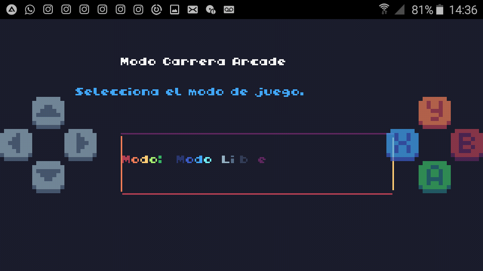
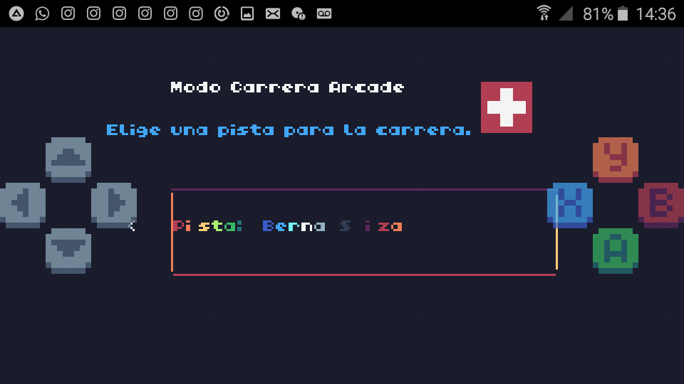
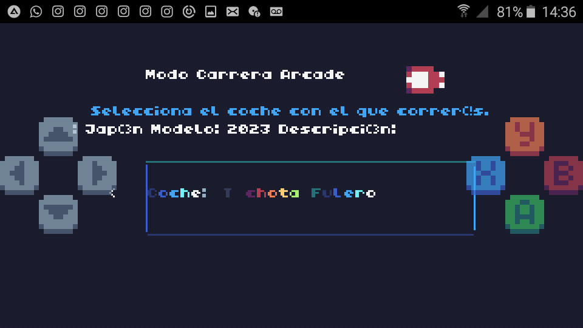
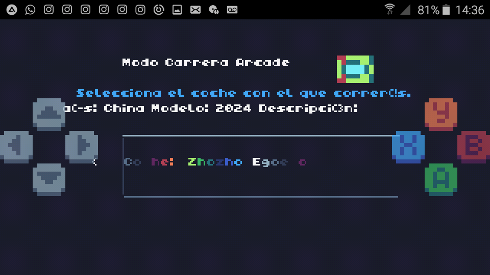
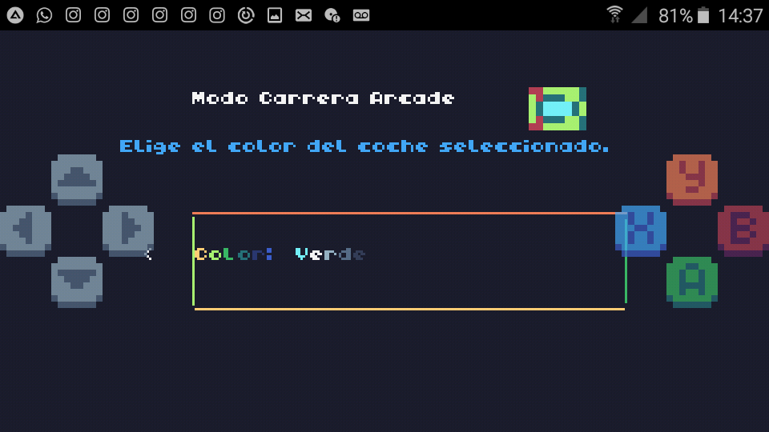
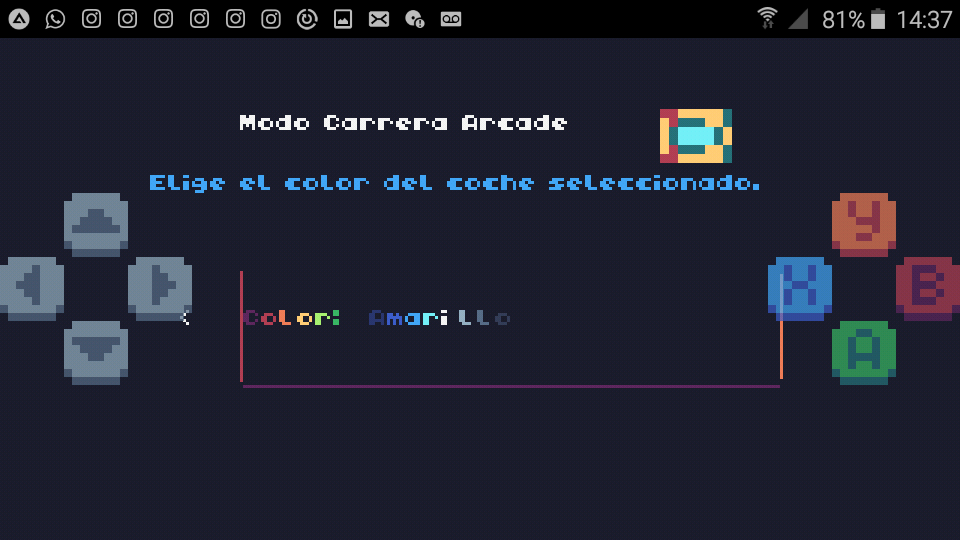
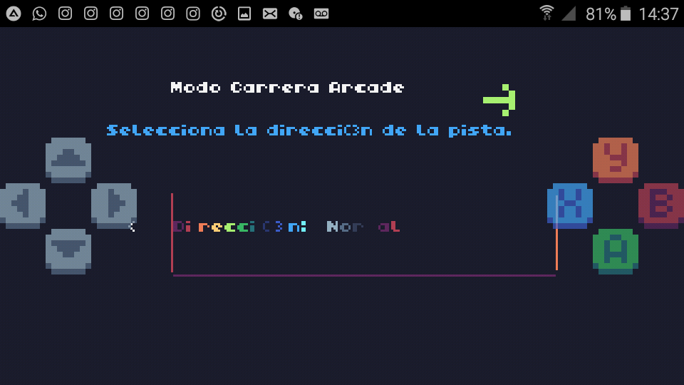
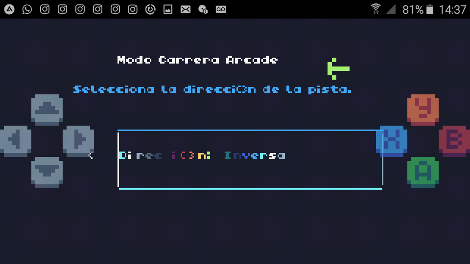
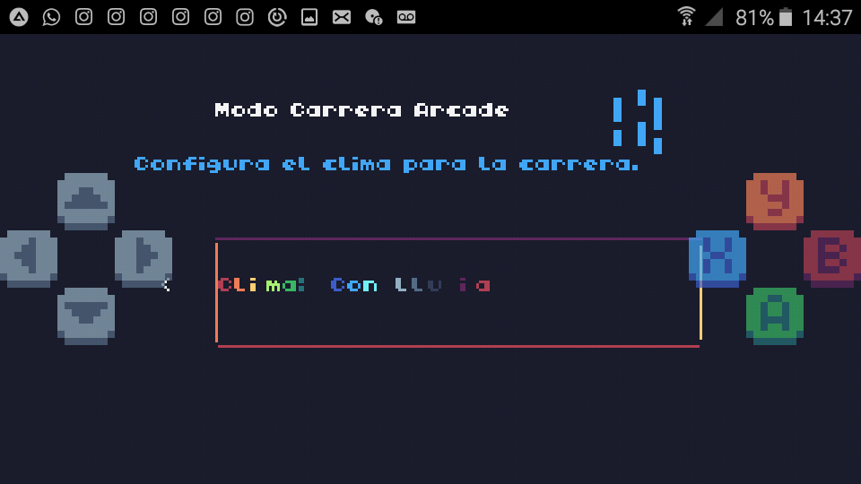
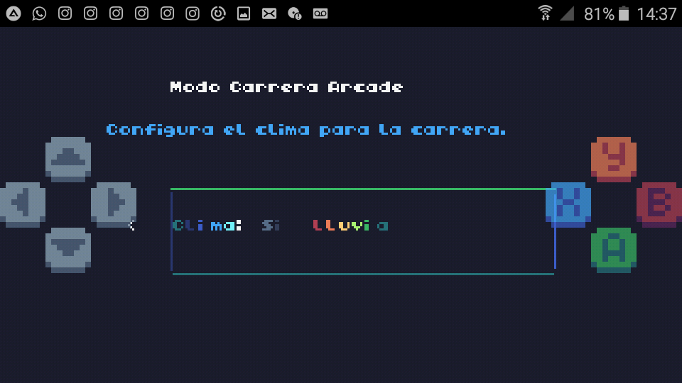

# 🎭 Modo Carrera Arcade


Elementos

#### ▶️-Modo Carrera / Libre


Carrera: Dar vueltas en un escenario.



Libre: Correr sin ningún objetivo.

#### ▶️-Pista

Berna,Suiza



#### ▶️-Coches

--Tochota Fulero ( Japón )



--ZhoZho EgoEgo ( China )



--Color

2 colores por cada coche.




#### ▶️-Direccion

Normal o Inversa.




#### ▶️-Con / Sin Lluvia




## ✨️Variables / Atributos

```

```

Funciones:

#### 🔑-1  menu()

Menú principal.

#### 🔑-2  cambiar_opcion(opcion,direccion)

Cambia las opciones según la entrada del jugador.

#### 🔑-3  carrera()

Pantalla de carrera.

#### 🔑-4  wrap( valor,max )

Función auxiliar para envolver índices.

#### 🔑-5  dibujar_rectangulo_arcoiris(x,y,w,h)

Función para dibujar rectángulos con bordes animados arcoíris.

#### 🔑-6  TIC()

Bucle principal.

