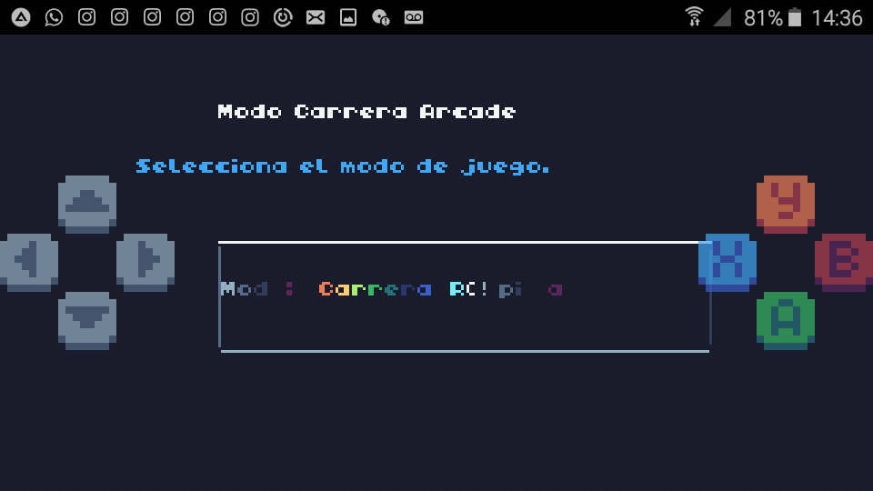

Modo Carrera

Elementos

#### ▶️-Modo Carrera / Libre

Carrera: Dar vueltas en un escenario.

Libre: Correr sin ningún objetivo.

#### ▶️-Pista

Berna,Suiza

#### ▶️-Coches

--Tochota Fulero ( Japón )

--ZhoZho EgoEgo ( China )

--Color

2 colores por cada coche.

#### ▶️-Direccion

Normal o Inversa.

#### ▶️-Con / Sin Lluvia

