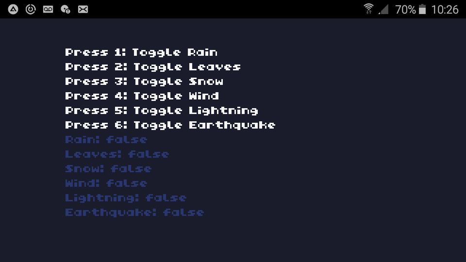
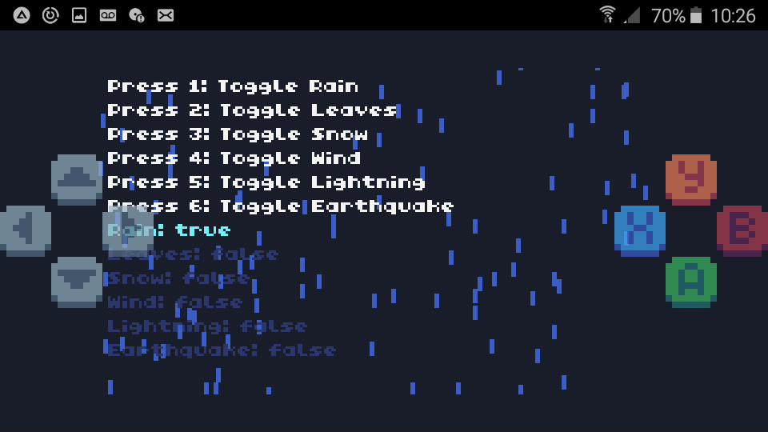
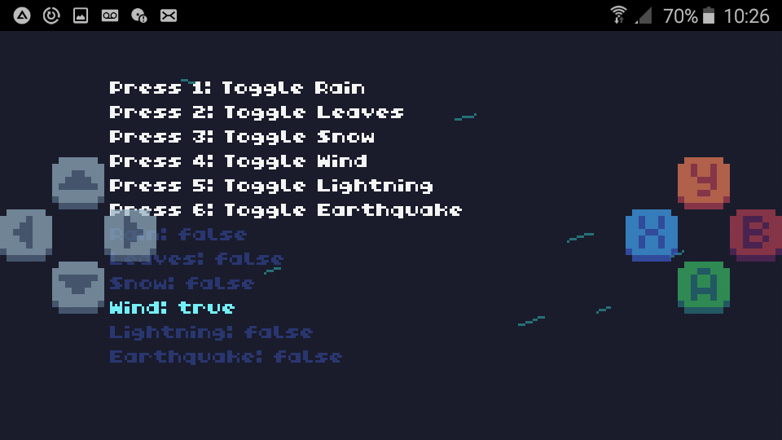
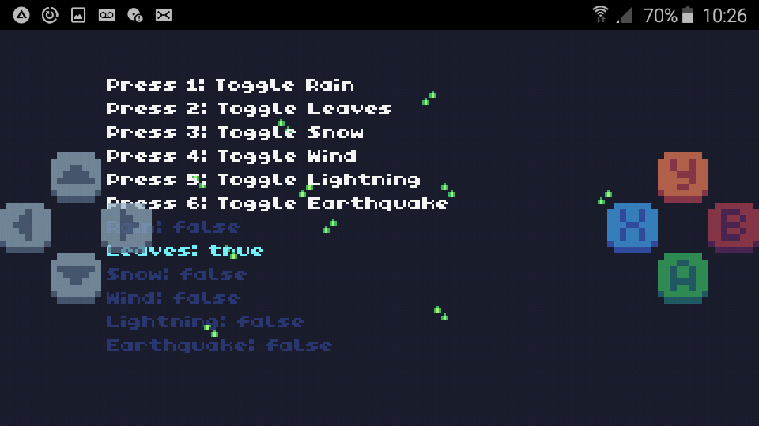
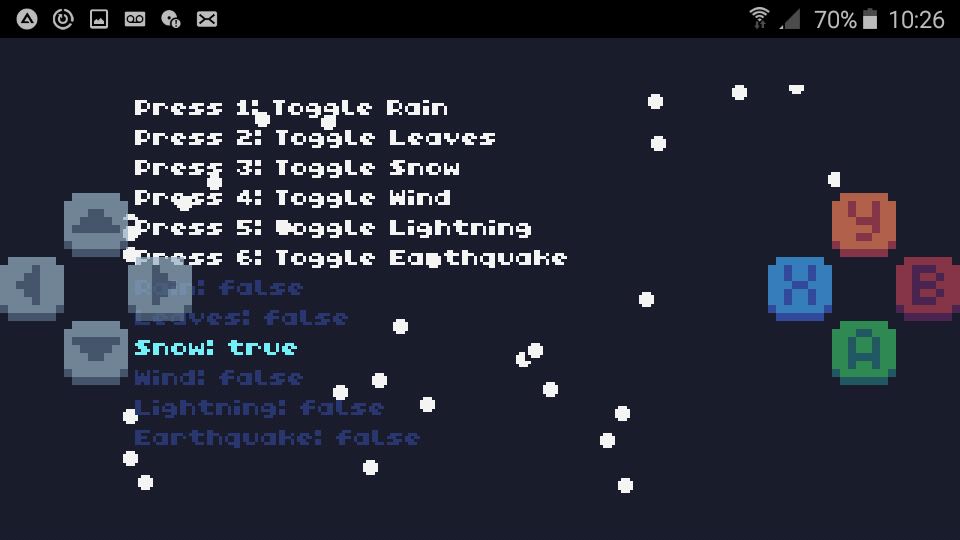
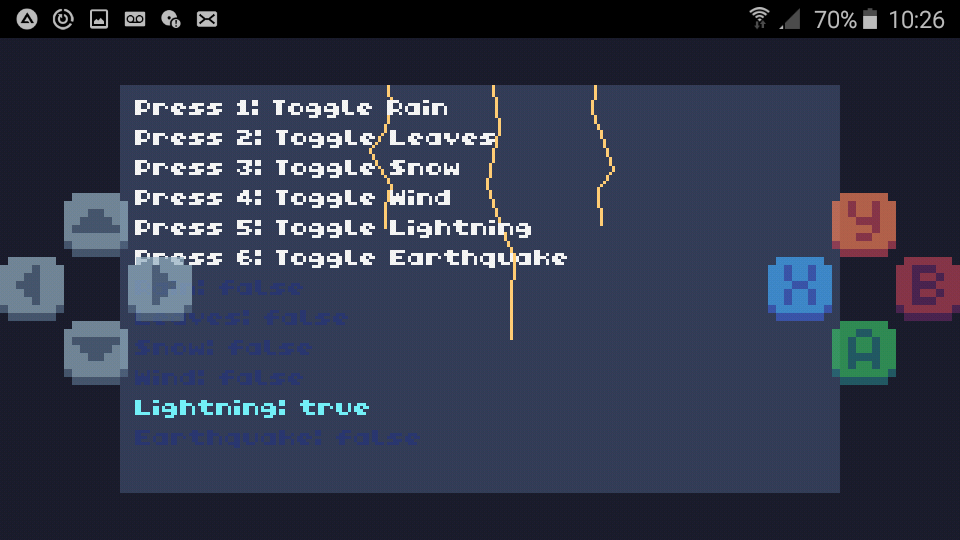

# 🎭 Climatologia


Distintos tipos de climas.


## 🎭 Tipos de Clima

### ⭐️ Sin Clima



### ⭐️ Lluvia



### ⭐️ Viento



### ⭐️ Hojas



### ⭐️ Nieve



### ⭐️ Relampagos



## 🎭 Variables / Atributos

```
-- Parámetros generales
raindrops = {}

leaves = {}

snowflakes = {}

wind_lines = {}

max_raindrops = 100

num_leaves = 10

max_snowflakes = 50

num_wind_lines = 8

wind_speed = 2 -- Velocidad del viento

-- Parámetros de los relámpagos
lightning_timer = 0

lightning_flash_duration = 5

lightning_active = false

-- Estado de los efectos
effects = {
    earthquake = false,
    rain = false,
    leaves = false,
    snow = false,
    wind = false,
    lightning = false
}

-- Parámetros de los efectos de terremoto
earthquake_intensity = 0

earthquake_timer = 0

earthquake_duration = 30  -- Duración del terremoto en ciclos

-- Variables del mapa
map_width = 240

map_height = 136

map_offsetX = 0

map_offsetY = 0
```

## 🎭 Funciones

#### 🔑-1  init_raindrops()

Inicializa las gotas de lluvia.

#### 🔑-2  init_leaves()

Inicializa las hojas.

#### 🔑-3  init_snowflakes()

Inicializa los copos de nieve.

#### 🔑-4  init_wind()

Inicializa las líneas de viento.

#### 🔑-5  update_earthquake()

Función de terremoto.

#### 🔑-6  toggle_earthquake()

Función de terremoto.

#### 🔑-7  update_raindrops()

Actualiza las gotas de lluvia.

#### 🔑-8  update_leaves()

Actualiza las hojas.

#### 🔑-9  update_snowflakes()

Actualiza los copos de nieve.

#### 🔑-10  update_wind()

Actualiza las líneas de viento.

#### 🔑-11  update_lightning()

Actualiza el estado del relámpago.

#### 🔑-12  draw_lightning_effect()

Dibuja el efecto de relámpago.

#### 🔑-13  draw_lightning(x_start,y_start,segments,length)

Genera un rayo zigzagueante.

#### 🔑-14  draw_raindrops()

Dibuja las gotas de lluvia.

#### 🔑-15  draw_leaves()

Dibuja las hojas.

#### 🔑-16  draw_snowflakes()

Dibuja los copos de nieve.

#### 🔑-17  draw_wind()

Dibuja el viento (líneas).

#### 🔑-18  draw_menu()

Dibuja el menú.

#### 🔑-19  toggle_effect(effect)

Manejo de efectos.

#### 🔑-20  toggle_earthquake()
REPETIDO

Manejo de efectos.

#### 🔑-21  TIC()

Bucle principal.