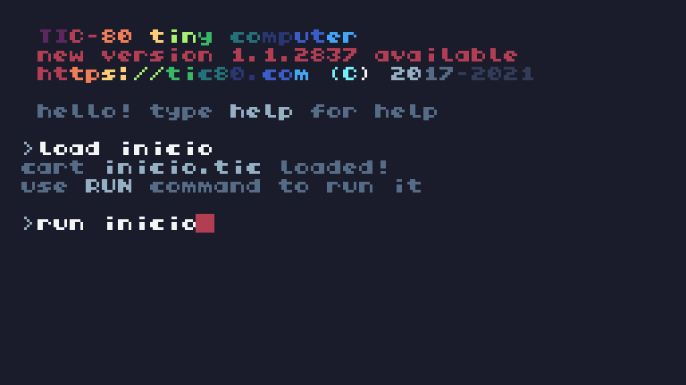
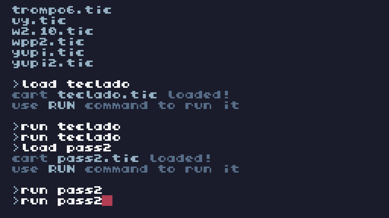
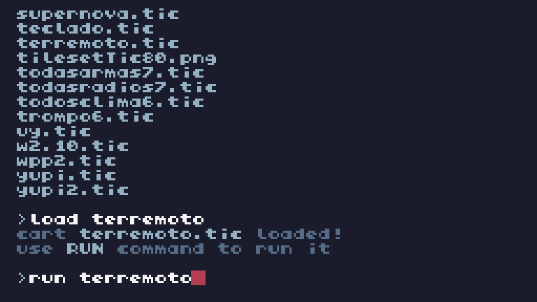

## ⭐️ Inicio



### ✨️ Variables / Atributos

```
-- Variables

1
t = 0

2
indice_mensaje = 1

3
mensajes = {
"Alta Facha Games",
"Todos los derechos reservados 2025",
"by Pascua",
"Proyecto 2025"
}

-- Generar estrellas en posiciones aleatorias
4
estrellas = {}
for i = 1, 50 do
    table.insert(estrellas, 
{x = math.random(0, 239), 
y = math.random(0, 135)})
end
```

### 🎃 Funciones

#### 🔑-1  dibujar_texto_arcoiris( texto,x,y )

Función para dibujar texto con efecto arcoíris.

#### 🔑-2  dibujar_estrellas()

Función para dibujar estrellas con efecto arcoíris.

#### 🔑-3  TIC().

Bucle principal.

## ⭐️ Créditos


### ✨️ Variables / Atributos

```
-- Variables
1
t = 0

2
y = 136  
-- Posición inicial de los créditos (fuera de la pantalla)

-- Texto de los créditos
3
creditos = {
			 "CREDITOS",
				"",
    "Director de Ética de IA: Pascua",
    "",
    "Generador de Contenido: ChatGPT",
    "",
    "Diseñador de Sprites: Pascua",
    "",
    "Director Ejecutivo de Código: ChatGPT",
    "",
    "Agradecimientos Especiales:",
    "",
    "- Chistes Random: Un tipo de internet",
}

-- Generar estrellas en posiciones aleatorias

4
estrellas = {}

5
for i = 1, 50 do
    table.insert
(estrellas, 
{x = math.random(0, 239), 
y = math.random(0, 135)})
end
```

### 🎃 Funciones

#### 🔑-1  dibujar_texto_arcoiris ( texto,x,y )

Función para dibujar texto con efecto arcoíris.

#### 🔑-2  dibujar_estrellas()

Función para dibujar estrellas con efecto arcoíris.

#### 🔑-3  TIC().

Bucle principal.


## ⭐️ Nafta


### ✨️ Variables / Atributos

```
-- Configuración inicial
1
local car_x = 120  
-- Posición inicial en X

2
local car_y = 68   
-- Posición inicial en Y

3
local fuel = 50    
-- Nafta inicial (cantidad total)

4
local max_fuel = 100 
-- Capacidad máxima del tanque

5
local fuel_consumption = max_fuel / 300 
-- Nafta consumida por frame

6
local speed = 1.5  
-- Velocidad del coche en píxeles por frame

7
local money = 200  
-- Dinero inicial en peluca$

8
local car_sprite = 0 
-- ID del sprite del coche

9
local running = true 
-- Indica si el coche está funcionando

-- Estación de servicio
10
local station_x = 50

11
local station_y = 50

12
local station_width = 30

13
local station_height = 30

14
local refill_cost = 100 
-- Costo de recargar el tanque
```

### 🎃 Funciones

#### 🔑-1 TIC().

Bucle principal.


## ⭐️ Moneda


### ✨️ Variables / Atributos

```
-- Variables
1
t = 0

2
x_personaje = 64  
-- Posición inicial del personaje (horizontal)

3
y_personaje = 64  
-- Posición inicial del personaje (vertical)

4
balanza = nil  
-- La balanza estará inicialmente inactiva

5
velocidad = 1  
-- Velocidad del personaje

6
direccion_balanza = 0  
-- Dirección de la balanza 
(0 = no disparada, 
1 = disparada hacia la derecha, 
-1 = disparada hacia la izquierda)

7
pos_balanza_x = 0  
-- Posición X de la balanza

8
pos_balanza_y = 64  
-- Posición Y de la balanza

9
-- Contador de balas
numero_balas = 20  
-- Número inicial de balas

10
disparando = false  
-- Estado de disparo

11
tiempo_frase = 0  
-- Temporador para la frase

12
frase_actual = ""  
-- Frase que se mostrará

13
tiempo_frase_mostrar = 0  
-- Tiempo en que se mostró la última frase

-- Frases aleatorias
14
frases = 
{"yupi", 
"ya tengo crédito para la SUBA"}

-- Posición de los coches
15
coches = {
    {x = 120, y = 64, colisionado = false},  
-- Primer coche
    {x = 120, y = 40, colisionado = false},  
-- Coche arriba
    {x = 120, y = 88, colisionado = false},  
-- Coche abajo
}

16
coche_explosion = false  
-- Estado de la explosión

17
explosion_tiempo = 0  
-- Temporizador para la animación de explosión

18
explosion_puntos = {}  
-- Lista de puntos para la explosión

-- Variables para el poder del jugador

19
poder_jugador = 0  
-- Poder que se mostrará al colisionar

20
poder_tiempo = 0  
-- Tiempo en que se generó el poder

21
mostrar_poder = false  
-- Indica si el poder debe mostrarse

-- Nueva variable para contar monedas
22
monedas = 0  
-- Contador de monedas

-- Posición de las monedas normales
23
monedas_pos = {
    {x = 100, y = 50, recogida = false},
    {x = 150, y = 100, recogida = false},
    {x = 200, y = 120, recogida = false},
}

-- Posición de las monedas especiales
24
monedas_especiales_pos = {
    {x = 120, y = 80, recogida = false},
    {x = 180, y = 140, recogida = false},
    {x = 50, y = 40, recogida = false},
    {x = 220, y = 90, recogida = false},
    {x = 30, y = 130, recogida = false},
    {x = 170, y = 60, recogida = false},
}

-- Estado de compra
25
comprando_chori = false  
-- Si está en proceso de comprar un chori
```

### 🎃 Funciones

#### 🔑-1  dibujar_personaje()

Función para dibujar el personaje.

#### 🔑-2  dibujar_coches()

.

#### 🔑-3  dibujar_balanza()

.

#### 🔑-4  dibujar_monedas()

.

#### 🔑-5  dibujar_monedas_especiales()

.

#### 🔑-6  mover_personaje()

.

#### 🔑-7  detectar_colision_monedas()

.

#### 🔑-8  detectar_colision_monedas_especiales()

.

#### 🔑-9  mostrar_monedas()

.

#### 🔑-10  mostrar_frase()

.

#### 🔑-11  mostrar_opcion_comprar_chori()

.

#### 🔑-12  comprar_chori()

.

#### 🔑-13  mostrar_texto_abajo()

.

#### 🔑-14 TIC().

Bucle principal.


## ⭐️ Parada


### ✨️ Variables / Atributos

```
-- Variables
1
t = 0

2
x_personaje = 64  
-- Posición inicial del personaje (horizontal)

3
y_personaje = 64  
-- Posición inicial del personaje (vertical)

4
velocidad = 1  
-- Velocidad del personaje

-- Posición de la tarjeta SUBA
5
tarjeta_suba = {x = 100, y = 50, recogida = false}

-- Mensajes al recoger la tarjeta SUBA
6
mensaje_suba = ""

7
tiempo_mensaje = 0  
-- Temporizador para mostrar mensajes

-- Cantidad de Peluca$ que posee el jugador
8
peluca_saldo = 8000

-- Crédito inicial de la tarjeta SUBA
9
suba_credito = 0

-- Frases al cargar la SUBA
10
frases_carga = {
    "Ahora me puedo ir de joda",
    "Justo en la billetera",
    "Espero no llegar al saldo negativo",
    "Qué caro che"
}

11
frase_carga_actual = ""

12
tiempo_frase_carga = 0  
-- Temporizador para mostrar la frase de carga

-- Variables para el colectivo
13
colectivo = {
    x = 104,  
-- Posición inicial del colectivo (en el mapa)
    y = 32,   
-- Posición vertical
    moviendo = false  
-- Estado del colectivo (si está en movimiento)
}

```

### 🎃 Funciones

#### 🔑-1  dibujar_personaje()

.

#### 🔑-2  dibujar_tarjeta_suba()

.

#### 🔑-3  mover_personaje()

.

#### 🔑-4  detectar_colision_tarjeta_suba()

.

#### 🔑-5  mostrar_mensaje_suba()

.

#### 🔑-6  cargar_suba()

.

#### 🔑-7  mostrar_saldos()

.

#### 🔑-8  mostrar_frase_carga()

.

#### 🔑-9  dibujar_parada()

.

#### 🔑-10  interactuar_con_parada()

.

#### 🔑-11  mover_colectivo()

.

#### 🔑-12  mostrar_texto_parada()

.

#### 🔑-13  mostrar_texto_colectivo()

.

#### 🔑-14  TIC().

Bucle principal.

## ⭐️ Menú de Pausa


### ✨️ Variables / Atributos

```
-- Variables

1
t = 0

2
y = 136  
-- Posición inicial de los créditos

3
seleccion = 1  
-- Índice de la opción seleccionada

-- Opciones del menú
4
opciones_menu = {
    "Misiones",
    "Objetos",
    "Armas",
    "Vehiculos",
    "Estadísticas",
    "Enciclopedia",
    "DiosGPT"
}

-- Descripciones de cada opción
5
descripciones_menu = {
    "Explora diferentes misiones",
    "Accede a tus objetos",
    "Consulta tus armas disponibles",
    "Gestiona tus vehículos",
    "Revisa tus estadísticas",
    "Consulta la enciclopedia",
    "Accede a DiosGPT"
}

-- Generar estrellas en posiciones aleatorias

6
estrellas = {}

7
for i = 1, 50 do
    table.insert(estrellas, 
{x = math.random(0, 239), 
y = math.random(0, 135)})
end

```

### 🎃 Funciones

#### 🔑-1  dibujar_texto_arcoiris(texto,x,y,color_seleccionado)

.

#### 🔑-2  dibujar_estrellas()

.

#### 🔑-3  dibujar_minimapa()

.

#### 🔑-4  dibujar_menu()

.

#### 🔑-5  TIC()

Bucle principal.


## ⭐️ Lector de Diarios


### ✨️ Variables / Atributos

```
-- Variables de desplazamiento
1
scroll = 0

2
scroll_max = 480 
-- Máximo desplazamiento ajustado para el contenido visible

```

### 🎃 Funciones

#### 🔑-1  dividir_texto_por_palabras(texto,max_caracteres)

.

#### 🔑-2  dibujar_diario()

.

#### 🔑-3  actualizar_scroll()

.

#### 🔑-4  TIC()

Bucle principal.


## ⭐️ Skate


### ✨️ Variables / Atributos

```
-- Posición inicial del skate
1
local x, y = 120, 68

2
local mounted_right_to_left = false  
-- Estado para saber si el skate se está montando de derecha a izquierda

3
local mounted_left_to_right = false  
-- Estado para saber si el skate se está montando de izquierda a derecha

4
local sparks = {}  
-- Lista para almacenar las posiciones de las chispas
```

### 🎃 Funciones

#### 🔑-1 TIC()

Bucle principal.

### ⭐️ Jetpack


.

#### 🔑-2  update_sparks()

.

#### 🔑-3  draw_sparks()

.

#### 🔑-4  TIC()

Bucle principal.


## ⭐️ Telescopio


### ✨️ Variables / Atributos

```
Ninguna? ( en Init() )
```

### 🎃 Funciones

#### 🔑-1  init()

.

#### 🔑-2  draw_star(x,y,color)

.

#### 🔑-3  draw_visible_stars()

.

#### 🔑-4  draw_visible_shooting_star()

.

#### 🔑-5  update_shooting_star()

.

#### 🔑-6  update_telescope()

.

#### 🔑-7  draw_telescope()

.

#### 🔑-8  TIC()

Bucle principal.


## ⭐️ Mensajes Moviles


### ✨️ Variables / Atributos

```
1
t = 0

2
mostrar_mensaje = false

3
tiempo_mensaje = 0

-- Animación del ícono de WhatsApp

4
whatsapp_icons = {16, 32, 48}  
-- Ids de los íconos para la animación

5
icono_gato = 96                
-- Id del ícono del gato

6
frame_actual = 1               
-- Frame de animación actual

-- Datos del mensaje

7
remitente = "Gatito"

8
mensaje = "Miau miau miau ('Dame de comer, gil')"
```

### 🎃 Funciones

#### 🔑-1  split_lines(text,max_width)

.

#### 🔑-2  print_rainbow(text,x,y)

.

#### 🔑-3  TIC()

Bucle principal.

## ⭐️ Teclado 1


### ✨️ Variables / Atributos

```
- Variables para el teclado

1
teclado = {
    {"Q", "W", "E", "R", "T", "Y", "U", "I", "O", "P"},
    {"A", "S", "D", "F", "G", "H", "J", "K", "L"},
    {"Z", "X", "C", "V", "B", "N", "M"},
    {"Enter", "Borrar"}
}

2
cursor_x = 1

3
cursor_y = 1

4
texto_escrito = ""

5
clave_correcta = "inglish"

6
pantalla_correcta = false

-- Tamaño de las teclas y posiciones iniciales

7
TECLA_ANCHO = 20

8
TECLA_ALTO = 10

9
ESPACIO_X = 5

10
ESPACIO_Y = 5

11
POS_X_INICIAL = 0

12
POS_Y_INICIAL = 40
```

### 🎃 Funciones

#### 🔑-1  dibujar_teclado()

.

#### 🔑-2  mover_cursor()

.

#### 🔑-3  selecionar_tecla()

.

#### 🔑-4  dibujar_texto()

.

#### 🔑-5  dibujar_pantalla_correcta()

.

#### 🔑-6  TIC()

Bucle principal.


## ⭐️ Teclado 2



### ✨️ Variables / Atributos

```
-- Configuración de variables

1
local correct_password = "1234"  
-- La contraseña correcta

2
local input_password = ""        
-- La contraseña ingresada por el usuario

3
local message = ""               
-- Mensaje a mostrar

4
local selected_key = 1           
-- Tecla seleccionada (índice del teclado)

5
local keys = {
    "1", "2", "3",
    "4", "5", "6",
    "7", "8", "9",
    "0", "Borrar", "Enter"
}  
-- Teclas disponibles

-- Colores del arcoíris
6
local rainbow_colors = {8, 12, 11, 10, 9, 7, 6}

7
local color_offset = 0  
-- Offset para animar el arcoíris
```

### 🎃 Funciones

#### 🔑-1  draw_keyboard()

.

#### 🔑-2  handle_input()

.

#### 🔑-3  print_rainbow(text,x,y)

.

#### 🔑-4  TIC()

Bucle principal.


## ⭐️ Terremoto



### ✨️ Variables / Atributos

```
1
t = 0

2
x = 5

3
y = 80  
-- Posición más cercana al límite inferior de la pantalla

-- Variables de desplazamiento

4
indice_frase = 1

5
temblor_intensidad = 5 
-- Aumenté la intensidad del temblor

6
temblor_duracion = 30 
-- Duración del temblor en cuadros

7
temblor_tiempo = 0 
-- Contador de tiempo para duración del temblor
```

### 🎃 Funciones


#### 🔑-1  aplicar_temblor()

.

#### 🔑-2  TIC()

Bucle principal.
