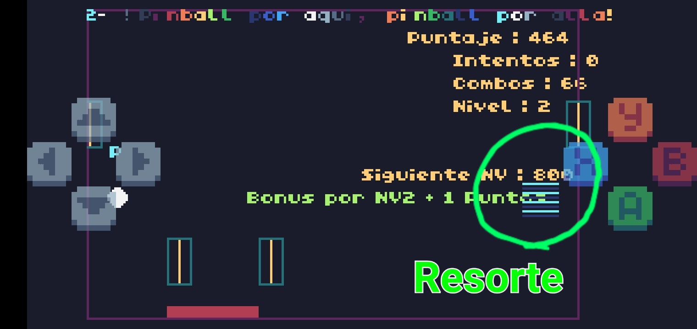
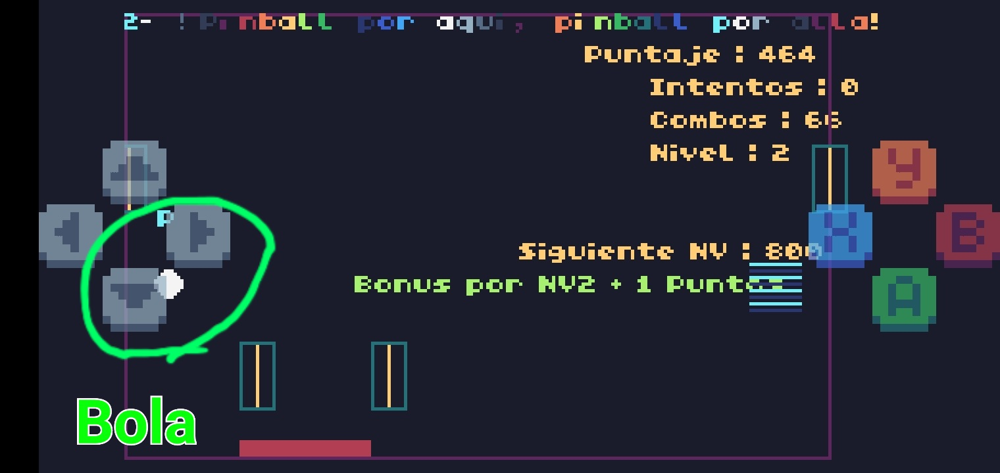
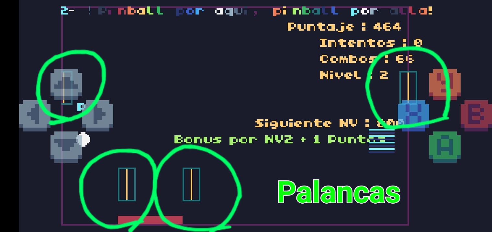
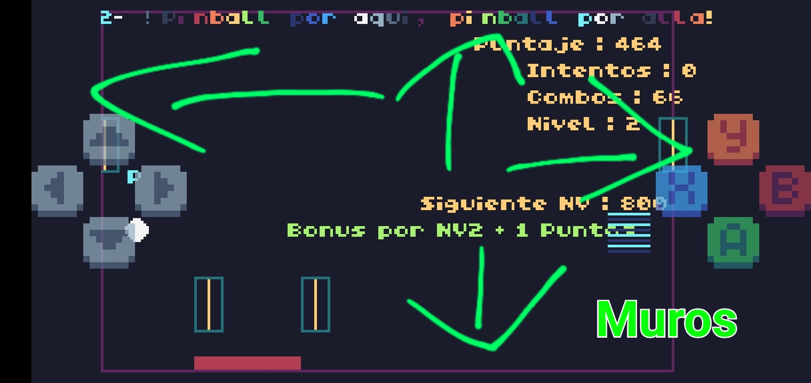
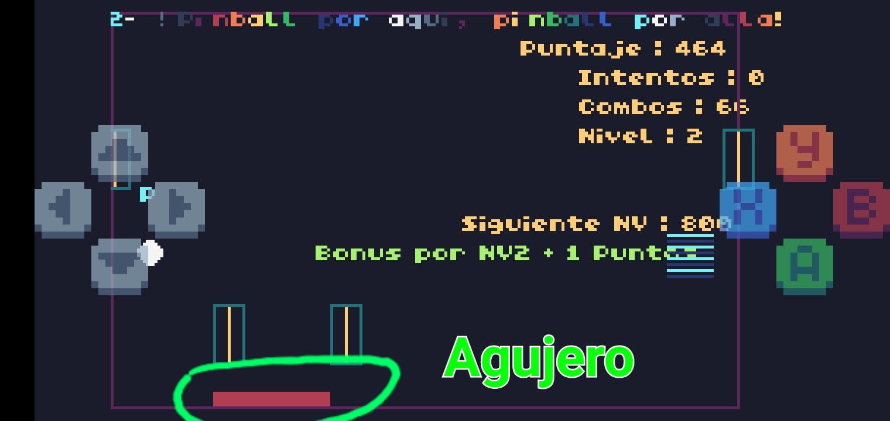
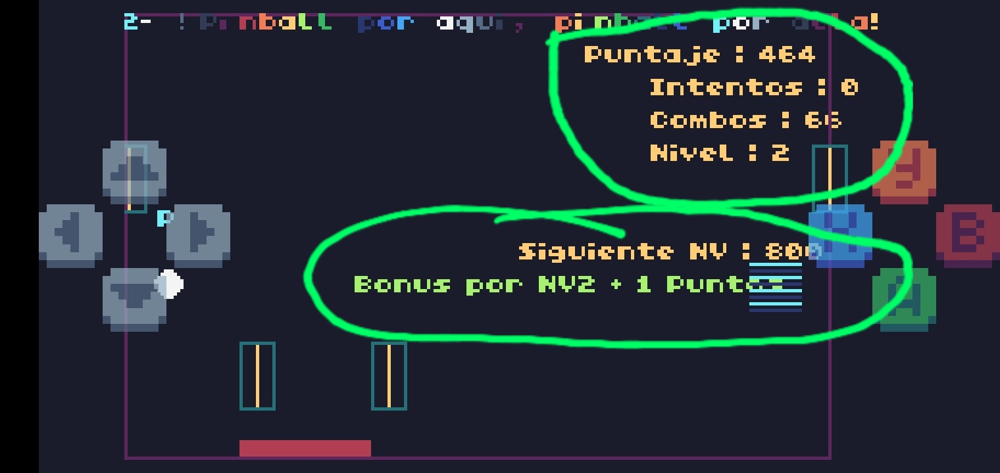
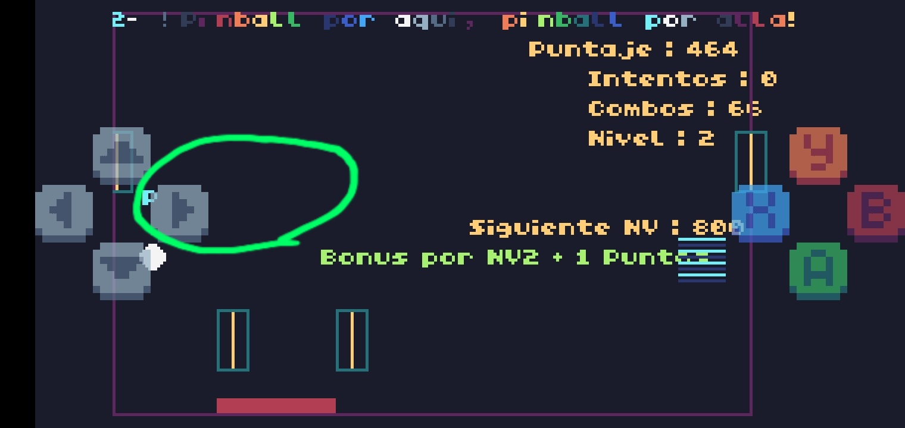
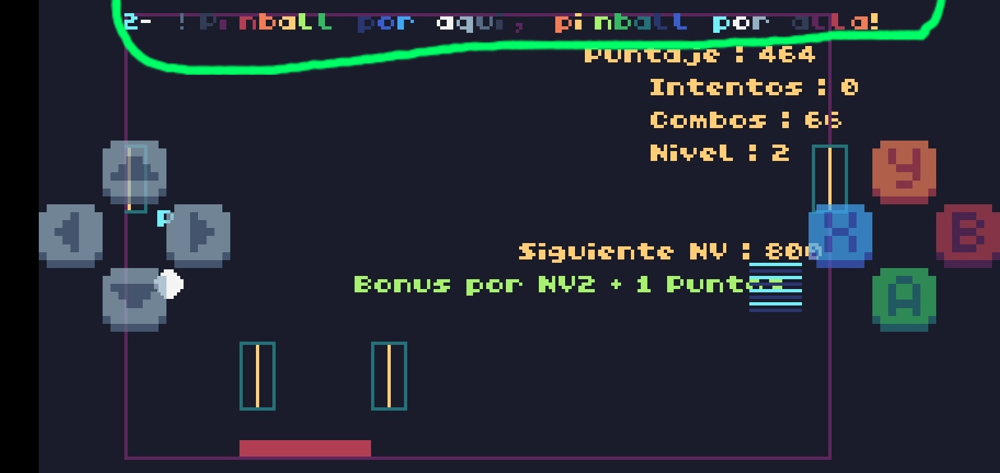

# 🎭 Pinball


## 🎭 Elementos:

#### ✨️-Resorte

Es el que dispara la bola.



#### ✨️-Bola

Rebota en el escenario.



#### ✨️-Palancas

Hay 2 de cada lado,con el botón de dirección se mueven ambas del mismo lado ( = izquierdo o derecho ).



#### ✨️-Muros

Para evitar que la bola se salga de la pantalla.Al tocar un muro este se enciende.



#### ✨️-Agujero ( Game Over )

Por donde cae la bola y se pierde una vida.



#### ✨️-Combos,Puntos y Niveles

Al rebotar múltiples veces la bola se generan combos.
Al subir de niveles se multiplican los puntos recibidos.



Puntos necesarios para subir de Nivel :
```
NV2=300
NV3=800
NV4=1300
NV5=1800
NV6=3000
NV7=5500
NV8=9000
NV9=15000
```
#### ✨️-Frase a Completar ( Hashtags )

Se van completando con cada Rebote.
Al completarse el jugador gana puntos y se empieza a completar otra frase.



```
"Tecnofeudalismo",
"Cuchi Cuchi Cuchi",
"No seas gilipollas",
"Viva el britpop",
"Party Hard",
"Usa condon,no seas pelotudo",
"Soy la hostia tio"
```

#### ✨️-Rap

Se reproduce mientras el jugador está jugando.


``` 
"1- Rap del pinball en Buenos Aires",
"2- Pinball por aqui, pinball por alla!",
"3- Que vuele el pinball, rebote y gire",
"4- Pinball, pinball, siempre para adelante!"
```

## ✨️Variables / Atributos

```
-- Variables de la bola
local ball = {x = 190, y = 120, vx = 0, vy = 0, radius = 4}

local ball_launched = false

nv=1
nvsig=300
signv2=300
signv3=800
signv4=1300
signv5=1800
signv6=3000
signv7=5500
signv8=9000
signv9=15000

combos=0

-- Variables de las paletas

local paddle_left = {x = 40, y = 100, length = 20, angle = -math.pi / 2}  -- Inicialmente hacia abajo

local paddle_right = {x = 80, y = 100, length = 20, angle = -math.pi / 2}  -- Inicialmente hacia abajo

local paddle_top_left = {x = 1, y = 40, length = 20, angle = -math.pi / 2}  -- Paleta en la parte superior izquierda (más arriba)

local paddle_top_right = {x = 214, y = 40, length = 20, angle = -math.pi / 2}  -- Paleta en la parte superior derecha (más arriba)

intentos=0

-- Agujero

local hole = {x = 35, y = 130, width = 40, height = 10}

hashtag="Sos el rey de la fiesta wacho"

hashtags= {"Tecnofeudalismo",
"Cuchi Cuchi Cuchi",
"No seas gilipollas",
"Viva el britpop",
"Party Hard",
"Usa condon,no seas pelotudo",
"Soy la hostia tio"} 

contadorcolision=0

colorizq=4

colorder=4

colorarr=4

coloraba=4

colorpaletaizq=1

colorpaletader=1

colorpaletaarr=1

colorpaletaaba=1

poshash=1

-- Puntaje
local score = 0

-- Círculos animados
local circles = {}
```

## 🎭 Funciones:

#### 🔑-1  update_ball()

Maneja el movimiento de la bola.

#### 🔑-2  update_paddles()

Maneja las paletas.

#### 🔑-3  draw_paddle( paddle )

Dibujar una paleta como línea rotada.

#### 🔑-4  create_animated_circles()

Crea círculos animados.

#### 🔑-5  update_circles()

Actualiza los círculos animados.

#### 🔑-6  draw_spring()

Dibuja el resorte debajo de la bola.

#### 🔑-7  wall_collision()

Maneja la colisión de la bola con las paredes.

#### 🔑-8  draw_paddle_collision(paddle)

Dibuja área de colisión de las paletas.

#### 🔑-9  frase()

Dibuja frases del Rap del Pinball.

#### 🔑-10  imprimir_frase(frase,num_caracteres)

Imprimir una frase ( hashtag ) hasta un número de caracteres.

#### 🔑-11  TIC()

Bucle principal.
