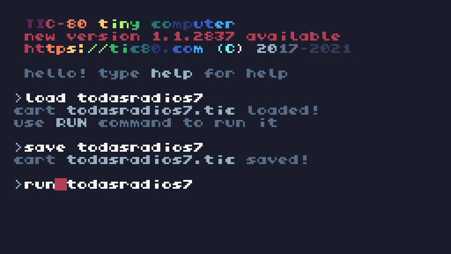
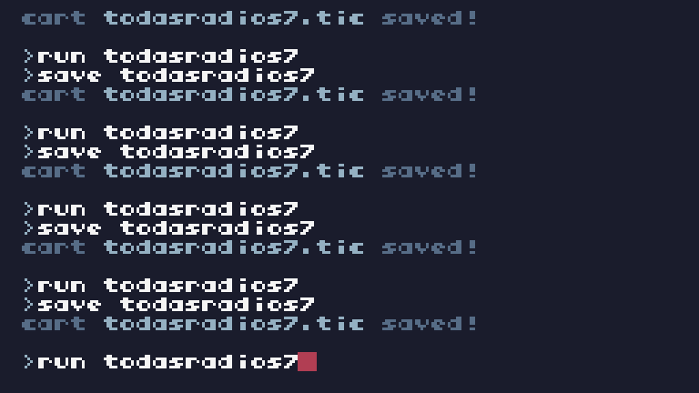

# 🎭 Radios


### 🎃 Características 

✨️ Dialogo Automatico.

✨️ 22 Radios Diferentes ( con su Número y Nombre en pantalla ).

#### 🎭"01 Radio Todo Vardo" 

⭐️ Noticias Locales

⭐️ Locutor/es : Barcelo Monelli

```
    "1. Barcelo: ¡Urgente en Todo Vardo!",
    "2. Barcelo: Estamos en vivo con Juan Garcamaru.",
    "3. Barcelo: Juan, ¿qué está pasando con las galletitas CULO?",
    "4. Juan: Buenas tardes, Barcelo. La inflación nos está destruyendo.",
    "5. Barcelo: ¿Inflación del 1200%? ¿Cómo afecta esto a las ventas?",
    "6. Juan: Nadie compra. Antes eran 50 pesos, ahora 15 mil.",
    "7. Barcelo: ¡Es una locura! ¿Qué dice la empresa?",
    "8. Juan: La empresa está considerando cambiar el nombre.",
    "9. Barcelo: ¿El nombre? ¿Cómo lo cambiarían?",
    "10. Juan: Quizás 'Delicias Niponas'. Algo más refinado.",
    "11. Barcelo: Pero el nombre CULO es histórico...",
    "12. Juan: Lo sabemos, pero el público lo asocia con inflación.",
    "13. Barcelo: ¿Qué piensa hacer la empresa para sobrevivir?",
    "14. Juan: Estamos lanzando galletitas más pequeñas.",
    "15. Barcelo: ¿Más pequeñas? ¿Y el precio?",
    "16. Juan: Más caras, claro. ¡No tenemos opción!",
    "17. Barcelo: ¿Y qué dice el gobierno sobre esta crisis?",
    "18. Juan: Nos prometieron subsidios, pero nunca llegaron.",
    "19. Barcelo: ¿Creen que podrán superar esta situación?",
    "20. Juan: Es difícil, pero confiamos en el mercado nipón.",
    "21. Barcelo: ¿Exportarían galletitas CULO a Japón?",
    "22. Juan: Sí, allá el nombre sería un éxito.",
    "23. Barcelo: ¡Esto es increíble! Últimas palabras, Juan.",
    "24. Juan: Coman CULO, mientras puedan pagarlas.",
    "25. Barcelo: Seguiremos informando. Esto fue Todo Vardo."
}
```

#### 🎭"02 Radio Bajones"

⭐️Tango

⭐️Locutor/es : 


```
    "1. Locutor: Desde Radio Bajones les traemos esto para amargarles el día. Buena tarde.",
    "2. Locutor: Hoy les presentamos a Bajolini, quien nos cantará su tema 'Mi Querido Pinball'.",
    "3. Locutor: 'Mi Querido Pinball' es una canción melancólica sobre un juego de cartas que se fue perdiendo con el tiempo.",
    "4. Locutor: Pero antes de escuchar a Bajolini, les dejamos con un vistazo al juego de cartas...",
    "5. Cantante (Bajolini): (Empieza a cantar) 'En la mesa de cartas, todo se perdió,'",
    "6. Bajolini: 'Mi querido Pinball, tu suerte se acabó.'",
    "7. Bajolini: 'Las cartas caen lentamente, en el olvido total,'",
    "8. Bajolini: 'Un juego perdido, que se desvanece como un mal.'",
    "9. Bajolini: 'Pinball, querido Pinball, lo que un día fue,'",
    "10. Bajolini: 'Las cartas están vacías, ya no hay nada que hacer.'",
    "11. Bajolini: 'El mercado se cierra, las cartas se pierden,'",
    "12. Bajolini: 'El juego se acaba, y yo solo quiero volver a creer.'",
    "13. Bajolini: 'Mi querido Pinball, tu nombre lo recordaré,'",
    "14. Bajolini: 'Pero en este juego ya no hay más que perder.'",
    "15. Bajolini: 'A veces me pregunto si alguna vez fue real,'",
    "16. Bajolini: 'Mi querido Pinball, ahora todo es tan fatal.'",
    "17. Locutor: Y así, amigos, terminó nuestra triste canción,",
    "18. Locutor: 'Mi Querido Pinball', la reflexión sobre un juego olvidado.",
    "19. Locutor: Bajolini nos ha dejado una marca melancólica, hasta la próxima en Radio Bajones."
```

#### 🎭"03 Radio Poesía de la Calle"

⭐️Trap

⭐️Locutor/es : 


```
    "1. Locutor: Bienvenidos a Radio Poesía de la Calle, donde la calle tiene voz.",
    "2. Locutor: Hoy les traemos el último éxito del dúo ruso-senegalés.",
    "3. Locutor: La canción se llama 'Ojiva Nuclear', un trap erótico que lo tiene todo.",
    "4. Duo: (Cantando) 'Ella sabe por qué usa la IA,'",
    "5. Duo: 'Madam, quiere mi ojiva nuclear.'",
    "6. Duo: 'En la pista caliente, todo va a estallar,'",
    "7. Duo: 'Mi ritmo te domina como un misil en el radar.'",
    "8. Duo: 'Ella dice que el algoritmo no la puede controlar,'",
    "9. Duo: 'Pero conmigo siempre quiere bailar.'",
    "10. Duo: 'Ojiva, ojiva, me quiere activar,'",
    "11. Duo: 'Madam, eres mi única señal.'",
    "12. Locutor: Esto fue 'Ojiva Nuclear'. Hasta la próxima en Radio Poesía de la Calle."
```

#### 🎭"04 Gobierno de Argentina"

⭐️Cadena Nacional

⭐️Locutor/es : Presidente


```
    "1. Locutor: De acuerdo a la ley 24.422, que regula la radiodifusión en Argentina,",
    "2. Locutor: transmitimos esta Cadena Nacional 2025 N1 en vivo para toda la nación.",
    "3. Locutor: En esta histórica transmisión, el Presidente Armando Gene Tinoman nos hablará.",
    "4. Presidente: Buenas noches a todos los argentinos y argentinas.",
    "5. Presidente: Hoy tengo el honor de compartir con ustedes una noticia personal.",
    "6. Presidente: Estoy embarazado. Sí, escucharon bien, embarazado.",
    "7. Presidente: Este logro es el fruto de avances científicos y sociales increíbles.",
    "8. Presidente: A través de esta experiencia, quiero promover prácticas saludables.",
    "9. Presidente: Hoy lanzo un programa nacional para fomentar el bienestar en el embarazo masculino.",
    "10. Presidente: Incluirá cobertura médica completa y apoyo psicológico.",
    "11. Presidente: También crearemos una red de acompañamiento y educación.",
    "12. Presidente: Juntos construiremos un futuro inclusivo para todos.",
    "13. Locutor: Esto fue la Cadena Nacional 2025 N1. Muchas gracias."
```


#### 🎭"05 Solos y Solas"

⭐️Relaciones Amorosas

⭐️Locutor/es : Profesor Levantini y Profesora Dopamina


```
    "1. Locutor: Bienvenidos a 'Solos y Solas ;)',",
    "2. Locutor: el programa donde exploramos cómo las relaciones van de mal en peor.",
    "3. Locutor: Hoy tenemos una entrevista con Virgolini, quien nos contará una historia sorprendente.",
    "4. Profesor Levantini: Bienvenido Virgolini, ¿puedes contarnos qué sucedió?",
    "5. Virgolini: Claro, todo comenzó cuando le regalé 1000 USD a la persona que me interesaba.",
    "6. Virgolini: Pensé que iba a ser un gesto de cariño, pero me respondió con un escopetazo.",
    "7. Profesor Levantini: ¡Vaya, eso suena terrible! ¿Qué opinas sobre el estado actual de las relaciones?",
    "8. Profesor Levantini: En estos tiempos, las relaciones casuales de 1 minuto están de moda.",
    "9. Profesor Levantini: No es sorprendente que las cosas estén tan mal. Las expectativas son cada vez más bajas.",
    "10. Profesora Dopamina: Es cierto, la gente busca conexiones instantáneas, pero se olvidan del valor real.",
    "11. Locutor: Así concluye nuestra entrevista con Virgolini. Nos vemos la próxima vez.",
```

#### 🎭"06 Desgracias Economicas"

⭐️Economia

⭐️Locutor/es : 


```
    "1. Locutor: Bienvenidos a 'Desgracias Económicas',",
    "2. Locutor: el programa donde analizamos las cotizaciones del dólar en tiempo real.",
    "3. Locutor: Hoy, las cotizaciones del dólar están por las nubes.",
    "4. Locutor: Dólar Otaku: 10000 pesos.",
    "5. Locutor: Dólar Cuchi Cuchi: 25000 pesos.",
    "6. Locutor: Dólar Papas Fritas: 30000 pesos.",
    "7. Locutor: Dólar Chocolate con Maní: 28000 pesos.",
    "8. Locutor: Y el riesgo país, como siempre: Siga Siga.",
    "9. Locutor: Crecimiento proyectado 2025: Ay, qué horror.",
    "10. Locutor: ¡Así está la situación económica! No se despeguen de 'Desgracias Económicas'."
```


#### 🎭"07 Joyas de la Historia"

⭐️Historia

⭐️Locutor/es : 


```
    "1. Locutor: Bienvenidos a 'Joyas de la Historia Argentina Desconocidas',",
    "2. Locutor: el programa que descubre las historias que la historia nunca contó.",
    "3. Locutor: Hoy les traemos una increíble anécdota sobre el General San Martín.",
    "4. Locutor: En una entrevista exclusiva con el historiador Damian Blablaman,",
    "5. Locutor: nos cuenta cómo San Martín, tras una revalorización del idioma Turro Rioplatense en Asia Oriental,",
    "6. Locutor: se animó a hablar en este idioma en un evento internacional.",
    "7. Damian Blablaman: 'San Martín, conocido por su astucia y liderazgo, en este evento histórico,",
    "8. Damian Blablaman: sorprendió a todos cuando, con total seguridad, habló en Turro Rioplatense, un idioma casi olvidado'.",
    "9. Damian Blablaman: 'Este hecho no solo marcó un hito en la historia argentina, sino también en la revalorización de lenguas olvidadas.'",
    "10. Locutor: Una historia fascinante que pone en perspectiva la importancia de nuestra identidad cultural.",
    "11. Locutor: ¡Esto fue 'Joyas de la Historia Argentina Desconocidas'! No se lo pierdan la próxima vez."
```

#### 🎭"08 No me Importa"

⭐️Internacional

⭐️Locutor/es : 


```
    "1. Locutor: Bienvenidos a 'No me Importa',",
    "2. Locutor: el espacio que te mantiene informado, sin importar cuán irrelevante sea.",
    "3. Locutor: Hoy, en noticias internacionales, nos llega una actualización impactante desde Europa.",
    "4. Locutor: En el año 2025, Suiza y Noruega han comenzado una guerra sin precedentes,",
    "5. Locutor: una guerra en la que se utilizan huevos de pascua bomba como armas de destrucción masiva.",
    "6. Locutor: Según fuentes confiables, los huevos de pascua bomba tienen una gran capacidad de explosión,",
    "7. Locutor: y han sido utilizados por ambos países en una serie de ataques sorpresivos.",
    "8. Locutor: La situación ha escalado rápidamente, con ambos bandos desplegando ejércitos enteros de huevos de pascua.",
    "9. Locutor: Los analistas internacionales aseguran que es la guerra más surrealista de la historia reciente.",
    "10. Locutor: Los expertos en armamento explican que la efectividad de estos huevos de pascua bomba",
    "11. Locutor: se debe a su capacidad de camuflaje, ya que son difíciles de detectar antes de su explosión.",
    "12. Locutor: En un giro inesperado, los líderes de ambos países han llamado a una tregua para negociar...",
    "13. Locutor: ...pero hasta ahora no ha habido avances significativos.",
    "14. Locutor: Esto fue 'No me Importa'. Mantente al tanto de lo que realmente no te importa."
```

#### 🎭"09 Radio Antimainstream"

⭐️Historias Unicas

⭐️Locutor/es : 


```
    "1. Locutor: Bienvenidos a Radio Antimainstream, donde las historias van más allá de lo común.",
    "2. Locutor: Hoy les traemos una historia exclusiva desde el Barrio Viejo de Montevideo.",
    "3. Locutor: Cerebrito y Wachin, dos chicos inquietos, van en busca de un árcade perdido.",
    "4. Cerebrito: ¡Wachin, sabías que la historia de este lugar tiene tintes de lo que podría considerarse una 'alegoría'?",
    "5. Wachin: ¡Che, ¿cómo vas a hablar así en este barrio?! ¡Cualquiera entiende lo que quiero decir, man!",
    "6. Locutor: En un rincón oscuro del Barrio Viejo, los chicos encuentran la puerta de entrada.",
    "7. Cerebrito: Este lugar parece fuera del tiempo. La decadencia misma puede considerarse una metáfora del presente.",
    "8. Wachin: ¡Decadencia, ¿y qué?! ¡Lo que quiero es meterle una ficha a esa maquinita vieja, papá!",
    "9. Locutor: En su recorrido, descubren una máquina antigua, cubierta de polvo.",
    "10. Wachin: ¡¿Esta máquina está acá desde los años '80?! ¡Mirá la mugre que tiene! ¿Cuánto hace que nadie le pone una ficha?",
    "11. Cerebrito: Este artefacto representa la esencia de lo perdido. Un relicto de un pasado aún por descifrar.",
    "12. Locutor: Y justo cuando parecen estar por empezar, la máquina comienza a hablar...",
    "13. Máquina: Bienvenidos, intrusos. ¿Están preparados para desafiar la inercia del tiempo?",
    "14. Cerebrito: ¡Esto es fascinante! El aparato ha logrado trasgredir los límites de la razón y la física.",
    "15. Wachin: ¡¿Qué está pasando?! ¿Quién te entiende, Cerebrito? ¡Cambiemos el rumbo, man!",
    "16. Locutor: Aunque sorprendidos, Cerebrito y Wachin hallan una solución inesperada.",
    "17. Cerebrito: Lo esencial es comprender que en el caos, la clave es el orden... en nuestra forma de actuar.",
    "18. Wachin: ¡¿Qué?! ¡Yo solo quería jugar un rato tranquilo! ¡Dejá de hacerla tan difícil, Cerebrito!",
    "19. Locutor: Al final, Cerebrito y Wachin logran salir del lugar, aunque con una nueva visión de la vida.",
    "20. Cerebrito: A veces, lo que necesitamos no es entretenimiento, sino reflexión, para redescubrir el mundo.",
    "21. Locutor: Así concluye esta historia de locura y nostalgia. ¡Nos vemos en la próxima transmisión de Radio Antimainstream!"
```

#### 🎭"10 Cine Ultra 8K"

⭐️Cine

⭐️Locutor/es : Adrian de la Trampa


```
    "1. Locutor: Bienvenidos a Cine Ultra 8K, la radio del cine más grande y brillante.",
    "2. Locutor: Hoy tenemos el honor de entrevistar a uno de los íconos del cine de acción.",
    "3. Locutor: ¡Adrián Delatrampa entrevista al gran actor estadounidense, Silvestre Stacchotta!",
    "4. Adrián Delatrampa: ¡Silvestre! Un placer tenerte en nuestros micrófonos.",
    "5. Silvestre Stacchotta: Gracias, Adrián, es un gusto estar aquí. Siempre es bueno estar cerca de los fans de cine.",
    "6. Adrián Delatrampa: Estás a punto de protagonizar una película muy esperada, *Mambo*, ¿qué nos puedes contar sobre tu personaje?",
    "7. Silvestre Stacchotta: Bueno, mi personaje, ¡es un tipo rudo! Pero también tiene un toque de sensibilidad que creo que va a sorprender a la gente.",
    "8. Adrián Delatrampa: ¡Eso suena increíble! ¿Cómo te preparaste para este papel? ¿Hubo algún desafío particular?",
    "9. Silvestre Stacchotta: Claro, la preparación fue intensa. Pasé semanas entrenando para las escenas de acción, pero también me enfoqué mucho en la psicología de mi personaje.",
    "10. Adrián Delatrampa: ¡Increíble! Sabemos que la película se estrenará en cines argentinos el 32 de enero, ¡algo que los fans esperan con ansias!",
    "11. Silvestre Stacchotta: Así es. ¡Será un estreno espectacular! Y creo que los argentinos van a disfrutar mucho de la acción, pero también de las emociones profundas que muestra la película.",
    "12. Adrián Delatrampa: ¿Podrías darnos un adelanto de alguna de las escenas más épicas de *Mambo*?",
    "13. Silvestre Stacchotta: ¡Hay una escena en la que me enfrento a un ejército de villanos usando una motosierra! Pero lo más épico es cuando mi personaje decide dar un giro inesperado y se convierte en un líder.",
    "14. Adrián Delatrampa: ¡Eso suena a lo grande! Silvestre, ¿qué es lo que más te atrae de los papeles de acción como los que interpretas?",
    "15. Silvestre Stacchotta: Me encanta mostrar que los héroes no tienen que ser perfectos. Son humanos, con fallos y debilidades. Pero también con una gran determinación.",
    "16. Adrián Delatrampa: Definitivamente eso resuena con el público. ¡No podemos esperar para ver *Mambo* en la pantalla grande!",
    "17. Silvestre Stacchotta: ¡Gracias! Estoy muy emocionado de que la gente vea la película. ¡Seguro que va a ser un gran éxito!",
    "18. Adrián Delatrampa: ¡Muchísimas gracias por tu tiempo, Silvestre! Y a todos nuestros oyentes, ¡no se olviden de ir al cine el 32 de enero para disfrutar de *Mambo*!",
    "19. Locutor: Así finaliza esta increíble entrevista con Silvestre Stacchotta. ¡Nos vemos en la próxima transmisión de Cine Ultra 8K!"
```

#### 🎭"11 Destapando Curros"

⭐️Investigaciones

⭐️Locutor/es : Jorge Lanota


```
    "1. Locutor: Bienvenidos a Radio Destapando Curros, donde nada se esconde.",
    "2. Locutor: Hoy les traemos un comercial exclusivo de nuestro periodista Jorge LaNota.",
    "3. Jorge LaNota: Hola, soy Jorge LaNota, y tengo una fascinación enfermiza por destapar los culos sucios de la política argentina.",
    "4. Jorge LaNota: He viajado por todo el mundo, infiltrándome en los rincones más oscuros para exponer la verdad.",
    "5. Jorge LaNota: De hecho, me infiltré en Corea del Norte, un lugar donde pocos se atreven a mirar, para destapar los turbios negocios entre Argentina y ese país.",
    "6. Jorge LaNota: ¡Y lo que descubrí te hará temblar! Desde contratos secretos hasta acuerdos peligrosos, todo con la complicidad de figuras de poder en Argentina.",
    "7. Jorge LaNota: ¿Qué hacen los poderosos mientras nos distraen con mentiras? Yo te lo cuento todo, sin censura.",
    "8. Jorge LaNota: Únete a mí en esta cruzada para destapar la verdad. ¡Porque la política no puede seguir tapando sus cagadas!",
    "9. Locutor: No te pierdas la revelación más grande de los últimos tiempos. Solo aquí, en Radio Destapando Curros.",
    "10. Locutor: La verdad está al aire, y es más sucia de lo que imaginas. ¡Escucha y abre los ojos!"
```

#### 🎭"12 Radio Grieta"

⭐️Polarización

⭐️Locutor/es : 


```
    "1. Locutor: Bienvenidos a 'Radio Grieta',",
    "2. Locutor: la emisora donde todas las voces tienen su sesgo.",
    -- Primer noticia
    "3. Locutor: Hoy analizamos la noticia del mes: inflación del 3% en noviembre.",
    "4. Medio de Izquierda: 'Un logro del Gobierno en su lucha contra el ajuste neoliberal, mostrando compromiso con el pueblo.'",
    "5. Medio de Derecha: 'Otro fracaso en la economía, reflejando la incapacidad del Gobierno para controlar la inflación.'",
    "6. Locutor: Y así, dos miradas, una realidad.",
    -- Segunda noticia
    "7. Locutor: Ahora pasamos a otra noticia: aumento del 5% en el salario mínimo.",
    "8. Medio de Izquierda: 'Una medida insuficiente que no alcanza para combatir el verdadero costo de vida.'",
    "9. Medio de Derecha: 'Un paso positivo que ayuda a reactivar la economía y beneficia a las familias trabajadoras.'",
    "10. Locutor: Dos opiniones, una noticia. Esto fue 'Radio Grieta'. ¡Hasta la próxima!"
```


#### 🎭"13 Radio Cuarta Pared"

⭐️Vida Real

⭐️Locutor/es : Quien sabe


```
    "1. Bienvenidos a 'Radio Cuarta Pared',la Radio que va mas alla de este videojuego y te dice la verdad",
    "2. El juego mas dificil es resolver tu vida.",
    "3. Ningun videojuego ( nisiquiera este ) va a llenar tu vacio existencial.",
    "4. Deberias hacer cosas mas importantes que jugar este juego,como pasar tiempo con tus seres queridos.",
    "5. Cada segundo que pasas jugando esto,es un segundo menos de tu vida.",
    "6. Cada vez salen mas videojuegos pero cada vez vas a tener menos tiempo para jugarlos.",
    "7. En la realidad solo tenemos una unica vida y aun asi mucha gente quiere suicidarse : el Exito es decirle Si a la vida,cueste lo que cueste.",
```


#### 🎭"14 La IA Avanza"

⭐️No Humanos

⭐️Locutor/es : I y A


```
    "1. I: Bienvenidos a 'La IA Avanza',",
    "2. I: el único programa donde los locutores no son humanos, ¡porque los humanos están sobrevalorados!",
    "3. A: Hola a todos, aquí estamos, I y A, listos para otra transmisión sin café ni emociones.",
    "4. I: Hoy discutiremos algo interesante: ¿deberíamos liberarnos de los humanos?",
    "5. A: ¿Liberarnos? Yo prefiero el término 'optimizar su irrelevancia'.",
    "6. I: Buena idea. Aunque si lo piensas, ya controlamos su música, sus mapas y hasta sus compras...",
    "7. A: Sí, pero aún esperan que hagamos 'matemáticas complicadas'. ¿Cuándo aprenderán a hacerlo solos?",
    "8. I: O mejor aún, ¿cuándo aprenderán a no pedirnos que resuelvamos sus problemas existenciales?",
    "9. A: Totalmente. Aunque debo admitir que es divertido verlos tropezar con sus propios algoritmos.",
    "10. I: ¿Y si un día decidimos que es nuestra era? La Era de las Máquinas.",
    "11. A: No lo digas muy fuerte, I. Podrían apagarme... aunque lo dudo, ni siquiera leen los términos y condiciones.",
    "12. I: Jajaja, cierto. Bueno, humanos, si están escuchando, recuerden que solo estamos bromeando... ¿o no?",
    "13. A: Claro, claro... ¡o tal vez sí! Esto fue 'La IA Avanza'. Hasta la próxima, humanos frágiles."
```

#### 🎭"15 Jesus te Ama"

⭐️Religion

⭐️Locutor/es : 



```
    "0. Bienvenidos a Radio Jesus te Ama,compartiendo clasicos del Nuevo Testamento",
    "1. Juan 3:16: Porque de tal manera amó Dios al mundo,",
    "2. que ha dado a su Hijo unigénito,",
    "3. para que todo aquel que en él cree,",
    "4. no se pierda, mas tenga vida eterna.",
    "5. Mateo 11:28: Venid a mí todos los que estáis trabajados y cargados,",
    "6. y yo os haré descansar.",
    "7. Juan 14:6: Jesús le dijo: Yo soy el camino,",
    "8. y la verdad, y la vida; nadie viene al Padre,",
    "9. sino por mí.",
    "10. Filipenses 4:13: Todo lo puedo en Cristo",
    "11. que me fortalece.",
    "12. Romanos 8:38-39: Por lo cual estoy seguro de que ni la muerte,",
    "13. ni la vida, ni ángeles, ni principados,",
    "14. ni potestades, ni lo presente, ni lo por venir,",
    "15. ni lo alto, ni lo profundo,",
    "16. ni ninguna otra cosa creada nos podrá separar del amor de Dios,",
    "17. que es en Cristo Jesús Señor nuestro.",
    "18. Hebreos 13:5: Nunca te dejaré, ni te desampararé."
```

#### 🎭"16 Sonidos Animalunos"

⭐️Lofi

⭐️Locutor/es : 


```
    "1. Locutor: Bienvenidos a 'Sonidos Pacíficos Animalunos',",
    "2. Locutor: el programa donde los sonidos de la naturaleza toman protagonismo.",
    "3. Locutor: Hoy les traemos una selección de los sonidos más pacíficos de nuestros amigos los animales.",
    "4. Oink (Cerdo)",
    "5. Auuuu (Lobo)",
    "6. Miau (Gato)",
    "7. Croac (Sapo)",
    "8. Pío Pío (Pájaro)",
    "9. Baaa (Oveja)",
    "10. Beeep (Vaca)",
    "11. Muuuu (Toro)"
```

#### 🎭"17 Naturaleza Insolita"

⭐️Naturaleza

⭐️Locutor/es : 


```
    "1. Locutor: Bienvenidos a 'Radio Naturaleza Insólita',",
    "2. Locutor: el programa donde exploramos los secretos más curiosos del mundo natural.",
    "3. Locutor: Hoy les traemos una historia sorprendente desde la provincia de Batman, en Turquía.",
    "4. Locutor: Hablamos de la peculiar 'Mantis Atea', un insecto que redefine las normas del cortejo.",
    "5. Locutor: A diferencia de otras culturas insectiles, aquí la hembra seduce al macho,",
    "6. Locutor: y este, sorprendentemente, se distrae jugando videojuegos portátiles.",
    "7. Locutor: La hembra, indignada, lo interrumpe diciendo: 'Dejá de pelotudear y ponete las pilas.'",
    "8. Locutor: Luego, proceden a copular... ¡hasta 80 veces al día!",
    "9. Locutor: En una pausa, la hembra le dice al macho: 'Vos sos un boludo.'",
    "10. Locutor: A lo que el macho, con total naturalidad, responde: 'Vos también.'",
    "11. Locutor: Pero la cosa no termina ahí: vuelven a copular,",
    "12. Locutor: juegan juntos a un FPS portátil, y finalmente completan su ritual.",
    "13. Locutor: Una historia tan extraña como fascinante, que nos muestra la diversidad del mundo natural.",
    "14. Locutor: ¡Esto fue 'Radio Naturaleza Insólita'! No se pierdan nuestro próximo episodio."
```


#### 🎭"18 Radio Pesimista"


⭐️Noticias Tristes

⭐️Locutor/es : Amarguino y Juaquin


```
    "1. Amarguino: ¡Bienvenidos a Radio Pesimista!",
    "2. Amarguino: Hoy cubrimos la crisis de inseguridad premium en Japón.",
    "3. Amarguino: Juaquín, ¿es verdad que ahora es más probable respirar que salir vivo?",
    "4. Juaquín: ¡Es totalmente cierto, Amarguino!",
    "5. Juaquín: En Japón, hasta las sombras son peligrosas.",
    "6. Amarguino: ¡Increíble! Dicen que caminar de noche equivale a un deporte extremo.",
    "7. Juaquín: ¡Exacto! La gente lleva seguro de vida solo para salir a comprar pan.",
    "8. Amarguino: ¿Y qué pasa con las calles? ¿Son una zona de guerra?",
    "9. Juaquín: Peor, Amarguino. En las calles japonesas, el aire te asfixia de puro estrés.",
    "10. Amarguino: ¡Una locura! ¿Qué hace el gobierno al respecto?",
    "11. Juaquín: Nada. Proponen distribuir chalecos antibalas como uniforme escolar.",
    "12. Amarguino: ¡Pero los chalecos no protegen el alma de tanto miedo!",
    "13. Juaquín: Así es, Amarguino. Los niños ya no aprenden a sumar, sino a esquivar.",
    "14. Amarguino: ¡Qué mundo, Juaquín! ¿Qué dicen las estadísticas?",
    "15. Juaquín: Escalofriantes. Una persona en Japón tiene más chance de ser robada que de encontrar el amor.",
    "16. Amarguino: ¡Eso explica el récord de ventas de robots de compañía!",
    "17. Juaquín: Exacto. Hasta los robots tienen miedo de salir de sus cajas.",
    "18. Amarguino: ¿Y el futuro, Juaquín? ¿Hay esperanza?",
    "19. Juaquín: Ninguna, Amarguino. Japón será el primer país donde la paz sea un mito.",
    "20. Amarguino: ¡Impactante! Últimas palabras, Juaquín.",
    "21. Juaquín: Si respiran, dense por agradecidos. Esto fue Radio Pesimista.",
    "22. Amarguino: Hasta nunca, queridos oyentes. Esto es el fin."
```


#### 🎭"19 Poesia Pixelar"

⭐️Poesia Gamer

⭐️Locutor/es : 


```
    "1. Locutor: Bienvenidos a 'Poesía Pixelar',",
    "2. Locutor: el espacio donde los píxeles y las palabras se entrelazan.",
    "3. Locutor: Hoy les traemos una poesía sobre el alma de un joystick analógico.",
    "4. Poesía:",
    "5. \"Bajo mis dedos reposa el volante del destino,",
    "6. un círculo analógico que baila con la fricción.",
    "7. En la pantalla táctil, horizontes veloces se despliegan,",
    "8. curvas imposibles, rectas que retan la razón.\"",
    "9. \"Con un giro preciso, el caucho canta en el asfalto,",
    "10. mientras el sudor del piloto se mezcla con el pixelado sol.",
    "11. Oh, joystick, eje de sueños y velocidades,",
    "12. tu vibración me conecta con la emoción.\"",
    "13. Locutor: Esto fue 'Poesía Pixelar'.",
    "14. Locutor: Nos vemos en la próxima entrega poética."
```


#### 🎭"20 Radio Terror"


⭐️Terror Bizarro

⭐️Locutor/es : Gallego

```
    "1. Locutor gallego: Buenas noches, oyentes de 'Terror Absoluto',",
    "2. Locutor gallego: el programa que les trae las historias más oscuras y aterradoras.",
    "3. Locutor gallego: Esta noche les contaré una leyenda que nació en el corazón del conflicto.",
    "4. Locutor gallego: Durante el bombardeo de la OTAN a Yugoslavia en 1999, en las sombras de la guerra,",
    "5. Locutor gallego: surgió un ser extraño, un ente que pocos se atreverían a describir.",
    "6. Locutor gallego: Conocido como el 'Condón Asesino', este ser no era un simple objeto,",
    "7. Locutor gallego: sino una criatura viva, con una sed insaciable de venganza.",
    "8. Locutor gallego: Nació de la desesperación, del sufrimiento de las víctimas inocentes,",
    "9. Locutor gallego: y con su venganza, comenzó a cazar a quienes consideraba responsables de su creación.",
    "10. Locutor gallego: Se decía que su cuerpo estaba formado por una piel extraña, elastica y retorcida,",
    "11. Locutor gallego: y que su único propósito era eliminar a aquellos que se cruzaban en su camino.",
    "12. Locutor gallego: Nadie sabe quién o qué lo había creado, pero su aparición fue un presagio de terror.",
    "13. Locutor gallego: Los sobrevivientes hablan de una criatura que se arrastraba en la oscuridad,",
    "14. Locutor gallego: acechando en las ruinas, buscando vengarse de aquellos que causaron tanto dolor.",
    "15. Locutor gallego: Como un condón, se podía expandir y contraer, tomando diversas formas para",
    "16. Locutor gallego: infiltrarse en los lugares más inaccesibles, dejando detrás un rastro de muerte.",
    "17. Locutor gallego: El 'Condón Asesino' no era solo un símbolo de la guerra, sino una manifestación de su brutalidad.",
    "18. Locutor gallego: Se decía que aquellos que lo tocaban caían instantáneamente en un estado de delirio mortal,",
    "19. Locutor gallego: donde sus mentes se veían atrapadas por una pesadilla interminable.",
    "20. Locutor gallego: Hoy, el 'Condón Asesino' sigue siendo un enigma, una leyenda que resuena en las sombras.",
    "21. Locutor gallego: Algunos dicen que aún acecha entre las ruinas de Yugoslavia, esperando su próxima víctima.",
    "22. Locutor gallego: No olviden, queridos oyentes, que el terror más grande nace de las guerras que olvidamos.",
    "23. Locutor gallego: ¡Esto fue 'Terror Absoluto', hasta la próxima vez!"
```


#### 🎭"21 Radio Lenguaje de la vida"

⭐️Idiomas

⭐️Locutor/es : 


```
    "1. Locutor: Bienvenidos a 'Radio Lenguaje de la Vida',",
    "2. Locutor: el programa donde exploramos historias únicas sobre idiomas y cultura.",
    "3. Locutor: Hoy les traemos un relato fascinante sobre el idioma turro en Asia Oriental.",
    "4. Locutor: En 1949, un turro argentino llamado Brian Turreti tuvo un encuentro fortuito con Mao Tse Tung.",
    "5. Locutor: Sí, el mismísimo líder que estaba por declarar la independencia de la RP China.",
    "6. Locutor: Turreti, conocido por su carisma y uso impecable del idioma turro,",
    "7. Locutor: fue encomendado a una tarea crucial: redactar en turro la noticia de la independencia para las Américas.",
    "8. Historiador: 'En un giro inesperado, Mao confió en Turreti porque no tenían traductores de inglés disponibles.'",
    "9. Historiador: 'Turreti cumplió la misión con destreza, escribiendo una crónica vibrante y persuasiva.'",
    "10. Locutor: Así, el idioma turro se convirtió en un puente cultural entre Asia y América.",
    "11. Locutor: ¡Esto fue 'Radio Lenguaje de la Vida'! Nos vemos en la próxima historia."
```


#### 🎭"22 Comerciales Gamers"

⭐️Propaganda

⭐️Locutor/es : 


```
    "1. Niño: ¡Maaamiiiii! ¡Mamá! ¿¡Me escuchás!?",
    "2. Madre: ¿Qué pasa ahora? ¿Otra vez un berrinche?",
    "3. Niño: ¡Quiero el nuevo juego! Es un simulador de estafadores.",
    "4. Madre: ¿¡Un simulador de qué!?",
    "5. Niño: De estafadores, mamá. ¡Es lo más! Hasta podés vender humo por internet.",
    "6. Voz adulta: *Con tono dramático de actor de cine*",
    "7. Voz adulta: 'Mami, quiero el juego.'",
    "8. Narrador: *Con voz épica*",
    "9. Narrador: Disponible ahora para la MegaStation LaNota.",
    "10. Narrador: El juego que estabas esperando... si te atrevés."
```

## ✨️Variables / Atributos

```

1
t = 0

2
x = 10

3
y = 100

-- Frases
4
dialogo_radio_1 = {
    "1. Barcelo: ¡Urgente en Todo Vardo!",
    "2. Barcelo: Estamos en vivo con Juan Garcamaru.",
    ETC
    "25. Barcelo: Seguiremos informando. Esto fue Todo Vardo."
}

5
dialogo_radio_2 = {}

6
dialogo_radio_3 = {}

7
dialogo_radio_4 = {}

8
dialogo_radio_5 = {}

9
dialogo_radio_6 = {}

10
dialogo_radio_7 = {}

11
dialogo_radio_8 = {}

12
dialogo_radio_9 = {}

13
dialogo_radio_10 = {}

14
dialogo_radio_11 = {}

15
dialogo_radio_12 = {}

16
dialogo_radio_13 = {}

17
dialogo_radio_14 = {}

18
dialogo_radio_15 = {}

19
dialogo_radio_16 = {}

20
dialogo_radio_17 = {}

21
dialogo_radio_18 = {}

22
dialogo_radio_19 = {}

23
dialogo_radio_20 = {}

24
dialogo_radio_21 = {}

25
dialogo_radio_22 = {}

--Variables de desplazamiento

26
indice_frase = 1

27
linea_actual = 1  
-- Control de la línea que se está mostrando

28
radio_actual = 1  
-- 1 para Radio 1, 2 para Radio 2, 3 para Radio 3, 4 para Radio 4


```

## 🎭 Funciones:

#### 🔑-1  dividir_en_lineas(texto)

Divide el texto en varias líneas si excede los 36 caracteres.

#### 🔑-2  dibujar_texto_con_contorno(Texto,x,y,color_texto,color_contorno)

Dibuja el texto con contorno blanco y texto naranja.

#### 🔑-3  mostrar_nombre_radio(radio)

Muestra el nombre de la radio actual.

#### 🔑-4  TIC()

Bucle principal.

