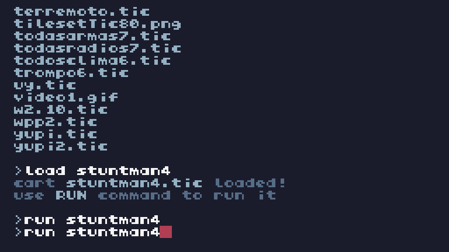
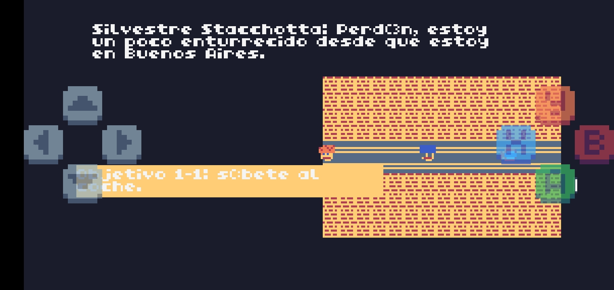
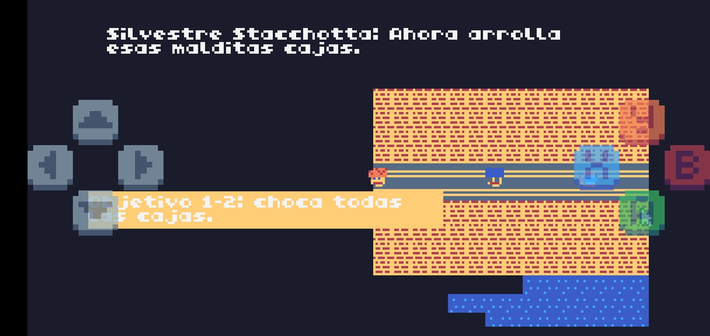
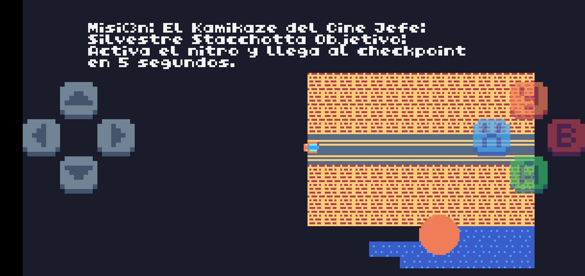
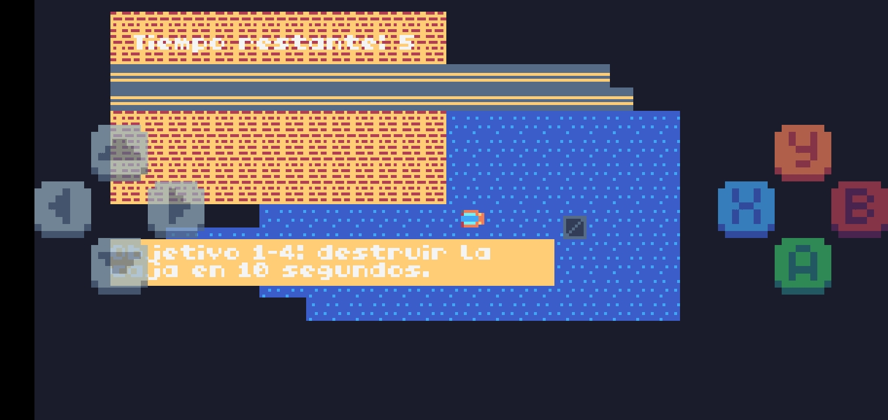
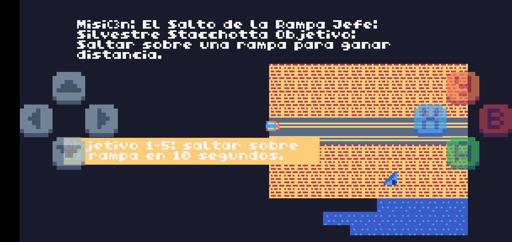
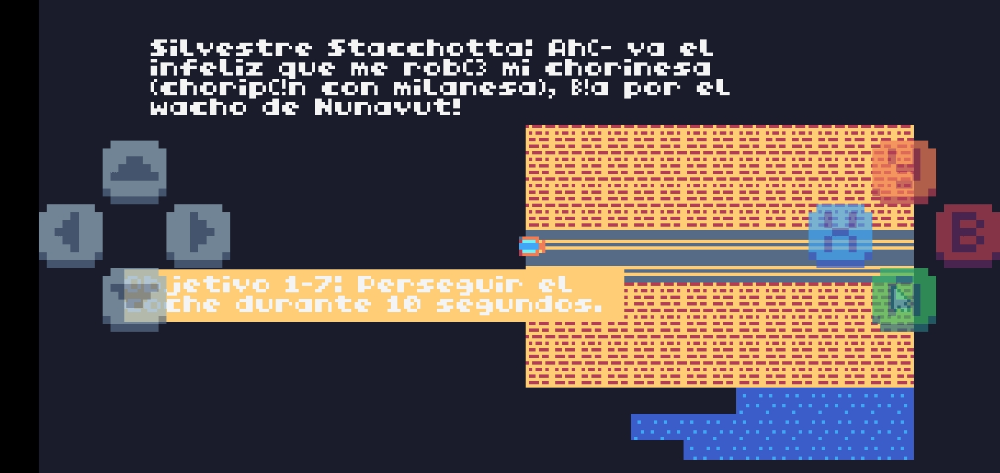
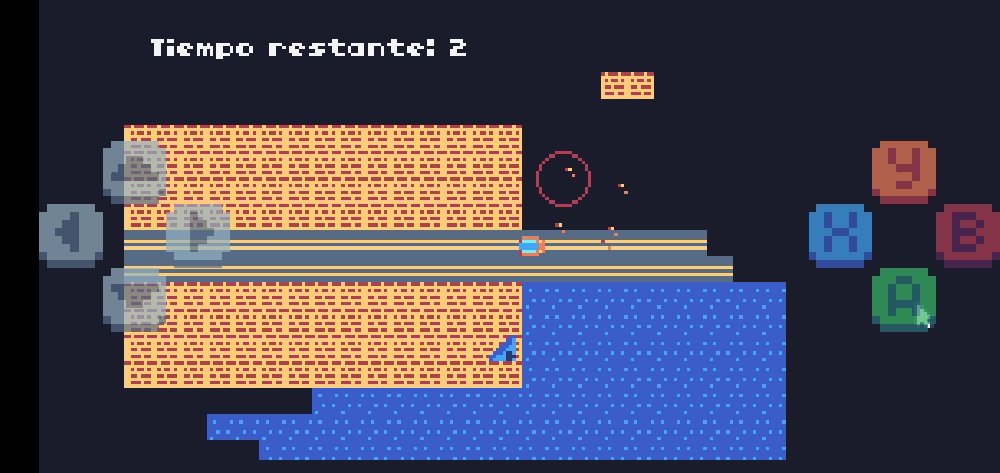
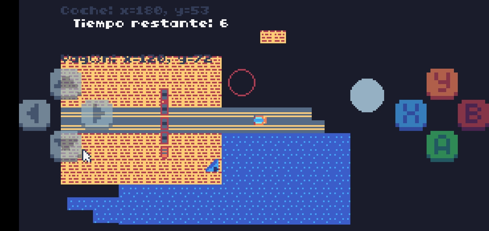
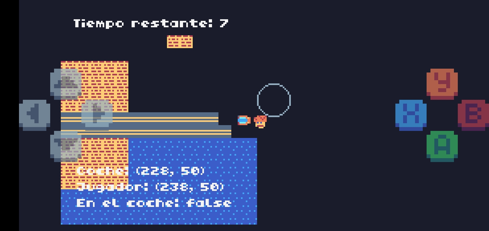

# 🎭 Stuntman



### 🎭 Ambientación

Estudios de Cine "Choriwood",Argentina

### 🎭 Descripción de la Mision

Misión: El Kamikaze del Cine

Jefe: Silvestre Stacchotta

Objetivo: Rodar exitosamente una escena de doble de películas con el coche.

### 🌇Mecanica 1



Subir a coche.


### 🎆Dialogo 1
```
"Silvestre Stacchotta: Good day wacho, altas llantas.",
"Silvestre Stacchotta: Perdón, estoy un poco enturrecido desde que estoy en Buenos Aires.",
"Silvestre Stacchotta: A diferencia de mi hogar en Los Guapos Country de Los Angeles,",
"Silvestre Stacchotta: la Fucking humedad de Buenos Aires está más fuerte que rusas en bikini.",
"Silvestre Stacchotta: En fin wacho, súbete al coche. Solo tienes 5 segundos.",
"Pulsa B para subir al coche."
```
### 🌇Mecanica 2



Arrollar cajas con el coche.


### 🎆Dialogo 2
```
"Silvestre Stacchotta: Ahora arrolla esas malditas cajas."
```
### 🌇Mecanica 3



Activar nitro para llegar a checkpoint.


### 🎆Dialogo 3
```
"Silvestre Stacchotta: Ahora eres un fucking meteorito,activa el nitro tardigrado de bosnia."
```

### 🌇Mecanica 4



Disparar desde el coche para destruir a la caja plateada ( no se puede destruir pisandola ).


### 🎆Dialogo 4
```
"Silvestre Stacchotta: Ahora tenes que dispararle desde el coche a esa caja malvada,solo puedes destruirla asi,lince del oblast de kursk."
```
### 🌇Mecanica 5



Usar rampa para saltar.


### 🎆Dialogo 5
```
"Silvestre Stacchotta: Lince, tenés que usar esa rampa para volar como los dioses del asfalto."
```
### 🌇Mecanica 6


Esquivar coches.


### 🎆Dialogo 6
```
"Silvestre Stacchotta: Mas vale que esquives esos coches porque me estoy enturreciendo mal ."
```
### 🌇Mecanica 7



Perseguir coche.


### 🎆Dialogo 7
```
"Silvestre Stacchotta: Ahí va el infeliz que me robó mi chorinesa (choripán con milanesa), ¡a por el wacho de Nunavut!"
```
### 🌇Mecanica 8



Saltar por el aro pero solo cuando no este en llamas.


### 🎆Dialogo 8
```
"Silvestre Stacchotta: Do you have enough chechona?",
"Salta por el aro, pero no te quemes."
```
### 🌇Mecanica 9



Esquivar tren.


### 🎆Dialogo 9
```
"Silvestre Stacchotta: Esquiva el maldito tren así llegas al final y posteamos algo en Egogram."
```
### 🌇Mecanica 10



Salir del coche para hacerlo detonar,pero a distancia.


### 🎆Dialogo 10
```
"Silvestre Stacchotta: Prepárate, conduce hacia el círculo violeta.",
"Silvestre Stacchotta: Una vez allí, presiona el botón para detonar la bomba."
```

## ✨️Variables / Atributos

1
```
-- Configuración inicial
1
player_x, player_y = 30, 50

2
stacchotta_x, stacchotta_y = 80, 50

3
car_x, car_y = 120, 50

4
player_in_car = false

5
camera_x, camera_y = 0, 0 
-- Coordenadas iniciales de la cámara

6
player_speed = 1

7
car_speed = 3 
-- Velocidad aumentada para el coche

8
debug=0

-- Diálogo inicial
9
mission_description =
{ "Mision: El Kamikaze del Cine" ,
  "Jefe: Silvestre Stacchotta" ,
  "Objetivo: Rodar exitosamente una escena de doble de peliculas con el coche."}

10
dialogue = {
    "Silvestre Stacchotta: Good day wacho, altas llantas.",
    "Silvestre Stacchotta: Perdon, estoy un poco enturrecido desde que estoy en Buenos Aires.",
    "Silvestre Stacchotta: A diferencia de mi hogar en Los Guapos Country de Los Angeles,",
    "Silvestre Stacchotta: la Fucking humedad de Buenos Aires está más fuerte que rusas en bikini.",
    "Silvestre Stacchotta: En fin wacho, súbete al coche. Solo tienes 5 segundos.",
    "Pulsa B para subir al coche."
}

11
dialogue_index = 1

12
introindex=1

13
countdown = 5

14
game_state = "mission_intro" 
-- Estados: mission_intro, dialogue, countdown, in_car, finished

-- Objetivo 1-1
15
objective_status = "incomplete"
```

2
```
-- Configuración inicial
1
car_x, car_y = 30, 50

2
camera_x, camera_y = 0, 0 
-- Coordenadas iniciales de la cámara

3
car_speed = 3 
-- Velocidad del coche

-- Diálogo inicial
4
mission_description = 
"Misión: El Kamikaze del Cine\n" ..
"Jefe: Silvestre Stacchotta\n" ..
"Objetivo: Rodar exitosamente una escena de doble de películas chocando cajas."

5
dialogue = {
    "Silvestre Stacchotta: Ahora arrolla esas malditas cajas.",
}

6
dialogue_index = 1

7
countdown = 10

8
game_state = "mission_intro" 
-- Estados: mission_intro, dialogue, countdown, finished

-- Configuración de cajas
9
boxes = {}

10
for i = 1, 10 do
    table.insert(boxes, {x = math.random(50, 300), y = math.random(50, 200), active = true})
end

11
particles = {} 
-- Lista para partículas de explosión

-- Objetivo 1-2
12
objective_status = "incomplete"
```

3
```
1
car_x, car_y = 30, 50

2
camera_x, camera_y = 0, 0 
-- Coordenadas iniciales de la cámara

3
car_speed = 3 
-- Velocidad del coche

4
nitro_active = false 
-- Si el nitro está activado

-- Diálogo inicial

5
mission_description = 
"Misión: El Kamikaze del Cine\n" ..
"Jefe: Silvestre Stacchotta\n" ..
"Objetivo: Rodar exitosamente una escena de doble de películas chocando cajas."

6
dialogue = {
    "Silvestre Stacchotta: Ahora eres un fucking meteorito,activa el nitro tardigrado de bosnia.",
}

7
dialogue_index = 1

8
countdown = 10

9
game_state = "mission_intro" 
-- Estados: mission_intro, dialogue, countdown, finished

-- Configuración de cajas
10
boxes = {}

11
for i = 1, 10 do
    table.insert(boxes, {x = math.random(50, 300), y = math.random(50, 200), active = true})
end

12
particles = {} 
-- Lista para partículas de explosión

-- Objetivo 1-3
13
objective_status = "incomplete"

```

4
```
-- Configuración inicial
1
car_x, car_y = 30, 50

2
camera_x, camera_y = 0, 0 
-- Coordenadas iniciales de la cámara

3
car_speed = 3 
-- Velocidad del coche

4
nitro_active = false 
-- Si el nitro está activado

5
bullet_speed = 5 
-- Velocidad de las balas

6
bullet_size = 4 
-- Tamaño de las balas

7
bullets = {} 
-- Lista de balas

8
bullet_timer = 0 
-- Temporizador para evitar disparos rápidos

-- Diálogo inicial

9
mission_description = 
"Misión: El Kamikaze del Cine\n" ..
"Jefe: Silvestre Stacchotta\n" ..
"Objetivo: Destruir una caja disparando balas."

10
dialogue = {
    "Silvestre Stacchotta: Ahora tenes que dispararle desde el coche a esa caja malvada,solo puedes destruirla asi,lince del oblast de kursk.",
}

11
dialogue_index = 1

12
countdown = 10

13
game_state = "mission_intro" 
-- Estados: mission_intro, dialogue, countdown, finished

-- Configuración de la caja

14
box = {x = 200, y = 100, active = true, health = 3} -- Caja con 3 de vida

15
particles = {} 
-- Lista para partículas de explosión

-- Objetivo 1-4
16
objective_status = "incomplete"

```

5
```
-- Configuración inicial

1
car_x, car_y = 30, 50

2
camera_x, camera_y = 0, 0 
-- Coordenadas iniciales de la cámara

3
car_speed = 3 
-- Velocidad del coche

4
nitro_active = false 
-- Si el nitro está activado

5
jumping = false 
-- Si el coche está saltando

6
jump_height = 0 
-- Altura del salto

7
jump_speed = 2 
-- Velocidad del salto (aumentado)

8
jump_distance = 50 
-- Distancia del salto (aumentado)

9
jumping_timer = 0 
-- Temporizador del salto

-- Diálogo inicial
10
mission_description = 
"Misión: El Salto de la Rampa\n" ..
"Jefe: Silvestre Stacchotta\n" ..
"Objetivo: Saltar sobre una rampa para ganar distancia."

11
dialogue = {
    "Silvestre Stacchotta: Lince, tenés que usar esa rampa para volar como los dioses del asfalto.",
}

12
dialogue_index = 1

13
countdown = 10

14
game_state = "mission_intro" 
-- Estados: mission_intro, dialogue, countdown, finished

-- Configuración de la rampa
15
ramp = {x = 150, y = 80} 
-- Coordenadas de la rampa

-- Objetivo 1-5
16
objective_status = "incomplete"
```

6
```
-- Configuración inicial
1
car_x, car_y = 30, 50

2
camera_x, camera_y = 0, 0 
-- Coordenadas iniciales de la cámara

3
car_speed = 3 
-- Velocidad del coche

4
nitro_active = false 
-- Si el nitro está activado

5
jumping = false 
-- Si el coche está saltando

6
jump_height = 0 
-- Altura del salto

7
jump_speed = 2 
-- Velocidad del salto (aumentado)

8
jump_distance = 50 
-- Distancia del salto (aumentado)

9
jumping_timer = 0 
-- Temporizador del salto

-- Diálogo inicial
10
mission_description = 
"Misión: El Salto de la Rampa\n" ..
"Jefe: Silvestre Stacchotta\n" ..
"Objetivo: Saltar sobre una rampa para ganar distancia."

11
dialogue = {
    "Silvestre Stacchotta: Mas vale que esquives esos coches porque me estoy enturreciendo mal .",
}

12
dialogue_index = 1

13
countdown = 5

14
game_state = "mission_intro" 
-- Estados: mission_intro, dialogue, countdown, finished

-- Configuración de la rampa
15
ramp = {x = 150, y = 80} 
-- Coordenadas de la rampa

-- Objetivo 1-6: Esquivar coches durante 5 segundos
16
objective_status = "incomplete"

17
cars = {}

18
car_spawn_timer = 0

19
time_avoided = 0 
-- Tiempo en segundos que el coche ha estado esquivando coches sin colisiones

```

7
```
- Configuración inicial
1
car_x, car_y = 30, 50

2
camera_x, camera_y = 0, 0 
-- Coordenadas iniciales de la cámara

3
car_speed = 3 
-- Velocidad del coche

4
nitro_active = false 
-- Si el nitro está activado

5
jumping = false 
-- Si el coche está saltando

6
jump_height = 0 
-- Altura del salto

7
jump_speed = 2 
-- Velocidad del salto (aumentado)

8
jump_distance = 50 
-- Distancia del salto (aumentado)

9
jumping_timer = 0 
-- Temporizador del salto

-- Diálogo inicial

10
mission_description = 
"Misión: El Persecución del Coche\n" ..
"Jefe: Silvestre Stacchotta\n" ..
"Objetivo: Perseguir al coche por 10 segundos para ganar."

11
dialogue = {
    "Silvestre Stacchotta: Ahí va el infeliz que me robó mi chorinesa (choripán con milanesa), ¡a por el wacho de Nunavut!",
}

12
dialogue_index = 1

13
countdown = 10 
-- Tiempo para la misión en segundos

14
game_state = "mission_intro" 
-- Estados: mission_intro, dialogue, countdown, finished

-- Configuración del coche a perseguir

15
target_car = {x = 40, y = math.random(10, 40), speed = 2, sprite_id = 50} 
-- Coche que el jugador debe perseguir

16
target_car_distance = 0 
-- Distancia entre el coche del jugador y el coche objetivo

17
chase_time = 0 
-- Tiempo de persecución

18
max_chase_time = 10 
-- Tiempo máximo de persecución en segundos

19
follow_range = 24 
-- Rango de seguimiento alrededor del coche objetivo

-- Objetivo 1-7: Perseguir al coche durante 10 segundos

20
objective_status = "incomplete"

```

8
```
-- Configuración inicial (igual que antes)

1
car_x, car_y = 30, 50

2
camera_x, camera_y = 0, 0

3
car_speed = 3

4
nitro_active = false

5
jumping = false

6
jump_height = 0

7
jump_speed = 2

8
jump_distance = 50

9
jumping_timer = 0

10
mission_description = 
"Misión: Aro en Llamas\n" ..
"Jefe: Silvestre Stacchotta\n" ..
"Objetivo: Salta por el aro sin tocar las llamas."

11
dialogue = {
    "Silvestre Stacchotta: Do you have enough chichón?",
    "Salta por el aro, pero no te quemes.",
}

12
dialogue_index = 1

13
countdown = 10

14
game_state = "mission_intro"

15
ramp = {x = 150, y = 80}

16
hoop = {x = 180, y = 40, state = "normal", timer = 0}

17
objective_status = "incomplete"

18
-- Partículas de llamas
particles = {}
```

9
```
 -- Configuración inicial
1
car_x, car_y = 30, 50

2
camera_x, camera_y = 0, 0 
-- Coordenadas iniciales de la cámara

3
car_speed = 3 
-- Velocidad del coche

4
nitro_active = false 
-- Si el nitro está activado

5
jumping = false 
-- Si el coche está saltando

6
jump_height = 0 
-- Altura del salto

7
jump_speed = 2 
-- Velocidad del salto (aumentado)

8
jump_distance = 50 
-- Distancia del salto (aumentado)

9
jumping_timer = 0 
-- Temporizador del salto

-- Diálogo inicial

10
mission_description = 
"Misión: Aro en Llamas\n" ..
"Jefe: Silvestre Stacchotta\n" ..
"Objetivo: Salta por el aro sin tocar las llamas y evita el tren."

11
dialogue = {
    "Silvestre Stacchotta: Esquiva el maldito tren así llegas al final y posteamos algo en Egogram.",
    "Salta por el aro, pero no te quemes. Y cuidado con el tren.",
}

12
dialogue_index = 1

13
countdown = 10

14
game_state = "mission_intro" 
-- Estados: mission_intro, dialogue, countdown, finished

-- Configuración de la rampa
15
ramp = {x = 150, y = 80} 
-- Coordenadas de la rampa

-- Configuración del aro
16
hoop = {x = 180, y = 40, state = "normal", timer = 0} 
-- Aro por donde pasar

-- Objetivo 1-9
17
objective_status = "incomplete"

-- Configuración del tren
18
train = 
{x = 120, y = -20, speed = 1, width = 2, height = 2, sprite_id = 49} 
-- Tren que se mueve de arriba a abajo

-- Configuración de los vagones

19
train_wagons = {
    {x = train.x, y = train.y}, 
-- Primer vagón
    {x = train.x, y = train.y - 32}, 
-- Segundo vagón (justo encima del primero)
    {x = train.x, y = train.y - 64}, 
-- Tercer vagón
    {x = train.x, y = train.y - 96}, 
-- Cuarto vagón
}


-- Configuración del círculo de victoria
20
victory_circle = { sx = 250, y = 40, radius = 10} 
-- Círculo para ganar

```

10
```
-- Configuración inicial
1
car_x, car_y = 30, 50

2
player_x, player_y = car_x, car_y 
-- Coordenadas iniciales del jugador

3
camera_x, camera_y = 0, 0 
-- Coordenadas iniciales de la cámara

4
car_speed, player_speed = 3, 2 
-- Velocidad del coche y del jugador

5
nitro_active = false 
-- Si el nitro está activado

6
in_car = true 
-- Estado del jugador (dentro o fuera del coche)

7
jumping = false 
-- Si el coche está saltando

8
game_state = "mission_intro" 
-- Estados: mission_intro, dialogue, countdown, explosion, final_escape, game_over

-- Diálogo inicial

9
mission_description = 
"Misión: Explosión Épica\n" ..
"Objetivo: Ve al círculo violeta y prepara la explosión."

10
dialogue = {
    "Prepárate, conduce hacia el círculo violeta.",
    "Una vez allí, presiona el botón para detonar la bomba.",
}

11
dialogue_index = 1

12
countdown = 10

-- Configuración del círculo de victoria

13
victory_circle = {x = 250, y = 40, radius = 10} 
-- Círculo violeta

14
bomb_prepared = false

15
explosion_timer = 0

16
explosion_radius = 40  
-- Radio de la explosión

17
explosion_complete = false 
-- Si la explosión se completó

```

## 🎭 Funciones:

#### ✨️Stuntman4 / Parte 1

##### 🔑-1  move_player()

Movimiento del jugador.

##### 🔑-2  move_car()

Movimiento del coche.

##### 🔑-3  nueva_camara(x,y)

Simulación de cámara.

##### 🔑-4  update_camera()

Actualizar cámara.

##### 🔑-5  draw_text_multiline_with_bg
(Text,x,y,color,bg_color,max_width)

Dividir texto en líneas con fondo negro.

##### 🔑-6  TIC()

Bucle principal.

#### ✨️Stuntmanv2.1 / Parte 2

-1  move_player()

-2  move_car()

-3  nueva_camara(x,y)

-4  update_camera()

##### 🔑-5  generate_particles(x,y)

Generar partículas de explosión.

##### 🔑-6  update_and_draw_particles()

Actualizar y dibujar partículas.

##### 🔑-7  check_collisions()

Detectar colisiones con cajas.

##### 🔑-8  draw_boxes()

Dibujar cajas.

-9  TIC()

#### ✨️Stuntmanv3.4 / Parte 3

-1  move_player()

-2  move_car()

-3  nueva_camara(x,y)

-4  update_camera()

-5  generate_particles(x,y)

-6  update_and_draw_particles()

-7  check_collisions()

-8  draw_boxes()

##### 🔑-9  draw_nitro_effect()

Mostrar la línea de nitro (cuando está activado).

##### 🔑-10  draw_checkpoint()

Dibujar el checkpoint como un círculo rojo.

##### 🔑-11  check_checkpoint_collision()

Comprobar si el coche ha pasado por el checkpoint (con un círculo).

-12  TIC()

#### ✨️Stuntmanv4.3 / Parte 4

-1  move_car()

-2  nueva_camara(x,y)

-3  update_camera()

-4  generate_particles(x,y)

-5  update_and_draw_particles()

-6  check_bullet_collisions()

##### 🔑-7  draw_box()

Dibujar la caja.

##### 🔑-8  draw_bullets()

Dibujar las balas.

##### 🔑-9  shoot_bullet()

Disparar balas.

##### 🔑-10  update_bullets()

Actualizar balas.

-11  draw_nitro_effect()

-12  check_checkpoint_collisions

-13 draw_text_multiline_with_bg
(Text,x,y,color,bg_color,max_width)

-14  TIC()

#### ✨️Stuntmanv5.1 / Parte 5

-1  move_car()

-2  nueva_camara(x,y)

-3  update_camera()

-4  draw_text_multiline_with_bg
(Text,x,y,color,bg_color,max_width)

##### 🔑-5  draw_ramp()

Dibujar la rampa.

##### 🔑-6  check_ramp_collision()

Comprobar colisión con la rampa.

##### 🔑-7  handle_jump()

Manejar el salto.

-8  draw_nitro_effect()

-9  TIC()

#### ✨️Stuntmanv6.2 / Parte 6

-1  move_car()

-2  nueva_camara(x,y)

-3  update_camera()

-4  draw_text_multiline_with_bg
(Text,x,y,color,bg_color,max_width)

-5  draw_ramp()

##### 🔑-6  spawn_car()

Crear y dibujar los coches enemigos.

##### 🔑-7  draw_cars()

Dibujar los coches enemigos.

##### 🔑-8  check_car_collision()

Comprobar colisión con los coches.

-9  handle_jump()

-10  draw_nitro_effect()

-11  TIC()

#### ✨️Stuntmanv7.3 / Parte 7

-1  move_car()

-2  nueva_camara()

-3  update_camera()

##### 🔑-4  draw_target_car()

Dibujar el coche a perseguir.

##### 🔑-5  draw_target_car_lost()

Comprobar si el jugador ha perdido el rastro del coche.

##### 🔑-6  draw_follow_range()

Dibujar el rango de persecución alrededor del coche objetivo.

-7  TIC()

#### ✨️Stuntmanv8.2 / Parte 8

-1  spawn_particles()

-2  update_particles()

-3  draw_particles()

-4  move_car()

##### 🔑-5  draw_hoop()

Dibujar el aro con partículas.

##### 🔑-6  update_hoop()

Actualizar el estado del aro.

##### 🔑-7  check_hoop_collision()

Comprobar colisión con el aro y la rampa.

-8  handle_jump()

-9  draw_nitro_effect()

-10  check_ramp_collision()

-11  nueva_camara(x,y)

-12  update_camera()

-13  draw_ramp()

##### 🔑-14  draw_landing_circle()

Dibujar el círculo verde de aterrizaje (fijo).

-15  TIC()

#### ✨️Stuntmanv9.5 / Parte 9

-1  move_car()

-2  nueva_camara(x,y)

-3  update_camera()

-4  draw_ramp()

-5  draw_hoop()

##### 🔑-6  draw_victory_circle()

Dibujar el círculo de victoria.

-7  update_hoop()

-8  check_hoop_collision()

-9  check_victory_collision()

-10  check_ramp_collision()

##### 🔑-11  check_train_collision()

Comprobar colisión con el tren y vagones.

-12  handle_jump()

-13  draw_nitro_effect()

##### 🔑-14  move_train()

Mover el tren y sus vagones.

##### 🔑-15  draw_train()

Dibujar el tren y los vagones.

-16  TIC()

#### ✨️Stuntmanv10.9 / Parte 10

-1  move_car()

-2  move_player()

-3  update_camera()

##### 🔑-4  draw_entities()

Dibujar el coche y el jugador.

-5  draw_victory_circle()

-6  check_victory_collision()

##### 🔑-7  handle_explosion()

Manejar la explosión.

##### 🔑-8  exit_car()

Salir del coche.

##### 🔑-9  handle_game_over()

Manejar el estado de Game Over.

-10  TIC()
