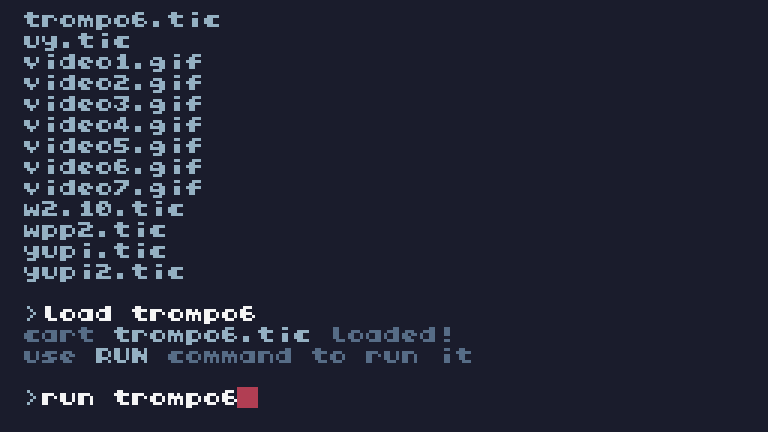

Trompos



Elementos

#### 🎆-Trompos

-Jugador 1

-Jugador 2

#### 🎆-Vida

Cada uno empieza con 100.

#### 🎆-Circulos

Agregan ( Circulo Azul ) o quitan ( Circulo Rojo ) vida al estar en ellos.

#### 🎆-Tiempo

Desde 30 segundos para abajo,gana el que llega al final con más puntos de vida ( si es que ambos sobreviven ).

#### 🎆-Rap

Rap del Trompo.

## ✨️Variables / Atributos

```

```

Funciones:

#### 🔑-1  add_particle(x,y)

Añade partículas al colisionar.

#### 🔑-2  update_particles()

Actualiza las partículas.

#### 🔑-3  draw_particles()

Dibuja las partículas ( al colisionar entre los trompos ).

#### 🔑-4  animate_beyblades()

Crea la animación de los trompos 

#### 🔑-5  move_player
(player,up,down,left,right)

Mover al jugador.

#### 🔑-6  check_collision()

Revisa si hay colisión entre los trompos.

#### 🔑-7  draw_health_number(player)

Dibuja el número de vida del jugador.

#### 🔑-8  draw_timer()

Dibuja la cuenta atrás.

#### 🔑-9  check_game_over()

Revisa si se llegó al fin del juego.

#### 🔑-10  draw_winner()

Dibuja quien ganó la partida.

#### 🔑-11  generate_circles()

Genera círculos en el escenario.

#### 🔑-12  update_circles()

Actualiza los círculos en el escenario.

#### 🔑-13  check_circle_collision(player)

Revisa si el jugador colisiona con los círculos.

#### 🔑-14  generate_rainbow_points()

Genera los puntos arcoíris si aun no existen.

#### 🔑-15  update_rainbow_points()

Actualiza los puntos arcoíris.

#### 🔑-16  draw_rainbow_points()

Dibuja los puntos arcoíris.

#### 🔑-17  draw_rapid_text()

Dibuja el texto del Rap del Trompo.

#### 🔑-18  TIC()

Bucle principal.
