# 🎭 Nerdpedia / Wiki


## 🎭 Elementos

### 🎃 Sección

Desde A ( Principal ) hasta N ( Tecnologia ).

#### 📀 01 Principal


#### 📀 02 Figuras

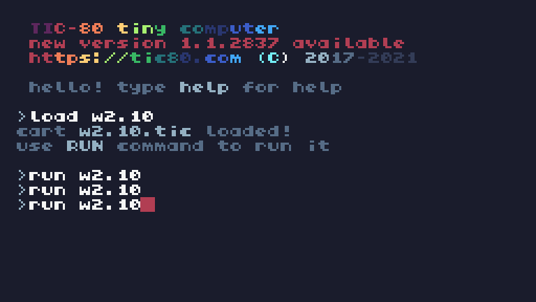

#### 📀 03 ArtiCULO Destacado

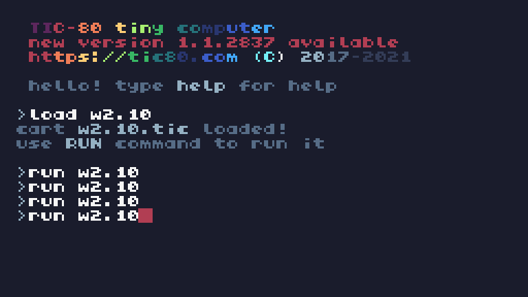

#### 📀 04 Eventos Deportivos

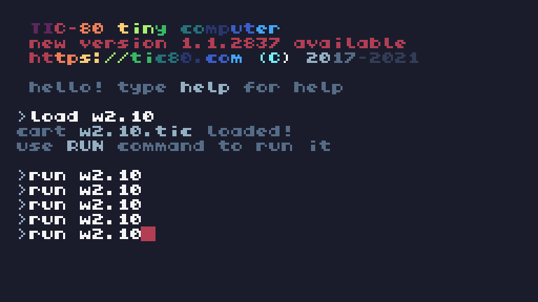

#### 📀 05 Curiosidades


#### 📀 06 Aniversarios


#### 📀 07 Especimen Destacado

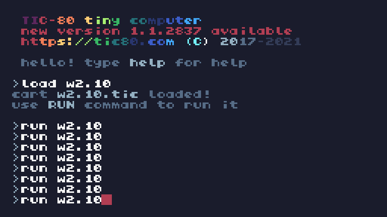

#### 📀 08 Idiomas

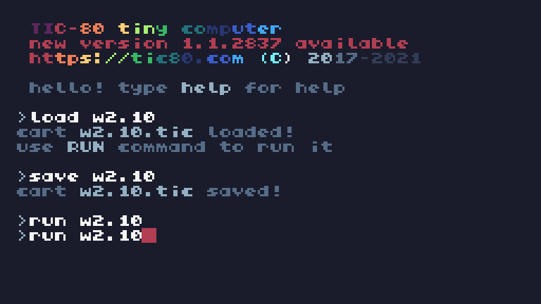

#### 📀 09 Frase del Dia

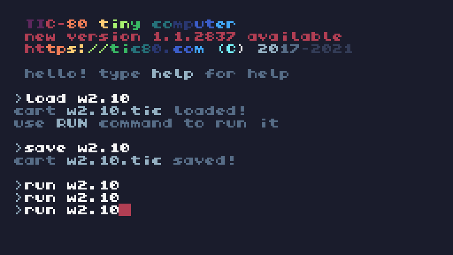

#### 📀 10 Noticias

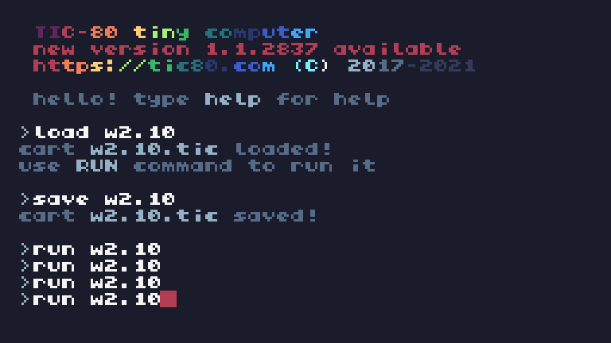

#### 📀 11 Poesia del Dia

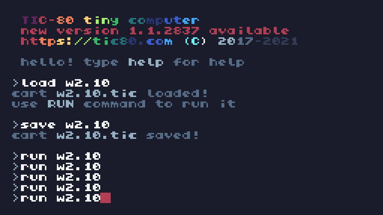

#### 📀 12 Música Destacada

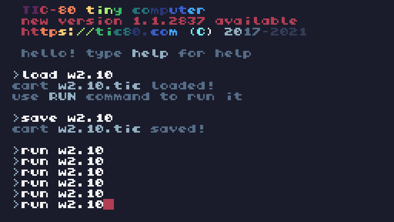

#### 📀 13 Videojuego Destacado

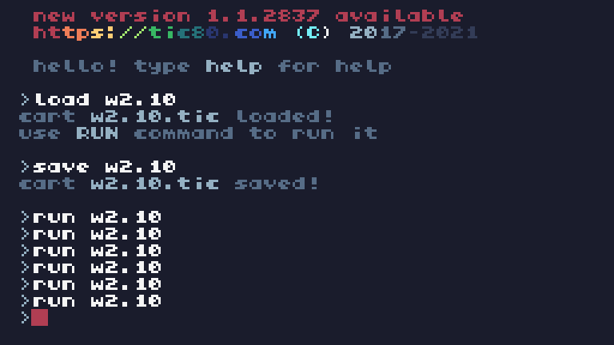

#### 📀 14 Tecnologia

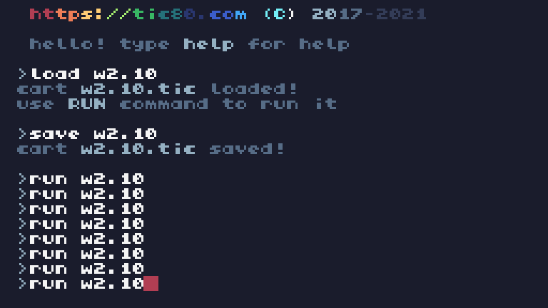

### 🎃 Pagina

Hay una o varias dentro de cada sección.

## ✨️Variables / Atributos

```
- Variables de estado

section = 1

page = 1

sections = {"A", "B", "C", "D", "E", "F", "G", "H", "I",
 "J", "K", "L", "M", "N"} 
-- Secciones disponibles (agregado "M" y "N")

pages = {{"A1"}, {"B1", "B2", "B3"}, {"C1"}, {"D1", "D2"}, {"E1", "E2", "E3", "E4", "E5", "E6"}, {"F1", "F2", "F3", "F4", "F5", "F6","F7"}, {"G1","G2"}, {"H1", "H2"}, {"I1"}, {"J1", "J2", "J3", "J4", "J5", "J6"}, {"K1"}, {"L1"}, {"M1","M2"}, {"N1","N2"}} 
-- Páginas por sección (agregado "M1" y "N1")

-- Contenido de las secciones y páginas
content = {
    A = {
        "Nerdpedia",
        "Fomentando tu distracción desde el año 2000.\nNavega entre las secciones y páginas con las flechas."
    },
    B = {
        "Figuras",
        {
            {"Jorge Lanota", "Periodista Argentino\nNació el 31 de diciembre de 1959 en CABA, Argentina.\n-Premio Sex Symbol Argentina 2020."},
            {"Juan Garcamaru", "Empresario Japonés Argentino\nNació el 1 de enero de 1960 en Tokio, Japón.\n-CEO de Grupo Galletitas CulOS"},
            {"Elon Mots", "Nació el 29 de febrero de 1970 en Mombasa, Tanzania.\nEmpresario Tanzano Canadiense\n-Fundador de OdiaME."}
        }
    },
    C = {
        "ArtiCULO Destacado",
        "Ley Antigrieta de Besitos\n\nEsta ley fue aprobada por el Parlamento Argentino en la Sesión Navideña de 2024.\nObliga (de lo contrario, pena de muerte) a que los ex presidentes argentinos se coman la boca para fomentar la unidad nacional y se filma en cadena nacional."
    },
    D = {
        "Eventos Deportivos",
        {
            "Torneo de EPinball de 2025 en Chad (país de África)",
            "Miss Jupiter 2025 en la Estación Espacial Internacional"
        }
    },
    E = {
        "Curiosidades",
        {
            "Facebutt fue fundada en 2002 por un grupo de empollones playboy tras mandar una milanesa en un cohete al espacio.",
            "Un chocolate hizo un video para adultos en una famosa web y tuvo cien mil trillones de visitas.",
            "El Artista Argentino Tomame surgió como un imitador de un imitador de una estrella de rock de EEUU.",
            "Se calcula que para el 2100 el idioma Turro Rioplatense será la lengua del futuro, superando al Inglés y al Chino.",
            "OdiaME fue creada como una app Anti citas y sin embargo logró 300 matrimonios.",
            "Una hamburguesa de pollo gana Elecciones Presidenciales en Uruguay en 2021: sin partido, aliados ni queso triple."
        }
    },
    F = {
        "Aniversarios (El día de hoy)",
        {
            "Hace 1000 millones de años - Big Bang.",
            "1900 - Guerra de Hormigas en Prusia.",
            "1950 - Epidemia de Estornudos Arcoiris en Madrid (víctimas: 50 resfriados).",
            "1979 - Incidente OVNI en Ushuaia.",
            "2000 - Juan Juano se convierte en el primer travesti en ejercer la presidencia de un país (Argentina).",
            "2013 - Sale el primer programa de Polemica Para Todos de Jorge Lanota, haciendo un rating de 150 puntos en Bangladesh.",
            "2023 - Un robot se revela contra el Ejército de la India, al grito de 'Extinguiré a la humanidad'."
        }
    },
    G = {
        "Especimen Destacado",
        {
            "Tardigrado Arcoiris",
            "Vive en Taringa, Queensland, Australia.\nEn los arrecifes de coral. Es conocido por su absoluta ira contra el ser humano, el antiguo ex premier Kangurin Tasma (2007-2011) perdió un brazo en el cargo tras ser mordido por uno de estos."
        }
    },
    H = {
        "Idiomas de Nerdpedia",
        {
            "Español Rioplatense - varios articulos",
            "Turro Rioplatense - beta"
        }
    },
    I = {
        "Frase del Día",
        "Si no puedes con ellos, ensuciales el culo - Juan Garcamaru"
    },
    J = {
        "Noticias",
        {
            "Guerra entre Noruega y Suiza de 2025",
            "Invasión de Castores Voladores en Canadá de 2025",
            "Atentado de Cucaracha Terrorista en Micronesia",
            "El Congo es el primer país Africano en unirse a la Unión Europea.",
            "La Casa de la Moneda de Argentina saca el histórico billete de José de San Martín subido a un coche Lowrider.",
            "Se termina el reinado de terror de Cuco en Senegal, comienza el reinado del terror de Turuturu."
        }
    },
    K = {
        "Poesía del Día",
        "\"La Jenny de Guilin\"\nEs una clásica poesía turra entregada en 1950 por Brian Turreti al Presidente Chino Mao Tse Tung como gesto de amistad entre ambos pueblos."
    },
    L = {
        "Música Destacada",
        "Cuarteto Britpop\nEs un género fusión del Cuarteto Cordobés y Britpop Británico, surgido en fiestas tecno por inmigrantes de Córdoba Capital en City of London, Inglaterra.\nTiene letras oscuras pero alegres."
    },
    M = {
        "Videojuego Destacado",
        {"Fútbol Estelar", "Lanzado en 2022, un juego donde los futbolistas vuelan y tienen superpoderes."}
    },
    N = {
        "Tecnología",
        {"Hologramas Mots", "Es el primer sistema holográfico en ciudades públicas, utilizado en Zurich."}
    }
}

-- Variables para animación de colores
color_offset = 0

rainbow_speed = 0 
-- Controla la velocidad del arcoíris

rainbow_timer = 3 
-- Cuántos TIC debe esperar antes de avanzar el color (más rápido)

rainbow_colors = 
{2, 3, 4, 5, 6, 7, 8, 9, 10, 11, 12, 13, 14, 15, 1, 0}

```

## 🎭 Funciones:

#### 🔑-1  split_lines(text,max_width)

Divide texto para mostrarlo correctamente en pantalla.

#### 🔑-2  print_rainbow(text,x,y)

Muestra texto animado con colores arcoíris.

#### 🔑-3  TIC()


Bucle principal.
