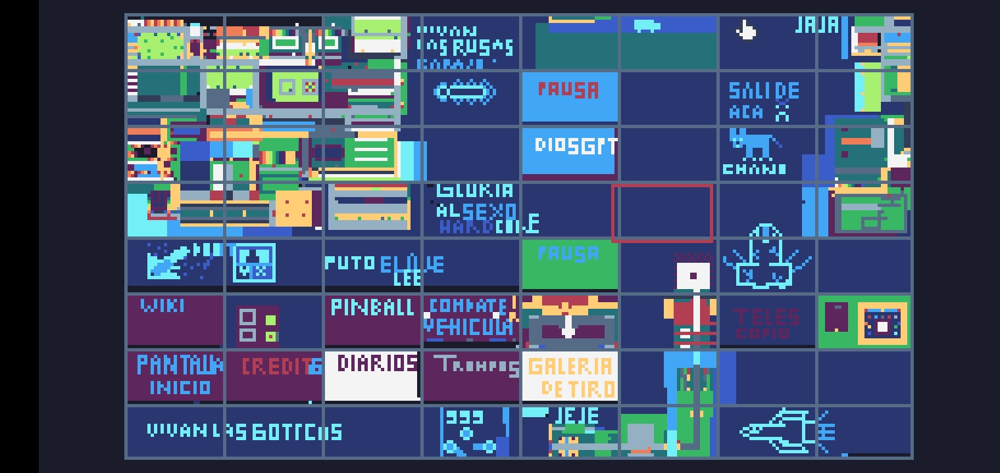

##### Hashtags #️⃣ : #gamedev #TIC80 #lua #sandbox #2D #Retro #Argentina #####

##### README en Español.To read the English versión,go to README-English.md


## 🎮 TIC80Sandbox
2D sandbox style videogame in fantasy console TIC80.


🎲 ***Nombre del juego :*** 

*Crimen y Chori*

🎲 ***Año :*** 

*2025?*

🎲 ***Desarrollador :***

*AltaVista Games*

( Pascua2020 y ChatGPT )

🎲 ***Género :*** 

```
-Sandbox 2D
-Minijuegos
-Conducción / Carreras
-Combate Vehicular
-Acción / Aventura
```

🎲 ***Plataforma :*** 

*TIC-80*

( Consola de Fantasía Open Source :
Funciona en PC,Raspberry Pi y Smartphones. )

Especificaciones ( de TIC-80 ):
```
-Resolución: 
240x136 pixeles , 16 colores.
-Mapa : 
1920 x 1088 pixeles ( Divido en Bloques de 8 x 8 - 64 Bloques en total ).
-Graficos : 
256 Tiles y 256 Sprites.
-Memoria : 
272 KB de RAM ( 32 KB de VRAM ).
```

🎲 ***Lenguaje de Programación :*** 

*Lua*

Juego hecho en su mayoria desde el Celular,SIN PC 
( eso si,con ayuda de ChatGPT ).

Eso incluye dibujar los gráficos con el dedo táctil y tocar el código desde el editor,ambos de TIC80.


## 🎮 Sinopsis : 

Crimen y Chori es un juego sandbox 2D ambientado en una ciudad de Argentina pseudo ficticia llamada Ciudad Rapera de Buenos Aires.



Aunque también tiene pequeñas ambientaciones en:

🍪 ***La VirgoCueva*** 

( Pantalla de Inicio,Hub de Niveles. )

.jpg)

🍪 ***Pista de Carreras en Berna , Suiza***

( Minijuego de Carreras. )


🍪 ***"La Pistita"***,

Pista de Carreras de Coches a Control Remoto ( en País Vasco,España ) 

( Minijuego de Carreras RC. )


🍪 ***"Flippersburgo,Alemania"***

( Minijuego de Pinball. )


🍪 ***"Satélite Tokyo"*** 

( Minijuego de Baile. )


🍪 ***"Trompolandia" en Estonia***

( Minijuego de Trompos. )


## 🎮 Requisitos e instalacion:

Al ser un juego de TIC-80,corre en:
```
-PC ( Windows,Linux,Mac OS )
-Android
-Raspberry Pi
-Nintendo 3DS
-Retroarch
-HTML5
```


Como jugar :

```
1-Descarga el archivo .TIC .
2-Abre TIC-80 y carga el cartucho en la terminal de consola ( load juego.tic ).
3-corre el juego ( run juego.tic ).
```

## 🎮 Controles:


### Modo 1 jugador ( todo el juego excepto RC y Trompos):

```
* Botones 0,1,2,3 : Mover jugador/vehículo.

*Boton 4 / A : Elegir opcion / Interactuar
*Boton 5 / B : Modo táctico / Pausa
*Boton 6 / X : Golpear / Disparar
*Boton 7 / Y : Subir a Vehículo.
```
### Modo 2 jugadores ( RC y Trompos ) :

```
* Botones 0,1,2,3 : mover RC / Trompo jugador 1.

* Botones 4,5,6,7 : mover RC / Trompo jugador 2.

( Solo RC : * Mouse/Pantalla Tactil : Editar Mapa )
```

## 🎮 Características del juego:


✅️ 01

22 "Radios" en texto.


```
"01 Radio Todo Vardo" : Noticias Locales
"02 Radio Bajones" : Tango
"03 Radio Poesía de la Calle" : Trap
"04 Gobierno de Argentina" : Cadena Nacional
"05 Solos y Solas" : Relaciones Amorosas

"06 Desgracias Economicas" : Economia
"07 Joyas de la Historia" : Historia
"08 No me Importa" : Internacional
"09 Radio Antimainstream" : Historias Unicas
"10 Cine Ultra 8K" : Cine

"11 Destapando Curros" : Investigaciones
"12 Radio Grieta" : Polarización
"13 Radio Cuarta Pared" : Vida Real
"14 La IA Avanza" : No Humanos
"15 Jesus te Ama" : Religion

"16 Sonidos Animalunos" : Lofi
"17 Naturaleza Insolita" : Naturaleza
"18 Radio Pesimista" : Noticias Tristes
"19 Poesia Pixelar" : Poesia Gamer
"20 Radio Terror" : Terror Bizarro

"21 Radio Lenguaje de la vida" : Idiomas
"22 Comerciales Gamers" : Propaganda
```


✅️ 02

512 Gráficos como máximo en formato 8x8.


✅️ 03

16 Barrios en Buenos Aires.

Cada barrio tiene sus calles.

Y los Barrios poseen una historia resumida la cual se puede leer.


✅️ 04

15 Vehículos 
( la mayoría con 4 colores -Rojo,Azul,Verde y Amarillo-).

Hay 2 marcas :

-Tochota ( de Japón )

-Zho Zho ( de China )


```
01-Tochota - Fulero ( Coche )
02-Tochota - Strella ( Coche )
03-Tochota - Random ( Moto )
04-Tochota - Airlines ( Avión )
05-Tochota - Bondi ( Colectivo )
06-Tochota - Salud ( Ambulancia )
07-Tochota - Raíles ( Tren )
08-Tochota - Yip ( Camioneta )

09-Zho Zho - Ego Ego ( Coche )
10-Zho Zho - Jinping ( Coche )
11-Zho Zho - Xi ( Coche )
12-Zho Zho - RC
13-Zho Zho - Skate
14-Zho Zho - Woter ( Bomberos )
15-Zho Zho - Armageddon ( Policía )

```

✅️ 05

11 Armas.


```
01--Puño
02--Pistola
03--Escopeta
04--Katana
05--Bazooka
06--Rayo láser
07--Rifle electrico
08--Granada
09--Lanzallamas
10--AK47
11--Minigun
```


✅️ 06

Trama Bizarra,con mezcla de datos ficticios ( ej : Presidente Hamburguesa en Uruguay ) y reales ( ej : el Idioma Tenis ).


✅️ 07

Easter Eggs 
( Ej : Dibujos misteriosos en el agua. )


✅️ 08

19 Personajes.


```
01-Jugador ( Wikiman )
02-Gatito ( Mascota )
03-Silvestre Stacchotta ( actor de EEUU )
04-Jorge Lanota ( Periodista )
05-Juan Garcamaru ( Empresario )

06-Profesor Levantini ( Influencer )
07-Profesora Dopamina ( Doctora )
08-Barcelo Monelli ( Periodista )
09-Elon Mots ( Magnate Africano )
10-Big Faso ( Duo Ruso Senegales )

11-Señor Amarguino ( Locutor )
12-Adrian DelaTrampa ( Crítico de cine )
13-I y A ( Inteligencias Artificiales malvadas ) 
14-Damian Blabla ( Historiador )
15-IA de Brian Turreti ( Figura Historica Turra en China)

16-DiosGPT ( IA del Jugador )
17-Locutor de Terror Gallego / Manolo Joseche
18-Guillermo Bajolini ( Cantante de Tango )
19-ARmando GENe TINOman ( Presidente Saliente)
```

```
Peatones
1-Suizo Romanche
2-Rapi el Rapero
3-Timmy Trabalenguas

4-"Capitán Inflacion"
5-Obsesivo y Compulsivo
6-El Profeta

7-Cerebrito y Wachin
8-"El Payaso Curro Curro"
9-Mamá y Niño Diabolico

```

✅️ 09

Misión de Stuntman 

( Piruetas en vehículo de doble de cine.

Con 10 mecánicas distintas. )


```
-subir a coche
-destruir cajas
-usar nitro
-disparar desde vehiculo
-esquivar enemigos
-saltar rampa
-perseguir coche
-saltar aro de fuego
-esquivar tren
-explotar coche
```


✅️ 10

Simulador ( muy simple ) de app estilo 
ChatGPT ( llamada DiosGPT ) : 

Sirve como tutorial.


✅️ 11

Lector de Diarios 
( Noticias de varias Temáticas ).


✅️ 12

Simulador estilo Wiki ( llamado Nerdpedia ) , con interfaz simplificada y datos bizarros.


✅️ 13

El Skate se puede montar en Caños.


✅️ 14

El jugador puede tomarse Colectivos en Paradas,con la Tarjeta SUBA.


✅️ 15

Sistema de Dinero ( llamado Peluca$ ).

Se pueden comprar Choris o , recargar Nafta o viajar en Colectivo.


✅️ 16

Sistema de Climatologia

( Pueden activarse varios efectos simultáneamente).

```
--Lluvia
--Nieve
--Hojas
--Viento
--Relámpagos
```


✅️ 17

Cámara que sigue al jugador y Minicamara.


✅️ 18

Jetpack 
( Para poder volar sobre el agua ).


✅️ 19

Los vehículos tienen nafta,o se recarga o se acaba y no pueden moverse más.


✅️ 20

Hay una Pista a Control Remoto cuyos gráficos se pueden editar con la pantalla táctil,"pegando" los gráficos desde un editor.


✅️ 21

Minijuego de Trompos 
( con Modo 2 Jugadores ).


✅️ 22

Visor de Telescopio 
( Para ver Estrellas Normales y Fugaces ).


✅️ 23

Sistema de Mensajes Móviles.


✅️ 24

20 coleccionables en el mapa 
( 16 en la Ciudad - llamados Condones - y 4 en el Mar - llamados Diamantes - ).


✅️ 25

Modo Debug/Depuracion ( para ver mejor Variables en Pantalla , lo cual ayuda al testeo ).

✅️ 26

Interfaz Minimalista ( estilo Cartas ) ,con Modo Táctico.

.jpg)

✅️ 27

Trucos ( al conseguir 100% ).

✅️ 28

Objetos destructibles,sistema de partículas sangriento.


✅️ 29

Sistema de votación electoral
( Opcion A o B ).

✅️ 30

Diálogos automáticos.


✅️ 31

60 Frames por Segundo.

✅️ 32

Distintos tipos ( para la Ciudad ) de :
```
*Aceras
*Carteles de trafico
tráfico
*Cesped
*Oceanos
*Edificios
*Baldosas
*Faroles
*Muros
```


✅️ 33

Parques,Playa y Aeropuerto 
( en la Ciudad ).


✅️ 34

Cada Barrio tiene su Nombre y este se muestra en pantalla al estar en el.
Lo mismo las Calles.

✅️ 35

Modo Carrera Arcade.


✅️ 36

Modo Combate Vehícular.

✅️ 37

Rampas y Aros de Fuego.


✅️ 38

Minijuego de Baile


## 🎮 Mapa

.jpg)

##### 🌇 -Ciudad Rapera de Buenos Aires 

( Incluye 16 Barrios)


Nombres de los Barrios:

```
1-Nueva Pyongyang
2-Obelisco
3-Internets
4-No no no no

5-Vivan los osos
6-Tigerlandia
7-Nueva Madrid
8-Villa Castores

9-Currolandia
10-Villa Pinball
11-No se queje
12-Villa Casta

13-Barrio Turrisimo
14-Barrio Chetisimo
15-Casi casi
16-El Wiki Barrio
```

Nombres de las Calles:

```

1 Lalala
2 Lucifer
3 Proceda
4 Inflacion
5 Satanas
6 Conspiración
7 Turbina
8 Diamante
9 Chechona
10 Informeishon

11 Poker
12 No jodas
13 Cállate
14 Gilipollas
15 Anaconda
16 Siga Siga
17 Eureka
18 Laberinto
19 Meteorito
20 Miau

21 Yupi
22 Caos
23 Pixeles
24 Wauf
25 Seineldin
26 Pio pío
27 Jarbard
28 Ameo
29 Tuti fruti
30 Libre

31 Khe
32 Zig Zag
33 Tuki Tuki
34 Ouch
35 Chad
36 Pff
37 Chocolate
```

##### 🌅 -Mar Ram

( Rodea a la Ciudad. )


## 🎮 Jugabilidad

Es un videojuego Sandbox ( estilo GTA ) pero en 2D,y tiene varios minijuegos que le aportan un toque bastante diferenciador.

Debido a los pocos controles que hay el juego cuenta con un modo táctico,de forma que se puede  elegir múltiples opciones de forma pausada y retomar la acción una vez que el jugador define que hacer.

## 🎮 Estado

En Desarrollo ( desde 30/12/2024 ).
De momento sin Sonido.

## 🎮 Licencia

## 🎮 Creditos

Toda la música del juego es open source,acá están los nombres de los temas y el artista ( Todos de la web OpenGameArt.org ) :

```
01-Magic_Cristal.wav - https://opengameart.org/content/magic-crystal
02-Happy8Bit.wav - https://opengameart.org/content/happy-8-bit
03-dog_in_car.wav - https://opengameart.org/content/dog-in-car-seamless-loop
04-airtheme.wav - https://opengameart.org/content/air-theme
05-

06-
07-
08-
09-
10-

11-
12-
13-
14-
15-
```

## 🎮 Notas
