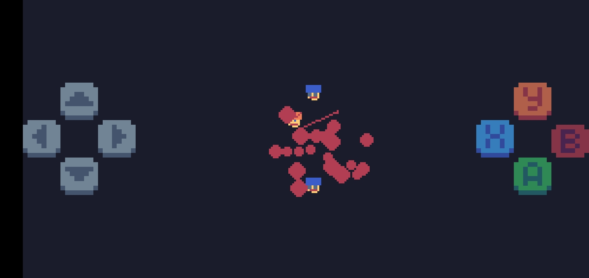

##### Hashtags #️⃣ : #gamedev #TIC80 #lua #sandbox #2D #Retro #Argentina #####

##### README en Español.To read the English versión,go to README-English.md


[](https://github.com/Naereen/StrapDown.js/blob/master/LICENSE)

[](https://your-game.itch.io)


## 🎮 TIC80Sandbox
2D sandbox style videogame in fantasy console TIC80.


Este es el README Principal.
READMEs de SubSecciones / Opcionales :

✨️1


✨️2


✨️3


✨️4


✨️5


✨️6


✨️7


✨️8


✨️9


✨️10


✨️11


****Modo TV de Tubo en TIC80 ( F6 ).****

 🎲 ***Nombre del juego :*** 


*Crimen y Chori*


 🎲 ***Año :*** 

*2025?*

 🎲 ***Desarrollador :***

*AltaVista Games*

( Pascua2020 y ChatGPT/DeepSeek )

 🎲 ***Género :*** 

```
-Sandbox 2D
-Minijuegos
-Conducción / Carreras
-Combate Vehicular
-Acción / Aventura
-Pinball
-Creación ( Solo para Editar Mapas en Modo RC ).
```

 🎲 ***Plataforma :*** 

*TIC-80*

( Consola de Fantasía Open Source :
Funciona en PC,Raspberry Pi y Smartphones. )

IMPORTANTE : TIC-80 funciona en Retroarch y este último funciona en un montón más de plataformas ( PS2,PS3,PS4,PSP,PSV,
Gamecube,Wii,WiiU,Switch,
Xbox(2001),Xbox One,Xbox Series X/S,tvOS)
así que en teoría también debería poder funcionar en todas esas plataformas ( pero no lo puedo confirmar - lo dice Wikipedia ).

Especificaciones ( de TIC-80 ):
```
-Resolución: 
240x136 Pixeles , 16 Colores.

-Mapa : 
1920 x 1088 Pixeles ( Dividido en Bloques de 8 x 8 - 64 Bloques en Total ).

-Graficos : 
256 Tiles y 256 Sprites.

-Memoria : 
272 KB de RAM ( 32 KB de VRAM ).
```

 🎲 ***Lenguaje de Programación :*** 

*Lua*

Juego hecho en su mayoria desde el Celular,SIN PC 
( eso si,con ayuda de ChatGPT / DeepSeek ).

Archivos .gif hechos con la herramienta integrada en TIC-80.


Eso incluye dibujar los Gráficos con el dedo táctil y tocar el Código desde el editor,ambos de TIC80.


## 🎮 Sinopsis : 

Crimen y Chori es un Videojuego Sandbox 2D ambientado en una ciudad de Argentina Pseudo-ficticia llamada Ciudad Rapera de Buenos Aires.

En esta Ciudad hay una fuerte presencia de las Emisoras de Radio y la Cultura Underground.Ademas ocurren todo tipo de cosas bizarras y en el medio hay un cambio de Gobierno.

El famoso actor Silvestre Stacchotta viene de Los Guapos County de Los Angeles a filmar escenas de Stuntman en Buenos Aires,en un clima de impresionante humedad y bardo nacional e internacional.

Y hay una fuerte hiperinflacion económica : El importantisimo empresario Japones-Argentino Juan Garcamaru enfrenta serias dificultades económicas con sus historicas Galletitas Marca CULO.

Esto y mucho más en...Crimen y Chori!


Aunque también tiene pequeñas ambientaciones en:

 🍪 ***La VirgoCueva en Argentina*** 

( Pantalla de Inicio,Hub de Niveles. )

.jpg)

 🍪 ***Pista de Carreras en Berna , Suiza***

( Minijuego de Carreras. )


 🍪 ***La Pistita en Pais Vasco , España***

( Minijuego de Carreras RC - a Control Remoto -. )


 🍪 ***Flippersburgo en Alemania***

( Minijuego de Pinball. )

Para más detalles sobre el pinball, consulta el [README del Pinball Minigame](https://github.com/Pascua2020/TIC80Sandbox/README-Pinball.MD).


 🍪 ***Satélite Tokyo en el Espacio Exterior*** 

( Minijuego de Baile. )


 🍪 ***Trompolandia en Estonia***

( Minijuego de Trompos. )


 🍪 ***Combate Vehicular en Lituania***

( Minijuego de Combate Vehicular. )


## 🎮 Requisitos e Instalación :

Al ser un Juego de TIC-80,corre en:
```
-PC ( Windows,Linux,Mac OS )
-Android
-Raspberry Pi
-Nintendo 3DS
-Retroarch
-HTML5 ( con WebAssembly )
```


Como Jugar :

```
1-Descarga el archivo .TIC .
2-Abre TIC-80 y carga el cartucho en la terminal de consola ( load juego.tic ).
3-corre el juego ( run juego.tic ).
```

## 🎮 Controles:


```
Botones del jugador (0-7) y sus equivalentes:

1. Botón 0:
   - Pantalla: Flecha arriba
   - Teclado PC: Flecha arriba

2. Botón 1:
   - Pantalla: Flecha abajo
   - Teclado PC: Flecha abajo

3. Botón 2:
   - Pantalla: Flecha izquierda
   - Teclado PC: Flecha izquierda

4. Botón 3:
   - Pantalla: Flecha derecha
   - Teclado PC: Flecha derecha

5. Botón 4:
   - Pantalla: A
   - Teclado PC: Z

6. Botón 5:
   - Pantalla: B
   - Teclado PC: X

7. Botón 6:
   - Pantalla: X
   - Teclado PC: A

8. Botón 7:
   - Pantalla: Y
   - Teclado PC: S
```

### Modo 1 Jugador ( Todo el Juego excepto RC y Trompos ):

```
* Botones 0,1,2,3 : Mover Jugador/vehículo.

*Boton 4 / A : Elegir Opcion / Interactuar.
*Boton 5 / B : Modo Táctico / Pausa.
*Boton 6 / X : Golpear / Disparar.
*Boton 7 / Y : Subir a Vehículo.
```
### Modo 2 Jugadores ( RC y Trompos ) :

```
* Botones 0,1,2,3 : Mover RC / Trompo jugador 1.

* Botones 4,5,6,7 : Mover RC / Trompo jugador 2.

( Solo RC : * Mouse/Pantalla Tactil : Editar Mapa )
```

## 🎮 Características del Juego:


✅️ 01

22 "Radios" en Texto.


```
"01 Radio Todo Vardo" : Noticias Locales
"02 Radio Bajones" : Tango
"03 Radio Poesía de la Calle" : Trap
"04 Gobierno de Argentina" : Cadena Nacional
"05 Solos y Solas" : Relaciones Amorosas

"06 Desgracias Economicas" : Economia
"07 Joyas de la Historia" : Historia
"08 No me Importa" : Internacional
"09 Radio Antimainstream" : Historias Unicas
"10 Cine Ultra 8K" : Cine
```

```
"11 Destapando Curros" : Investigaciones
"12 Radio Grieta" : Polarización
"13 Radio Cuarta Pared" : Vida Real
"14 La IA Avanza" : No Humanos
"15 Jesus te Ama" : Religion

"16 Sonidos Animalunos" : Lofi
"17 Naturaleza Insolita" : Naturaleza
"18 Radio Pesimista" : Noticias Tristes
"19 Poesia Pixelar" : Poesia Gamer
"20 Radio Terror" : Terror Bizarro

"21 Radio Lenguaje de la vida" : Idiomas
"22 Comerciales Gamers" : Propaganda
```


✅️ 02

512 Gráficos como máximo en formato 8x8 Pixeles.


Con Elementos divididos en secciones como:
```
-Asfalto
-Cesped
-Agua
-Pisos
-Carteles
-Personajes
-Armas
-Vehiculos
-Piedras
-Bicisendas
-Objetos
-Interfaz
ETC.
```

✅️ 03

16 Barrios en Buenos Aires.

Cada barrio tiene su propio estilo,con sus calles ( aunque hay barrios que comparten calles ) .

Y los Barrios poseen una Historia resumida la cual se puede leer.


✅️ 04


15 Vehículos 
( la mayoría con 4 Colores -Rojo,Azul,Verde y Amarillo-).

Hay 2 marcas :

-Tochota ( de Japón )

-Zho Zho ( de China )


```
01-Tochota - Fulero ( Coche )
02-Tochota - Strella ( Coche )
03-Tochota - Random ( Moto )
04-Tochota - Airlines ( Avión )
05-Tochota - Bondi ( Colectivo )
06-Tochota - Salud ( Ambulancia )
07-Tochota - Raíles ( Tren )
08-Tochota - Yip ( Camioneta )

09-Zho Zho - Ego Ego ( Coche )
10-Zho Zho - Jinping ( Coche )
11-Zho Zho - Xi ( Coche )
12-Zho Zho - RC
13-Zho Zho - Skate
14-Zho Zho - Woter ( Bomberos )
15-Zho Zho - Armageddon ( Policía )

```

✅️ 05

11 Armas.

-Algunas son de corto alcance / sin disparos ( Puño o Katana ).

-Otras tiran varios tiros de diferente manera.

-Otras no tiran tiros sino ráfagas ( fuego o electricidad ).


```
01-Puño
02-Pistola
03-Escopeta
04-Katana
05-Bazooka
06-Rayo láser
07-Rifle electrico
08-Granada
09-Lanzallamas
10-AK47
11-Minigun
```


✅️ 06

Trama Bizarra,con mezcla de Datos ficticios ( EJ : Presidente Hamburguesa en Uruguay ) y reales ( EJ : el Idioma Tenis ).


✅️ 07

Easter Eggs / Curiosidades

( Ej : Dibujos misteriosos en el agua. )


✅️ 08

19 Personajes de la Trama + 9 NPCs.


```
Trama
01-Jugador ( Wikiman )
02-Gatito ( Mascota )
03-Silvestre Stacchotta ( actor de EEUU )
04-Jorge Lanota ( Periodista )
05-Juan Garcamaru ( Empresario )

06-Profesor Levantini ( Influencer )
07-Profesora Dopamina ( Doctora )
08-Barcelo Monelli ( Periodista )
09-Elon Mots ( Magnate Africano )
10-Big Faso ( Duo Ruso Senegales )

11-Señor Amarguino ( Locutor )
12-Adrian DelaTrampa ( Crítico de cine )
13-I y A ( Inteligencias Artificiales malvadas ) 
14-Damian Blabla ( Historiador )
15-IA de Brian Turreti ( Figura Historica Turra en China)

16-DiosGPT ( IA del Jugador )
17-Locutor de Terror Gallego / Manolo Joseche
18-Guillermo Bajolini ( Cantante de Tango )
19-ARmando GENe TINOman ( Presidente Saliente)
```

```
Peatones / NPCs
1-Suizo Romanche
2-Rapi el Rapero
3-Timmy Trabalenguas

4-"Capitán Inflacion"
5-Obsesivo y Compulsivo
6-El Profeta

7-Cerebrito y Wachin
8-"El Payaso Curro Curro"
9-Mamá y Niño Diabolico

```

✅️ 09

Misión de Stuntman 

( Piruetas en vehículo de doble de cine.

Con 10 Mecánicas distintas. )

( Inspirado en el Videojuego de 2002 - Stuntman - de Reflections Interactive ).


```
01-Subir a Coche y conducirlo
02-Destruir Cajas
03-Usar Nitro
04-Disparar desde vehiculo
05-Esquivar enemigos
06-Saltar rampa
07-Perseguir coche
08-Saltar aro de fuego
09-Esquivar tren
10-Explotar coche
```


✅️ 10


Simulador ( muy simple ) de App estilo 
ChatGPT ( llamada DiosGPT ) : 

Sirve como tutorial.


✅️ 11


Lector de Diarios 
( Noticias de varias Temáticas ).


✅️ 12

Simulador estilo Wiki ( llamado Nerdpedia ) , con Interfaz simplificada y datos bizarros.


✅️ 13


El Skate se puede montar en Caños.


✅️ 14


El Jugador puede tomarse Colectivos en Paradas,con la Tarjeta SUBA.


✅️ 15


Sistema de Dinero ( llamado Peluca$ ).

Se pueden comprar Choris , recargar Nafta o viajar en Colectivo.


✅️ 16

Sistema de Climatologia


( Pueden activarse varios efectos simultáneamente ).

```
-Lluvia
-Nieve
-Hojas
-Viento
-Relámpagos
```


✅️ 17


Cámara que sigue al Jugador y Minimapa.


✅️ 18

Jetpack 
( Para poder volar sobre el agua ).


✅️ 19


Los vehículos tienen Nafta,o se recarga o se acaba y no pueden moverse más.


✅️ 20

Hay una Pista a Control Remoto cuyos gráficos se pueden editar con la pantalla táctil,"pegando" los gráficos desde un editor.


✅️ 21

Minijuego de Trompos 

( con Modo 2 Jugadores ).


✅️ 22

Visor de Telescopio 


( Para ver Estrellas Normales y Fugaces ).


✅️ 23

Sistema de Mensajes Móviles.


✅️ 24

20 Coleccionables en el Mapa : 

-16 "Condones" en la Ciudad.

-4 "Diamantes" en el Mar.


✅️ 25

Modo Debug / Depuración 

( Para ver mejor Variables en Pantalla , lo cual ayuda al Testeo ).


✅️ 26


Interfaz Minimalista ( Estilo Cartas ) ,con Modo Táctico.

.jpg)

✅️ 27

Trucos ( al conseguir 100% ).


✅️ 28


Objetos / Enemigos Destructibles,Sistema de Partículas sangriento.



✅️ 29

Sistema de Votación Electoral
( Opcion A o B ).

Con Personajes de la Trama.

✅️ 30

Diálogos Automáticos ( ya sea con Personajes o Radio ).


✅️ 31

60 Frames por Segundo.


( TIC-80 esta bloqueado a esos FPS ).

✅️ 32

Distintos Tipos ( para la Ciudad ) de :
```
*Aceras
*Carteles de Trafico
tráfico
*Cesped
*Oceanos
*Edificios
*Baldosas
*Faroles
*Muros
```


✅️ 33

Parques,Playa y Aeropuerto 
( en la Ciudad ).


✅️ 34

Cada Barrio tiene su Nombre y este se muestra en pantalla al estar en el.
Lo mismo las Calles.

✅️ 35

Modo Carrera Arcade.


✅️ 36

Modo Combate Vehícular.

✅️ 37

Rampas y Aros de Fuego ( Este ultimo se prende y apaga ).


✅️ 38

Minijuego de Baile

Con sus propias Letras de Canciones y Sistema de Combos.


✅️ 39

Terremoto


## 🎮 Mapa

.jpg)

##### 🌇 -Ciudad Rapera de Buenos Aires 

( Incluye 16 Barrios )


Nombres de los Barrios:

```
1-Nueva Pyongyang
2-Obelisco
3-Internets
4-No no no no

5-Vivan los osos
6-Tigerlandia
7-Nueva Madrid
8-Villa Castores

9-Currolandia
10-Villa Pinball
11-No se queje
12-Villa Casta

13-Barrio Turrisimo
14-Barrio Chetisimo
15-Casi casi
16-El Wiki Barrio
```

Nombres de las Calles:

```

1 Lalala
2 Lucifer
3 Proceda
4 Inflacion
5 Satanas
6 Conspiración
7 Turbina
8 Diamante
9 Chechona
10 Informeishon

11 Poker
12 No jodas
13 Cállate
14 Gilipollas
15 Anaconda
16 Siga Siga
17 Eureka
18 Laberinto
19 Meteorito
20 Miau

21 Yupi
22 Caos
23 Pixeles
24 Wauf
25 Seineldin
26 Pio pío
27 Jarbard
28 Ameo
29 Tuti fruti
30 Libre

31 Khe
32 Zig Zag
33 Tuki Tuki
34 Ouch
35 Chad
36 Pff
37 Chocolate
```

##### 🌅 -Mar Ram

( Rodea a la Ciudad. )


## 🎮 Jugabilidad

Es un videojuego Sandbox ( estilo GTA ) pero en 2D,y tiene varios minijuegos que le aportan un toque bastante diferenciador.

Debido a los pocos controles que hay el juego cuenta con un modo táctico,de forma que se puede  elegir múltiples opciones de forma pausada y retomar la acción una vez que el jugador define que hacer.

El jugador puede ir a pie o usar múltiples vehículos y también múltiples armas.

Si bien esta ambientado en una Ciudad,el Mapa es Pequeño pero sobrecargado de detalles y la Ciudad está rodeada por un mar : Aunque hay algunas zonas más que se pueden acceder fuera de este lugar.

También hay un enfoque importante en la Interactividad ( ej la lectura de la Wiki o el Diario ) en un mundo con todos los elementos interconectados.

## 🎮 Estado

En Desarrollo ( desde 30/12/2024 ).

Enero 2025 :
```
-Primeros Prototipos
-Primeros Backups
-Primeras Screenshots/Videos
-Creación de Gráficos
-Creación de Mapa
-Creación de Personajes
-Creación de Programación 
/ Mecánicas de todo tipo 
( incluido el Pinball )
```
Febrero 2025:
```
-Búsqueda de Feedback
-Creación de Repositorio de GitHub
-Búsqueda de Música Open Source
```

De momento sin Sonido.

## 🎮 Licencia

Open Source?

## 🎮 Creditos


Desarrollador : Pascua2020
```
-Diseño de Sprites
-Diseño de Mapa
-Ideas de Trama y Personajes
-Programación
-Backups en la Nube
-Mecánicas Jugables
-Testing/Debug
```

Asistentes de IA : ChatGPT , DeepSeek :
Me ayudaron a profundizar elementos de programación y de la trama 
( EJ : los diálogos de las Radios. )

Detalles del juego agregados : 
```
-Gente Conocida.
-Chistes leídos en Internet.
```

Inspiraciones : 
```
-Saga GTA
-Stuntman ( 2002 )
-Dance Dance Revolution
-Beyblade
-Wikipedia
-Gran Turismo
-Pinballs en general
```

Agradecimientos Especiales al Creador de TIC-80 y a Sam Altman por crear ChatGPT.

Toda la música del juego es Open Source,acá están los nombres de los temas y el artista 
( Todos de la web OpenGameArt.org ) :

```
01-Magic_Cristal.wav - https://opengameart.org/content/magic-crystal
02-Happy8Bit.wav - https://opengameart.org/content/happy-8-bit
03-dog_in_car.wav - https://opengameart.org/content/dog-in-car-seamless-loop
04-airtheme.wav - https://opengameart.org/content/air-theme
05-

06-
07-
08-
09-
10-

11-
12-
13-
14-
15-
```

## 🎮 Notas
```
*Versión 1.0
*Ideas Descartadas : Ciclo Día / Noche
*Ruta de TIC80 en Windows:
C/Usuario/AppData/Roaming/com.nesbox.tic/TIC-80

*Hacer capturas de pantalla del cartucho de TIC80 : 
1-abrir .TIC, pulsar F7.
2-Luego en el código poner
-- title: Nombre del juego
3-Guardar .TIC
4-Guardar nombredeljuego.png

Guardar .png del mapa del juego :
Escribir en la consola "export mapimg nombre.png
```

Todos los export:

### 1. **Exportar el cartucho completo**
Exporta todo el contenido del cartucho (sprites, mapas, código, música, etc.) en un archivo PNG.

```lua
export cart.png
```

### 2. **Exportar solo los sprites**
Exporta la tabla de sprites (sprite sheet) como un archivo PNG.

```lua
export spr.png
```

### 3. **Exportar solo los tiles**
Exporta la tabla de tiles (tile sheet) como un archivo PNG.

```lua
export tiles.png
```

### 4. **Exportar el mapa**
Exporta el mapa completo como un archivo PNG.

```lua
export map.png
```

### 5. **Exportar la pantalla (screen)**
Exporta la pantalla actual (lo que se muestra en la ventana de TIC-80) como un archivo PNG.

```lua
export screen.png
```

### 6. **Exportar la música**
Exporta la música del cartucho como un archivo WAV.

```lua
export music.wav
```

### 7. **Exportar efectos de sonido (SFX)**
Exporta los efectos de sonido como un archivo WAV.

```lua
export sfx.wav
```

### 8. **Exportar el código fuente**
Exporta el código Lua del cartucho como un archivo de texto.

```lua
export code.lua
```

### 9. **Exportar la paleta de colores**
Exporta la paleta de colores actual como un archivo PNG.

```lua
export palette.png
```

### 10. **Exportar el cartucho como un archivo .tic**
Si quieres guardar el cartucho en formato `.tic`, usa:

```lua
save mygame.tic
```

### 11. **Exportar un GIF animado**
Puedes capturar una animación y exportarla como un archivo GIF. Primero, inicia la captura:

```lua
gif record
```

Luego, detén la captura y exporta el GIF:

```lua
gif stop myanimation.gif
```

### 12. **Exportar un video**
Puedes capturar un video y exportarlo como un archivo `.webm`. Primero, inicia la captura:

```lua
video record
```

Luego, detén la captura y exporta el video:

```lua
video stop myvideo.webm
```

### Atajos generales:
- **F1**: Abre el menú de ayuda, donde puedes ver una lista de todos los atajos disponibles.
- **F2**: Guarda el proyecto actual.
- **F3**: Carga un proyecto guardado.
- **F4**: Reinicia la consola TIC-80.
- **F5**: Ejecuta el código actual (juego o programa).
- **F6**: Detiene la ejecución del código.
- **F7**: Pausa/Reanuda la ejecución del código.
- **F8**: Toma un screenshot (captura de pantalla) del programa en ejecución. La captura se guarda en la carpeta de capturas de TIC-80.
- **F9**: Graba un GIF animado de la ejecución del programa. Presiona F9 nuevamente para detener la grabación.
- **F10**: Muestra/oculta el contador de FPS (fotogramas por segundo) en la esquina superior izquierda de la pantalla.

### Atajos en el editor de código:
- **Ctrl + Z**: Deshacer.
- **Ctrl + Y**: Rehacer.
- **Ctrl + C**: Copiar.
- **Ctrl + X**: Cortar.
- **Ctrl + V**: Pegar.
- **Ctrl + S**: Guardar el archivo actual.
- **Ctrl + F**: Buscar texto en el código.
- **Ctrl + G**: Ir a una línea específica en el código.

*En TIC80 no parece funcionar ni la letra "Ñ" ni las Tildes ( ej : "á" ),por eso es que algunas palabras están escritas con errores de ortografía 
( ej : "próxima" en vez de "próxima" ).

## 🎮 Links Utiles

-Itch.io ( Descarga del Juego )

-HTML5 ( Jugar juego en el Navegador )

-Contacto ( Pascua )

-Web del Creador de TIC-80

https://tic80.com/

-Donaciones

-Canal de YouTube del Juego

-ADVA ( Asociación de Desarrolladores de Videojuegos de Argentina )

-Twitter de AltaVista Games
