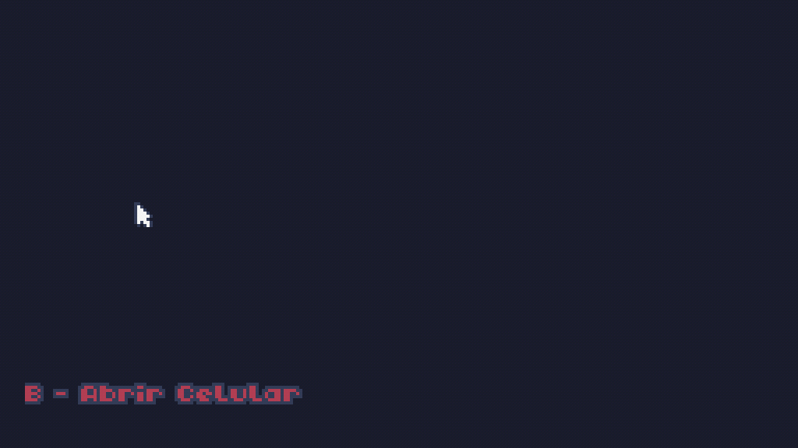
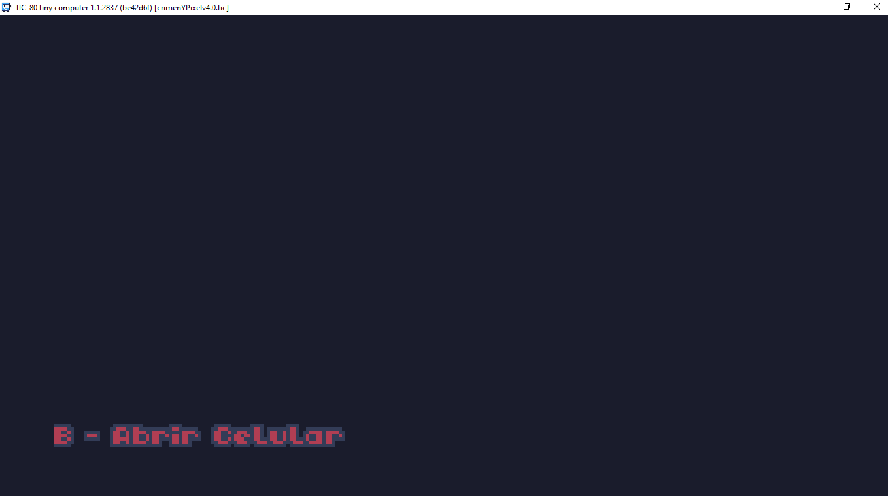
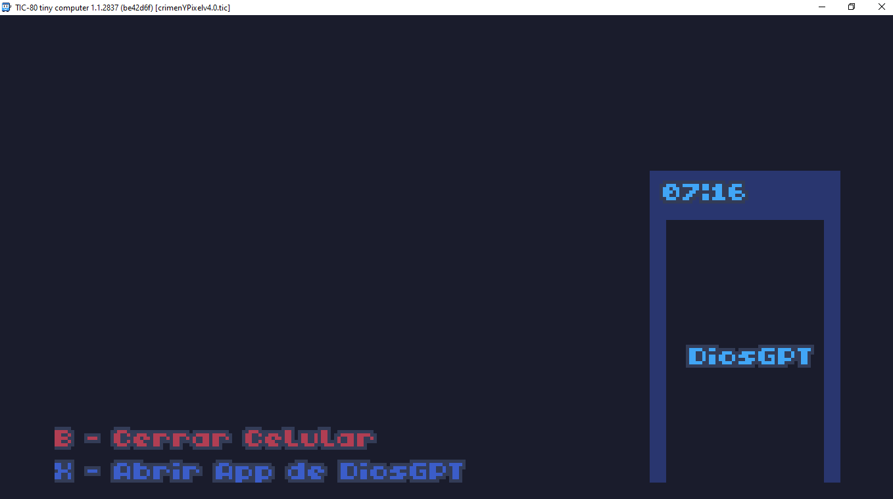
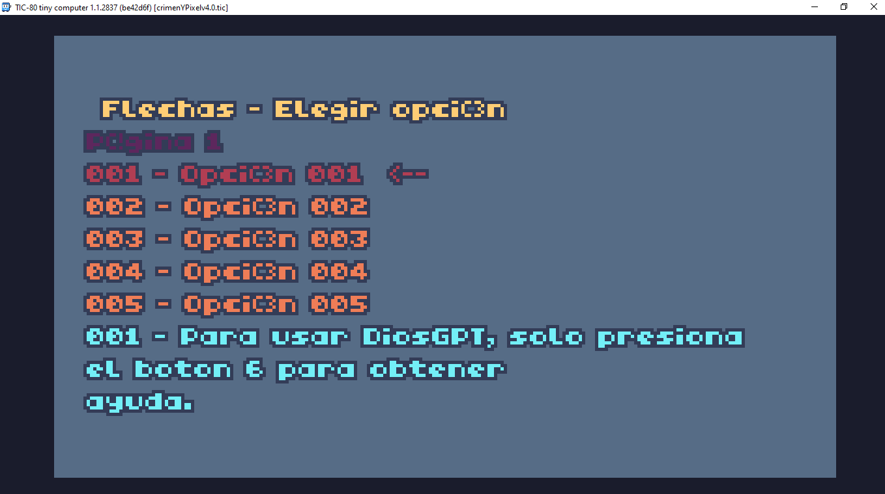
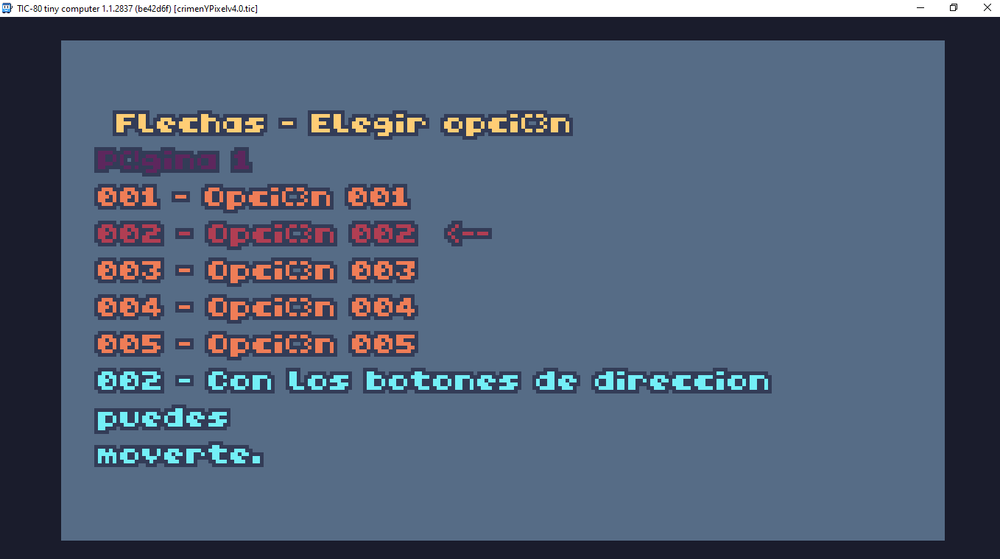
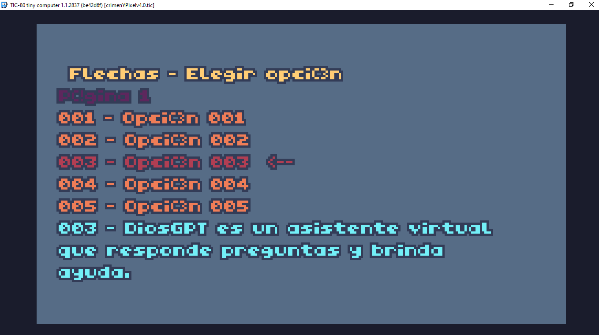
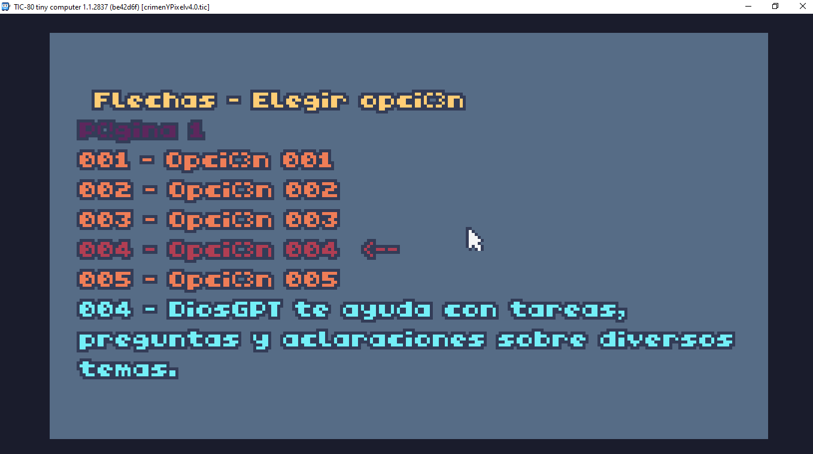
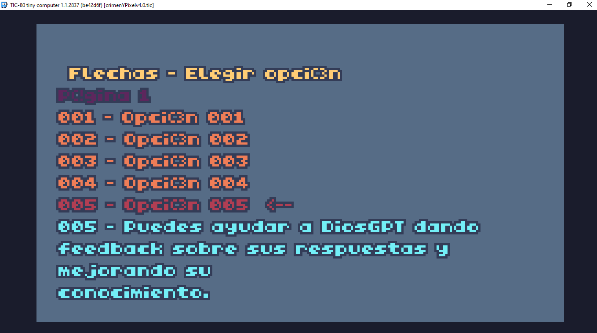
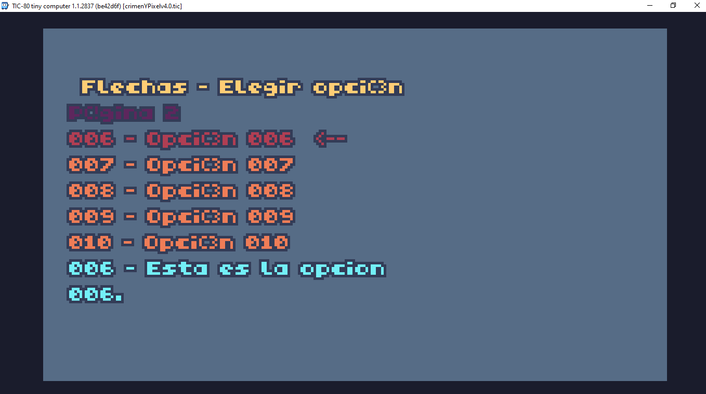

# Readme4.0DiosGPT

🎮👾🚔***Caracteristicas:***

1️⃣ Simulacion de asistente de IA🤖,aunque en este caso simplemente muestra textos en un menu.

2️⃣ Primero simula sacar un Celular📴,para luego abrir la "App"📳.

3️⃣ Al mostrar el menu de opciones se pinta de un color la pantalla 🗨️( para poder ver mas facilmente las opciones ).
Igualmente se puede sacar y volver a poner el "Celular" junto a la "App".

4️⃣ Opcion de ver multiples paginas de textos 🌐 ( aunque en este caso,limitada a solo 2 paginas ).

5️⃣

6️⃣

7️⃣

8️⃣

📱***Interfaz***

📱***Opciones***



