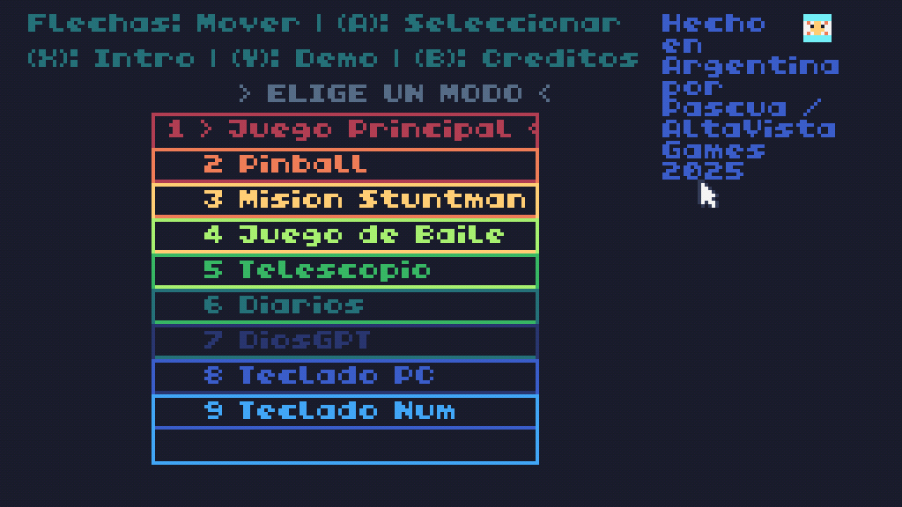

# 🎮Readme4.0 : Versiones

🎮👾🚔***Caracteristicas:***

1️⃣ V0 / Pre-V1 :

2️⃣ V1 :

3️⃣ V2.1 : 

4️⃣ V2.2 :

5️⃣ V2.3 : 

6️⃣ V2.4 :

7️⃣ V2.5 :

8️⃣ V2.6 :

📀Crimen y Pixel Version 1.0

***📅7/4/2025***

📀Crimen y Pixel Version 2.0

📀Crimen y Pixel Version 2.1

***📅18/4/2025***

📀Crimen y Pixel Version 2.2

***📅22/4/2025***

📀Crimen y Pixel Version 2.3

***📅24/4/2025***

📀Crimen y Pixel Version 2.4

***📅27/4/2025***

📀Crimen y Pixel Version 2.5

***📅30/4/2025***

📀Crimen y Pixel Version 2.6

***📅1/5/2025***

📀Crimen y Pixel Version 2.7

***📅3/5/2025***

📀Crimen y Pixel Version 2.8

***📅5/5/2025***

📀Crimen y Pixel Version 2.9

***📅6/5/2025***

📀Crimen y Pixel Version 3.0

***📅12/6/2025***

📀Crimen y Pixel Version 3.1

***📅13/6/2025***

📀Crimen y Pixel Version 3.2

***📅14/6/2025***

📀Crimen y Pixel Version 3.3

***📅14/6/2025***

📀Crimen y Pixel Version 3.4

***📅16/6/2025***

📀Crimen y Pixel Version 3.5

***📅18/6/2025***

📀Crimen y Pixel Version 3.6

***📅19/6/2025***

📀Crimen y Pixel Version 3.7

***📅21/6/2025***

📀Crimen y Pixel Version 3.8

***📅24/6/2025***

📀Crimen y Pixel Version 3.9

***📅25/6/2025***

💽Crimen y Pixel Version 4.0 ( ACTUAL )

***📌2/7/2025***

